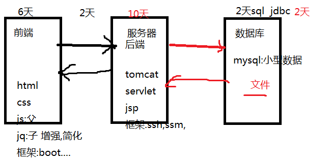
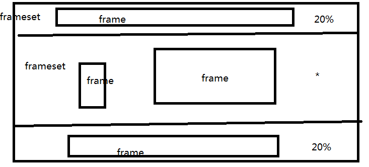

# 课程安排 #

# 什么是html #
	1. HTML的全称是Hyper Text Mark-up Language，**超文本**| |**标记**语言。
	2. 用于界面**展示**

## 超文本 ##
	1. 描述文本的字体 颜色 图片..

## 标记 ##
	1. 一套标记标签
	2. 标签(tag) :node节点)  element(元素)

# hbuilder #
1. 工具->变更默认代码存放空间->
2. 工具->选项->常规->工作空间->(右边)文件编码改成utf-8
		http://www.runoob.com/w3cnote/hbuilder-intro.html

----------

# 标签 #
## 格式 ##
### 围堵闭合标签 ###
	1. <开始标签> </结束标签>
			 < a>百度一下< /a>
	2. 中间的是标签体

### 自闭标签 ###
	< img/>

## 标签属性 ##
	1. key="value"
	
	< img src="路径"/>
	
	1. 双引号(推荐)

# 其他 #
## 特殊字符 ##
	1. &
	2. 名称
	3. ;
## 注释 ##
	<!--  注释信息  -->

## 规范 ##
	<!--  注释信息  -->
	1. 都需要**闭合**
	2. 标签名不区分大小写，建议都用**小写**
	3. HTML中不支持**空格，回车，制表符**,它们都会被解析成一个空白字符。(但是我们为了让代码清晰易读，可
	以使用空格和回车键进行编排)

----------

# html结构 #

## 头标签< head>...< /head> ##

	**相当于java程序的前面,存放当前页面的信息,不展示内容
	**
	
	1. 名称,图片
		* <title>结构</title>
		* <link rel="shot _icon" href=""/>
	2. 描述信息 :作者,关键字...
		* <meta name="keywords" content="w3cschool,HTML,CSS">
	3. 导包!!!
		
### title ###
	1. 左上角显示

### meta ###
	整个描述信息
	1. content="keywords,description" content="  xx"
	2. charset="utf-8"

## 身体标签< body>... < /body> ##
	具体展示内容

----------

----------

# 文本标签 #
	1. h1~h6:标题 : 换行,加粗,  
	2. font
	3. b ,strong 加粗
	4. i  :斜体

## h1-h6 标题标签 ##
	1. 换行 
	2. 属性:align

## font 字体 ##
	1. 属性size,color,face
				hello,world!
### color ###
	1. #xxxxxx 十六进制 rgb
	2. 英文单词

----------

# 格式排版标签 #
	1. p:段落
	2. pre:
	3. br:换行
	4. hr:水平线

华信官网文本小案例

----------

----------

# 图片标签 #
	1. src,alt,**title**,width,height

## 路径 ##
	1. 相对:
	2. 绝对:

# 列表 list#
	1. 有序 ol
	2. 无序 ul
	3. li

# 超链接(友情链接) #
	1. href,taget 
	2. #
	3. 锚点设置
		1. 最好id设置
	4. 图片链接
			
# 图片,超链接 #

----------

# table #
	1. caption 标题
	2. tr :align 
	3. th
	4. td :align 内容 
	5. 表格中能嵌套表格

			<table border="1">
				<tr>
					<caption>学生表</caption>
				</tr>
				<tr>
					<th>姓名</th>
					<th>性别</th>
				</tr>
				<tr>
					<td>小红花</td>
					<td>女</td>
				</tr>
			</table>

## 案例 ##
	1. 上下  左右

			<table width="100%" style="text-align: center;">
				<tr height="100px">
					<td colspan="2" bgcolor="red">网页的头部</td>
				</tr>
				
				<tr height="200px">
					<td width="30%" bgcolor="blue"> 网页的左边</td>
					<td bgcolor="aquamarine">网页的右边</td>
				</tr>
				<tr height="100px">
					<td colspan="2" bgcolor="red">网页的底部</td>
				</tr>
			</table>
			
----------

# frameset #
	1. frameset  norezise 滚动条   rows  cols
			cols：
				使用“像素数”和%分割左右窗口，“*”表示剩余部分
				使用“*”，“*”表示框架平均分成2个
				使用“*”，“*”，“*”表示框架平均分成3个
			rows：使用“像素数”和%分割上下窗口，“*”表示剩余部分
			frameborder：指定是否显示边框，0不显示，1显示
			border：设置边框的大小，默认值5像素

	2. frame  src name
			src：加载网页文件的URL地址
			name：框架名称，是链接标记的target所要参数
			noresize：表示不能调整框架大小，没有设置时就可以调整，参数值为noresize
			scrolling：是否需要滚动条，可选auto，yes，no
			frameborder：是否需要边框可选1显示边框，0不显示边框	

		<frameset rows="15%,*,10%" frameborder="1" border="1" >
			<frame src="framesetTop.html" />
			<!--noresize="noresize"-->
			<frameset cols="20%,*" >
				<frame src="framesetLeft.html" />
				<frame src="framesetRight.html" name="frameset_right" />
			</frameset>
			<frame src="framesetFoot.html" />
		</frameset>

----------

----------

# 表单(form重要) #
	1. 收集用户的信息

## form ##
	1. method属性: get,post
	2. action属性:提交的地址

				action =".." 提交的路径
				method =""  提交的方式  get  post
					get: 1. 提交参数显示在地址栏上url 2. 字数显示
					post:1. 参数请求体里面  2.没有字数限制
## input ##
	1. text 默认
	2. password
	3. radio
	4. checkbox
	5. file
	6. 
	6. button
	7. submit
	8. reset 
	9. image 图片提交
	10. hidden

### 属性 ###
	1. name
	2. value
	3. disabled="disabled"
	4. readonly="readonly"

## select ##
### option ###

## textarea ##
	1. cols  rows 

# 登入 #

## 注册 ##
	1. 账号密码
	2. 性别 爱好
	3. 头像
	4. 籍贯 select
	5. 自我介绍 textArea

# 属性 #
	1. id :js
	2. class:css
	3. name:后台用的

			<body style="text-align: center;">
				<!--注册表单
					账号:
					密码:
					爱好:
					性别:
					头像:
					籍贯:
					介绍:
					提交:
				-->
				<!--<form method="get" style="text-align: center;">-->
					<form method="get" >
					账号:<input type="text" name="username" />
					 
					 密码:<input type="password" />
					  性别:
					<input type="radio" name="sex" checked="checked">男
					<input type="radio" name="sex" />女
					  爱好:\
					<input type="checkbox" />篮球
					<input type="checkbox" />足球
					<input type="checkbox" />乒乓球
					  头像:
					<input type="file" />
					 籍贯:
					<select >
						<option > 湖南</option>
						<option > 湖北</option>
					</select>省
					<select >
							<option > 长沙</option>
						<option >衡阳</option>
					</select>市
					 介绍
					<textarea rows="5"></textarea>
					 
					<input type="submit" value="注册"/>
					
				</form>
			</body>

----------

# 任务 #
	1. 表单table,上课演示的 管理的 :上下左右
	2. 表单table,做一个注册页面
	3. frameset 管理界面 上下左右 

