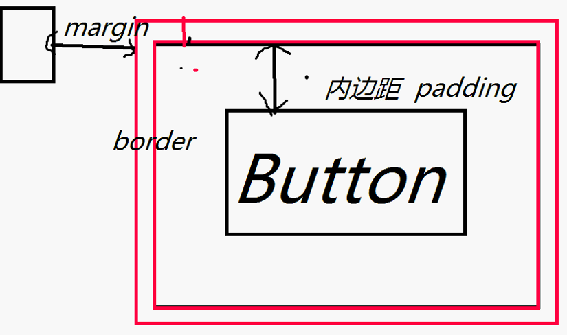

# CSS 层叠样式表 #
1. 作用:渲染界面,界面内容\样式分离
2. 格式:属性:值;
3. 方式:内联,内部,外部样式

1. **找**爷爷() ->  选择器  jquery ->**选择器**
2. 属性样式(文档)
----------

# 样式表方式 #
## 内联 ##
1. 通过标签属性 style
2. 针对一个有用,而且内用样式不分离
	2. < a style="c">
3. css,违背了其设计思想:内容和样式分离

## 内部 ##
1. 在html里面,head标签中定义,添加一个 < style type="text/css">...</ style>
2. type: mimeType :  大类型/小类型  image/jpeg image/png
3. 格式: 选择器{ 样式名1:值1;样式名2:值2;  }

## 外部 ##
	1. <link rel="StyleSheet" type="text/css" href="1.css"/>
 

----------
# 选择器 #
		css格式: 选择器{
		属性1:值1;属性2:值2;......
		}

1. 类选择器:通过标签的类属性
2. id选择器
3. 标签名选择器:<a>xx</a>
4. 属性选择器

## 类选择器  . ##
1. 元素必须要有class属性(  <xx class="cName"></xx> )
2. 在css中,用 .cName{....}

## id选择器 # ##
1. 元素必须要有id属性,唯一的(  <xx id=""></xx> )
2. 在css中,用 #id{....}

## 标签 标签名 ##
1. 无
2. 在css中,用 标签名{....}

## 属性选择器 ##
1. 元素必须要有att属性,唯一的(  <xx att="a"></xx> )
2. 在css中,用  标签名[属性名="a"]{....}

----------

----------

# 选择原则 #
1. 同一个样式的作用顺序
2. 不同样式叠加

## 同一选择器 ##
1. 就近原则
2. 内联最大
3. 内部,外部看谁近

## 不同选择器 ##
1. 特殊性排序,越特殊越先

### 顺序 ###
1. id选择器(一个)
2. 类选择器(一类)
		3. 属性选择器() 不排序
4. 标签名选择器(一种)

# 其他选择器 #
1. **派生选择器**(后代选择器) div span{xx}:满足前面的,然后找后面的选择器
2. **伪选择器** a:link{....}
3. link正常 hover放上去 active按下 visited 浏览过

----------

----------
# 属性学习(了解) #
## 背景 ##
1. background-color
2. background-image:url(../);
3. background

## 文本 ##
通过文本属性，您可以改变文本的颜色、字符间距，对齐文本，装饰文本，对文本进行缩进，等等。
1. 颜色:color
2. 行高:line-height
3. 位置:text-align
4. 修饰:text-decoration : 下划线,中划线,取消线(< a>)
			none 默认。定义标准的文本。 
			underline 定义文本下的一条线。 
			overline 定义文本上的一条线。 
			line-through 定义穿过文本下的一条线。 
			blink 定义闪烁的文本。 
			inherit 规定应该从父元素继承 text-decoration 属性的值。 

## 字体 ##
1. font-size:css单位
2. font-family:黑体
3. font-style :斜体
4. font-weight bold

## 列表 ##
1. 类型a..:list-style-type
		list-style-type: decimal ;
2. 图片列表项:list-style-image   url
		list-style-image: url(../img/qi.jpg);
## 表格 ##

## 轮廓 ##

----------
# 大纲 #
1. 回顾
	1. 作用
	2. 步骤 1. 找 2. 设置样式
	3. 导入方式
	4. 选择器
	5. 样式
2. 浮动
3. 盒子模型
4. 布局

----------

## 浮动 ##
		京东商品一行4个
		8个div 浮动
1. float属性   值: left right  
2. clear:设置元素的2边是否有浮动元素
3. display:
    	none 此元素不会被显示。 
    	block 此元素将显示为块级元素，此元素前后会带有换行符。 
    	inline 默认。此元素会被显示为内联元素，元素前后没有换行符。 

----------

----------

# 盒子模型 #
	JButton 图(两个 矩形框框)   

1. 内容
2. 内边距:padding
3. 边框:border
4. 外边距:margin

## 属性 ##
1. *-top:值
2. *-bottom:值
3. *-left:值
4. *-right:值
5. 值不可以为负数

### 简写 ###
1. 上右下左
2. 写一个: padding :10px;
3. 写二个: padding :10px 5px;
4. 写三个: padding :10px 5px;
5. 先去取值,取对面的,上一个的

## body清空 ##
		.reset {
				margin: 0;
				padding: 0;
			}

----------

# 布局 position 属性 #

## 值 ##
1. static(默认):等于没写
2. relative:相对自己
3. absolute:绝对,相对于父布局(父布局必须设置position属性);如果都没有,就相对于body标签
4. fixed:固定位置
			.pFixed{
				position: fixed;
				right: 0;
				bottom: 0;
			}
## 影响属性 ##

1. top right bottom left
2. -10px(可以负数)
3. z-index :0 (默认) -1(底层) 1上层
			

				

			

			.pRelative2{
					position: relative;
					width: 150px;
					height: 150px;
					top: 100px;
					background: yellow;
					z-index: -1;
				}
			.pRelative3{
					position: relative;
					width: 250px;
					height: 250px;
					top: 100px;
					background: black;
				}

# overflow  #
		hidden 隐藏超出层大小的内容
		scroll无论内容是否超出层大小都添加滚动条
		auto 超出时自动添加滚动条