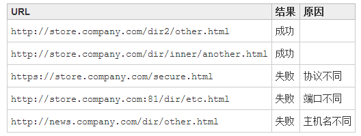

# js跨域问题 #
1. 说明:
	1. Js为了安全有一个限制，不允许跨域访问。(同源策略 Same-Origin Policy)
	2. js跨域是指通过js在不同的域之间进行数据传输或通信
		比如用ajax向一个不同的域请求数据，
		或者通过js获取页面中不同域的框架中(iframe)的数据
2. 条件两个url*不同
	1. 域名
	2. 端口
	3. 协议
	4. ip

3. 解决方案-jsonp
	1. 原理
		1. 在js中不能跨域请求数据，js可以跨域请求js片段。
		2. 被请求方B主动:把数据包装成js片段。可以把数据使用js方法来包装，形成一条方法的调用语句。
		3. 请求方A:使用ajax请求js片段，当js判断到达浏览器会被立即执行。
		4. 请求方A:在浏览器端，先创建好回调方法，在回调方法中通过参数可以获得请求的数据。
		5. 不支持post
	2. 步骤 [参考](https://www.cnblogs.com/chiangchou/p/jsonp.html)
		1. A: js中写好回调函数
		2. A: ajax请求,携带回调函数方法名
		    $.ajax({
			         url: "http://localhost:9090/student",
			         type: "GET",
			         dataType: "jsonp",  //指定服务器返回的数据类型
			         jsonp: "theFunction",   //指定参数名称
			         jsonpCallback: "showData",  //指定回调函数名称
			         success: function (data) {
			             console.info("调用success");
			         }
			     });
			先调用了指定的showData，然后再调用了success

		3. B: 数据包装好响应客户端A  

	3. 错误
		1. 405
			不支持post
		2. CORS头缺少“Access-Control-Allow-Origin” 服务端拒绝跨域访问
			response.setHeader("Access-Control-Allow-Origin", "*"); 设置允许任何域名跨域访问