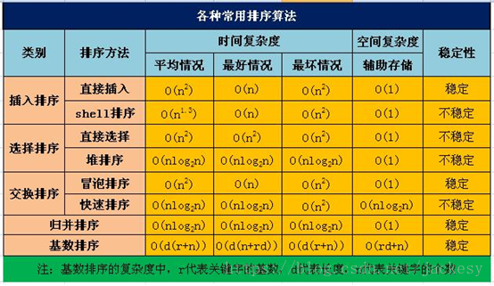

https://www.cnblogs.com/0201zcr/p/4764427.html
# 交换排序 #
## 冒泡 ##
```
    /**
     * 从小到大 : 第一次遍历,最大值到最后,然后遍历数目-1
     * 
     * @param list
     */
    public static void bubbleSort1(int[] list) {
        int temp = 0;
        int size = list.length-1;
        for (int i = 0; i < size ; i++) {
            for (int j = 0; j < size - i; j++) {
                if (list[j] > list[j + 1]) {
                    temp = list[j];
                    list[j] = list[j + 1];
                    list[j + 1] = temp;
                }
            }
        }
    }
```
## 快排 ##
```
   public static int getMiddle(int[] numbers, int low, int high) {
        // 第一个数默认中轴
        int temp = numbers[low];
        while (low < high) {
            // 过滤高位大数
            while (low < high && numbers[high] > temp) {
                high--;
            }
            // 替换位置
            numbers[low] = numbers[high];

            // 过滤低位小数
            while (low < high && numbers[low] < temp) {
                low++;
            }
            // 替换位置
            numbers[high] = numbers[low];
        }
        // 设置 中轴 位置的值
        numbers[low] = temp;
        return low;
    }

	public static void quickSort(int[] numbers, int low, int high) {
        if (low < high) {
            int middle = getMiddle(numbers, low, high);
            // 递归低位
            quickSort(numbers, low, middle - 1);
            // 递归高位
            quickSort(numbers, middle + 1, high);
        }
    }

    public static void quick(int[] numbers) {
        if (numbers.length > 0) // 查看数组是否为空
        {
            quickSort(numbers, 0, numbers.length - 1);
        }
    }

```


# 选择排序 #
```
    public static void selectSort(int[] numbers) {
        int temp = 0;
        int size = numbers.length;
        for (int i = 0; i < size; i++) {
            // 从i开始
            int min = i;
            for (int j = size - 1; j > i; j--) {
                // 取最小值
                if (numbers[j] < numbers[min]) {
                    min = j;
                }
            }
            // 交换
            temp = numbers[i];
            numbers[i] = numbers[min];
            numbers[min] = temp;
        }
    }
```


# 插入排序 #
```
    public static void insertSort(int[] numbers) {
		int temp =0;
		int j =0;
		for(int i=0; i<numbers.length;i++){
			temp=numbers[i];
			for(j=0;j>0 && temp<numbers[j-1];j--){
				//前面大数,往后面移动
				numbers[j]=numbers[j-1];
			}		
			number[j]=temp;
		}
	}
```