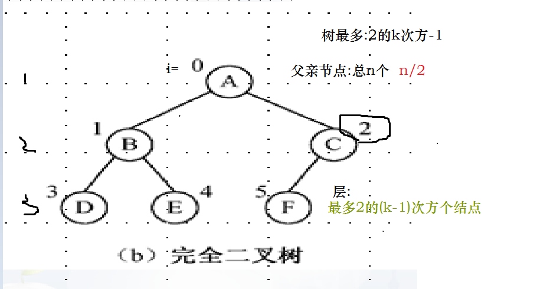
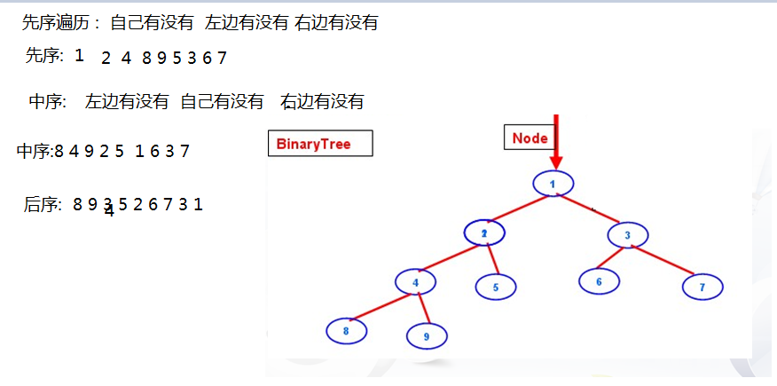

# 树 #
1. 节点度：一个节点含有子树的个数称为该节点的度
2. 树的度：一棵树中，最大的节点的度为树的度
3. 叶子节点：度为零的节点
4. 父亲节点：若一个节点含有子节点，则当前节点为改子节点的父亲节点
5. 子节点：一个节点含有子树，则子树的根节点为改节点的子节点
6. 兄弟节点：具有相同父亲节点的子节点互为兄弟节点
7. 节点层次：从根开始定义起，根为第1层，根的子节点为第2层，以此类推
8. 树的深度(高度)：树中节点最大的层次
9. 其他：堂兄弟节点、子孙、森林

# TreeSet #
二叉树

## 完全二叉树 ##

### 特性 ###
1. 第 h 层所有的结点都连续集中在最左边
2. 若根结点的层次为1，则二叉树第k层最多有2的(k-1)次方个结点。
3. 在高度为k的二叉树中，则最多有2的k次方-1个结点（k≥1）
4. 设一棵二叉树节点个数为n，则父节点个数为n/2。
5. 若2i+1<n，则i的左孩子结点序号为2i+1；否则i无左孩子.(i从0开始)
6. 若2i+2<n，则i的右孩子结点序号为2i+2；否则i无右孩子.(i从0开始)




### 构建完全二叉树步骤 ###
1. 数组 array
2. MydbNode  : leftNode data  rightNode
3. 用LinkedList  ,构建深林
4. 遍历父亲节点,设置他的左右孩子!!!

```
public class MyNode<T> {
	MyNode<T> leftChild;
	T data;
	MyNode<T> rightChild;
}
public class MyTree {
	// 1. 数组 array
	// 2. MydbNode
	// 3. 用LinkedList ,构建深林
	// 4. 遍历父亲节点,设置他的左右孩子!!!
	int[] array = { 1, 2, 3, 4, 5, 6, 7, 8, 9 };
	LinkedList<MyNode<Integer>> list = new LinkedList<MyNode<Integer>>();

	// 用LinkedList ,构建深林
	public void genFor() {
		for (int i = 0; i < array.length; i++) {
			// 拿到数据
			int j = array[i];
			// 生成节点
			MyNode<Integer> node = new MyNode<>(null, j, null);
			// 添加到集合
			list.add(node);
		}
	}

	public void genBinaryTree() {
		// 总结点
		int totalNodeNum = list.size(); // n
		// 父亲节点
		int parentNum = totalNodeNum / 2; // n/2
		// 遍历父亲节点,设置他的左右孩子!!!
		for (int i = 0; i < parentNum; i++) {
			// 拿到父亲节点
			MyNode<Integer> parentNode = list.get(i);
			// 设置左孩子,如果是父亲节点 左孩子 必定存在!!!
			parentNode.setLeftChild(list.get(2 * i + 1));
			// 设置右孩子? 如果是父亲节点,右孩子可能存在可能不存!!!
			if ((2 * i + 2) < totalNodeNum)
				parentNode.setRightChild(list.get(2 * i + 2));
		}
	}

	/** 先序 递归要素1.出口 2参数变 3.递归自己 **/
	public void prev(MyNode<Integer> node) {
		if (node == null) {
			return; // 递归出口
		}
		/** 自己有没有 **/
		System.out.print(node.getData() + " ");
		/** 左边有没有 **/
		prev(node.getLeftChild()); // 递归
		/** 右边有没有 **/
		prev(node.getRightChild()); // 递归
	}

	/** 中序 1.出口 2参数变 **/
	public void center(MyNode<Integer> node) {
		/** 自己有没有 **/
		if (node == null) {
			return; // 递归出口
		}
		/** 左边有没有 **/
		center(node.getLeftChild()); // 递归

		System.out.print(node.getData() + " "); // alt + 上下

		/** 右边有没有 **/
		center(node.getRightChild()); // 递归
	}

	/** 中序 1.出口 2参数变 **/
	public void after(MyNode<Integer> node) {	
		if (node == null) {
			return; // 递归出口
		}
		/** 左边有没有 **/
		after(node.getLeftChild()); // 递归
		/** 右边有没有 **/
		after(node.getRightChild()); // 递归
		/** 自己有没有 **/
		System.out.print(node.getData() + " "); // alt + 上下
	}

}
```


## 满二叉树 ##
1. 每一层都是满!!!　:除最后一层无任何子节点外，每一层上的所有结点都有两个子结点（最后一层上的无子结点的结点为叶子结点）

## 遍历二叉树 ##

1. 自己有没有:有打印
2. 左边有没有:有去左边
3. 右边有没有:有去右边

先序遍历 :  自己有没有  左边有没有 右边有没有
> 	/** 先序 递归要素1.出口 2参数变 3.递归自己 **/
	public void prev(MyNode<Integer> node) {
		if (node == null) {
			return; // 递归出口
		}
		/** 自己有没有 **/
		System.out.print(node.getData() + " ");
		/** 左边有没有 **/
		prev(node.getLeftChild()); // 递归
		/** 右边有没有 **/
		prev(node.getRightChild()); // 递归
	}

中序遍历 :  左边有没有  自己有没有   右边有没有

后序遍历 :  左边有没有  右边有没有   自己有没有





## 二叉排序树 ##
二叉排序树或者是一棵空树，或者是具有下列性质的二叉树：
1. 若左子树不空，则左子树上所有结点的值均小于或等于它的根结点的值；
2. 若右子树不空，则右子树上所有结点的值均大于或等于它的根结点的值；
3. 左、右子树也分别为二叉排序树；