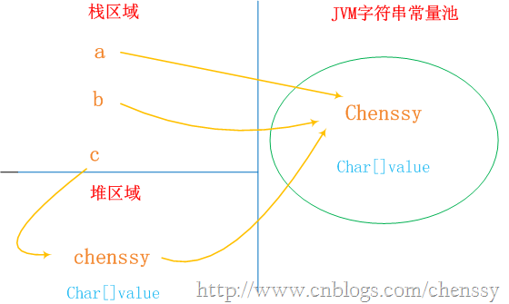

[string参考](https://www.cnblogs.com/xiaoxi/p/6036701.html)

1. Java中的String，StringBuilder，StringBuffer三者的区别
	* String	final
		* String为字符串常量(String对象一旦创建之后该对象是不可更改的)
		* 适用于少量的字符串操作的情况
	* StringBuffer	final
		* 字符串变量(对象是变量，是可以更改的)
		* StringBuffer是线程安全的(jdk1.1),会消耗一定的性能
		* 适用多线程下在字符缓冲区进行大量操作的情况
			 public synchronized StringBuffer append(String str) {  
			        super.append(str);  
			        return this;  
			    }  

	* StringBuilder	 final
		* 字符串变量(对象是变量，是可以更改的)
		* 线程不安全的
			  
	* 总结
		* 速度方面的比较：StringBuilder >  StringBuffer  >  String

2.  String str = “This is only a” + “ simple” + “ test”;
	1.  JVM : 　String str = “This is only a” + “ simple” + “test”;
		 	String s0="helloworld";
		    String s1="helloworld";
		    String s2="hello"+"world";//在编译期就被解析为一个字符串常量
		    System.out.println("===========test3============");
		    System.out.println(s0==s1); //true 可以看出s0跟s1是指向同一个对象 
		    System.out.println(s0==s2); //true 可以看出s0跟s2是指向同一个对象

3. String类是final类，也即意味着String类不能被继承，并且它的成员方法都默认为final方法
4. String类其实是通过char数组来保存字符串的
5. String对象一旦被创建就是固定不变的了，对String对象的任何改变都不影响到原对象，相关的任何change操作都会生成新的对象
6. 每当我们创建字符串常量时，JVM会首先检查字符串常量池，如果该字符串已经存在常量池中，那么就直接返回常量池中的实例引用。如果字符串不存在常量池中，就会实例化该字符串并且将其放到常量池中。由于String字符串的不可变性我们可以十分肯定常量池中一定不存在两个相同的字符串
7. 常量池
	1. 静态常量池
		* *.class文件中的常量池，class文件中的常量池不仅仅包含字符串(数字)字面量，还包含类、方法的信息，占用class文件绝大部分空间
	2. 运行时常量池
		* jvm虚拟机在完成类装载操作后，将class文件中的常量池载入到内存中，并保存在方法区中，我们常说的常量池，就是指方法区中的运行时常量池

8. string 内存()
		String a = "chenssy";//编译器确定
		String b = "chenssy";
		System.out.println(a==b);//true
		String c = new String("chenssy");//String str3=str1+str2是在运行时刻才能知道的。new对象也是
		String d=new String("chenssy");
		System.out.println(str3==str4);//false

		new关键字一定会产生一个对象chenssy（注意这个chenssy和上面的chenssy不同），同时这个对象是存储在堆中。所以上面应该产生了两个对象：保存在栈中的c和保存堆中chenssy。但是在Java中根本就不存在两个完全一模一样的字符串对象。故堆中的chenssy应该是引用字符串常量池中chenssy。所以c、chenssy、池chenssy的关系应该是：c--->chenssy--->池chenssy。

		String c = new String("chenssy");//JVM首先在字符串池中查找有没有"chenssy"这个字符串对象,中创建一个字符串对象，然后将堆中的这个对象的地址返回赋给引用str3
		String d=new String("chenssy");
		System.out.println(str3==str4);//false

