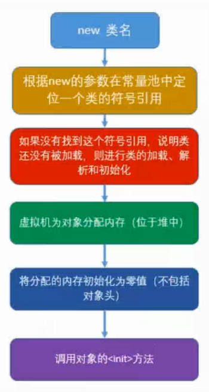

1. 1
2. 课程内容
	1. 了解历史
	2. 内存结果
	3. 垃圾回收机制
	4. 性能监控工具
	5. 性能调优案例实战
	6. 认识类的文件结果
	7. 类加载机制		类加载器
	8. 字节码执行引擎
	9. 虚拟机编译及运行时优化
	10. java线程高级 

3. jdk,jre,jvm
	1. [文档](https://docs.oracle.com/javase/8/docs/)
	2. jdk包含jre  ,jre包含 jvm
	3. jre = jvm + javase + deployment
	4. deployment(applet) 不常用
	4. 字节码,运行在jvm上	

	
	1. RIA 富互联网应用 Rich Internet Applications
		1. 最初,网络原因 c/s 客户端应用
		2. 后来,网络提升迁移到浏览器 b/s ,
		3. 现在,ria , flash,javaFx类似swing
		
4. 内存溢出问题 分析解决
	1. java.lang.OutofMeonryError : java heap space
	2. 堆内存快照
		1. run  configuration -> 切换tab arguments  
		2. VM arguments 输入
			* -XX:+HeapDumpOnOutOfMemeryError -Xms20m -Xmx20m
				* Xms20m
				* Xmx20m
		3. 运行,生成dump文件 到当前项目文件下面, java_pid11.hprof
		4. [查看工具eclipse mat MemoryAnalyzer ](https://www.eclipse.org/mat/downloads.php)
		5. 打开工具, File->Open Heep Dump

	```
	while(true){
	list.add(new Demo());
	}
	```
5. jvm 可视化监控工具
	1. jdk->bin->jconsole(实际是 lib/tools.jar)
		1. 显示所有java进程  , jps 显示出来的
	2. jvm内存 五大块 之一  堆内存
		1. 堆内存
			1. 新生代  younger generation
				1. Eden Space  (gc最喜光顾的地方)	new Object
				2. Survivor Space1 存活				
				3. Survivor Space2
			2. 老年代  old	generation
			3. 永久代
6. 杂谈
	
7. java发展历史
	https://www.cnblogs.com/guoqingyan/p/5667064.html
	
	1. Java 之父 James Gosling
	2. 最开始 oak 嵌入式系统语言,“Oak”（橡树），以他的办公室外的树而命名。 

	1. 1995.5 oak -> java1.0 write once run anywhere
	2. 1996.1 发布jdk1.0 jvm sun classic vm (被淘汰)
	3. 1996.9 首届javaOne大会
	4. 1997.2 jdk1.1 内部类 反射 jar文件格式 jdbc rmi
	5. 1999.6 j2 se,me,ee    Hotspot vm
	6. 2000.5 jdk1.3 timer , java2d
	7. 2002.2 jdk1.4 struts.hibernate,spring1.x
		1. 正则,Nio,日志,xml
	8. 2004.9 jdk1.5 tiger 自动装箱拆箱,泛型,注解,枚举,可变参数,增强for,spring2.x
	9. 2006 jdk1.6 java se,me,ee -> jdk6
		1. 提供脚本语言
		2. 提供编译api以及 http服务器api
		3. 
	10. 2009 jdk1.7 Jigsaw OSGI  oracle 收购 sun
	11. 2011 javase 1.7
	12. 2014 javase 1.8

8. 历史
	1. 2009 jdk1.7
	2. 2011 javase 1.7

9. java技术体系
	1. java程序设计语言
	2. 各硬件平台的java虚拟机
	3. Class文件格式
	4. Java Api
	5. 第三方java类库
		
	1. code java,c# ->不同 编译器[n]->class字节码->不同 jvm[n]

	1. java se standard  edition
	2. java me mobile edition
	3. java ee 

10. jdk8 新特性
	* 接口默认方法 和 静态方法
	* Lambda 表达式 和 函数式编程
		* 替代匿名内部类
		* 可读性好
		* 集合操作大大改善
	* Date Api
	* 重复注解
	* 更好的类型推断
	* Nashorn JavaScript 
		* Meta space 代替 持久代 PermGen space 

11. lambda 表达式
	1. ()->...

12. java虚拟机 Sun Classic VM
	1. 虚拟机产品
		1. Sun Classic VM
		2. Exact VM
		3. **Sun Hotsport**(虚拟机之一)
		4. KVM kilobyte
		2. Bea JRockit
		3. IBM J9
		4. Azul VM
		5. Liquid VM
		6. Dalvik VM
		7. Microsoft JVM
	2. Sun Classic VM 
		1. 世界第一款 商用java 虚拟机	
		2. 只能是**纯解释器**的方式来执行java代码
		3. 编译器 需要外挂
13. Exact VM
	1. jdk 1.2 出现
	2. 准确式内存管理 exact memory management
		1. 虚拟机 能准确知道内存某个位置是什么类型的
		2. 引用类型 还是 值
		3. 可以准确 垃圾回收
	3. 遍历器和解释器混合工作以及两级及时编译器
	4. 只在solaris平台发布,然后被取代
14. Sun Hotsport
	1. 历史
		1. 小公司设计,后收购
	2. 优势
		1. 热点探测
		2. 计数器,找寻最有价值代码,通知编译器 已方法为单位编译
	3. 称霸武林
		1. 2007
15. KVM kilobyte
	1. 简单,轻量,高度可移植  ,运行慢
	2. 手机平台运行
16. Bea JRockit
	1. bea 2008被 oracle 收购
	2. 世界上最快的java虚拟机
	3. 专注服务器端应用
	4. 优势
		1. 垃圾收集器
		2. MissionControl服务套件
			1. 诊断内存泄漏  
17. IBM J9
	1. IBM technology for java virtual Machine = IT4J
	2. 
18. Dalvik
	1. 不是java虚拟机, 没有遵循规范,不能运行编译后的class文件
	2. 基于寄存器架构	,而不是 jvm中栈架构
	3. 执行 Dex  dalvik executable

19. Microsoft JVM
	1. 

20. Azul VM  / Liquid VM  高性能的java虚拟机
	1. Azul VM 	
		1. HotSport改进
	2. Liquid VM
		1. bea 产品
		2. 不需要 操作系统 ,自己就是一个文件操作,网络操作等功能

21.  TaoBao Vm		
	1.  更具 hotsport
	2.  对硬件要求比较高 必须inter cpu,性能高
	3.  crc32 指令 ,native本地调用 性能高
----------

22.   java 内存区域


	运行时数据区
	1. 线程共享区
		1. 方法区
			1. 存储运行时常量池
			2. 已被细腻及加载的类信息
			3. 常量
			4. 静态变量
			5. 及时编译器编译后的代码
		2. java堆 heap
			1. 对象的实例
	2. 线程独占区
		1. 虚拟机栈 stack
			1. 局部变量表
			2. 运行时数据,成为栈帧
		2. 本地方法栈
			1. jvm调用的 native方法
			2. 本地方法服务
		3. 程序计数器
			1. 记录当前线程执行到的字节码行号

23. 程序计数器  
	1. 比较小的内存空间
	2. 当前线程执行的字节码行号指示器
	3. 处于线程独占区
	4. 如果线程执行的是java方法
		1. 记录的是正在执行的虚拟机字节码指令的地址
	5. 如果线程执行的是native方法
		1. 值为 undefined
	6. 是唯一 一个 在java虚拟机规范中没有规定任何OutOfMemoryError情况的区域
		* 开发者,不需要操作,,, 是由内部维护的
	
	1. goto | const 保留字和关键字

24. java虚拟机栈
	1. 存放运行时数据,称为栈帧
	2. java虚拟机栈描述的是 **java方法执行** 的动态内存模型
	3. 栈帧
		1. 每个方法执行都会创建一个栈帧,伴随着方法从创建到执行完成
		2. 用于 存储局部变量表,操作数栈,动态链接,方法出口等
	4. 局部变量表(对象的引用)
		1. 存放编译时期可知的各种基本数据类型,引用类型,returnAddress类型
		2. 局部变量表 所需内存空间,在编译器就完成了分配
		3. 当进入一个方法时候,这个方法需要在帧分配多少内存是固定的
		4. 在方法运行期间,不会改变局部变量表的大小	
	5. 栈的大小
		1. 栈 放不下 栈帧的时候 就会 StackOverflowError
		2. 也可能有 OutOfMemoryError
25. 本地方法栈
	1. Hostsport 不区分 虚拟栈  和本地方法栈 两个区域在一块
	2.  jvm调用的 native方法
	3.  
26. 堆内存
	1. 存储对象实例
		1. 优化,并不是所有的对象实例 都分配在堆中
	2. 垃圾收集器管理的主要区域
	3. 新生代
		1. Eden  新创建的对象(GC喜欢定位)
		2. Survivor 存活区
		3. Tenured Gen 
	4. 老年代
	5. OutOfMemoryError
	6. -Xms   -Xmx
27. 方法区
	1. 存储虚拟机加载的类信息,常量(运行时常量池),静态变量,即时编译器编译后的代码等数据
		1. 类信息
			1. 类的版本
			2. 字段
			3. 方法
			4. 接口
	2. 方法区和永久代
		1. Hotsport 使用 永久代实现方法区 
		2. IBM j9 没有永久代
		3. java虚拟机 没有明确规范,两种并不等价
	3. 垃圾回收再方法区的行为
		1. 一般比较少
		2. 常量池的回收
		3. 类型卸载
	4. 异常的定义
		1. OutOfMemoryError
28. 直接内存和运行时常量池
	1. 运行时常量池(方法区)
		1. 存放 编译器生成各种自变量和符号引用
		2. StringTable HashSet 无序不可重复

```
	String a = "a"; // a 字节码常量
	String b = new String("a"); // b 堆

	System.out.println(a == b); // false
	System.out.println(a == b.intern());// true 获取常量 运行时常量
	System.out.println(a == b);// false

```
	2. OutOfMemoryError
	2. 直接内存 off-head堆外内存
		1. Nio 通道,缓存区的io方式, native函数库 直接分配**堆外内存**,DirectBuffer作为内存的引用操作
		2. 不受java虚拟机内存的制约,提高性能
		3. 受到物理内存制约 也会有 OutOfMemoryError
		4. 也是 jvm进程管理的内存, 但是不受GC 回收!应为它不属于 新生代也不属于 老年代
29. 对象的创建
	1. 对象分配内存
		1. 指针碰撞
			1.  java堆内存 规整(连续)
			1. free  <-useed
		2. 空闲列表
			1.  java堆内存 不规整(不连续)
			2.  free,used相互交错,不是连续
			3. 需要记录哪些使用,哪些没使用
		3.  java堆内存 规整(连续)? 由垃圾回收策略决定	
			1.  有压缩整理 -> 指针碰撞 
			2.  
	2. 线程安全性问题
		1. 锁
		2. 本地线程缓存 TLAB
	3. 初始化对象()
		1. 初始化值
	4. 执行构造方法




30. 对象的结构
	1. Header(对象头,对象元数据)
		1. 自身运行时数据(Mark word)
			1. hash值
			2. GC分代年龄
			3. 锁标识位
			4. 线程持有的锁
			5. 偏向线程id
			6. 偏向时间戳
		2. 类型指针 : 
			1. 对象指向类的元数据的指针, 虚拟机通过他确定是哪个类的实例
			2. 不是每个jvm都要保留 类型指针
	2. InstanceData
		1. 对象的有效信息
		2. Hot sport 把相同长度的变量分配到一起, Longs/Doubles
			1. 父类中的变量,可能出现在子类之前
	3. Padding
		1. 不是必然存在的,相当于占位符
		2.  Hot sport 自动内存管理系统 ,对象的起始地址必须8个字节的整数倍
		3.  头部分是8个整数倍,instance 不够的话,需要padding 填充
31. 对象的访问定位
	1. 使用句柄
		1. 栈中引用类型 指向 堆内存中句柄池
		2. 句柄池 指向 对象的堆内存区域
		3. 栈中引用地址 地址永远不变,变句柄池地址
	2. 直接指针(hot sport)
		1. 栈中引用类型 直接指向对象的堆内存区域
		2. 速度快,减少一次 寻址过程
	
	1. 到对象实例数据的指针
	2. 到对象**类型**数据的指针


----------

32. 垃圾回收
	1. 如果判断对象为垃圾对象  判定对象是否存活算法
		1. 引用计数法
		2. 可达性分析法
	2. 如何回收	
		1. 回收策略
			1. 标记-清除算法
			2. 复制算法
			3. 标记-整理算法
			4. 分代收集算法
		2. 垃圾回收器
			1. serial
			2. parnew
			3. Cms
			4. G1
	3. 何时回收
	
33.  引用计数法
	1. 在对象堆内存区域 中添加一个引用计数器
		1. 当有引用+1
		2. 引用失效-1, 对象=null
	2. -verbose:gc
	3. -xx+PrintGCDetail
	4. 容易堆内相互引用(循环引用,不能判断出是否是垃圾对象),一般不使用
34. 可达性分析法
	1. GCRoot 查找
	2. 作为GCRoot的对象(起点)
		1. 虚拟机栈(局部变量表)
		2. 方法区的类属性所引用的对象
		3. 方法区中常量所引用的对象
		4. 本地方法栈中引用的对象

35. 标记-清除算法		老年代
	1. 判断对象为垃圾对象后,标记
	2. 空间不连续,效率慢
		1. 效率问题
		2. 空间问题
36. 复制算法		新生代
	1. 解决效率问题,针对新生代
	2. 堆内存
		1. 新生代 (复制算法)
			1. Eden  新创建的对象(GC喜欢定位)
			2. Survivor 存活区
			3. Tenured Gen 
		2. 老年代
	3. 堆内存中分词两块
		1. 第一块使用 ,第二块空闲
		2. 第一块回收后,把没回收的复制到 第二块空闲的区域,顺序排序,
		3. 然后第一块清空  第一块变成空闲的,第二块变成使用的 然后循环
	4. 问题
		1. 内存区域 ,真正使用的 只有一半
			1. 堆内存划分
				1. Eden 	80% 
				2. Survivor 1
				3. Survivor 2
				4. Tenured Gen
			2. 内存担保
	
37.  标记-整理算法  分代回收算法
	1. 标记-整理算法		老年代
		1. 针对 老年代 回收
		2. 先标记,回收的对象向一端整理移动,清理掉
	2. 分代回收算法
		1. 标记整理 + 复制算法 
		2. 更具 新生代 和 老年代 采用不同的算法

38. serial收集器详解   新生代
	1. 最基本 发展最悠久的
	2. 单线程垃圾收集器 , 整个系统所有线程停止,等待垃圾回收后在执行
	3. 适合分配内存比较小的应用 桌面应用
	4. 收集新生代 内存 复制算法 
39. parnew收集器      新生代
	1. 多线程垃圾收集器 ,  整个系统所有线程停止,等待垃圾回收后在执行
	2. 收集新生代 内存 复制算法 , 提高多线程垃圾回收效率
40. paralle收集器     新生代
	1. Parallel Scavenge 
	2. 线程垃圾 垃圾收集器 
	3. 收集新生代 内存 复制算法,达到可控制的吞吐量
		1. 吞吐量: cpu用于运行用户代码的时间 与cpu消耗的总时间的比值
		2. 吞吐量 = (用户代码时间)/(用户代码时间)+(垃圾回收时间)
	4. XX:MaxGCPauseMillis 垃圾收集器停顿时间
	5. XX:CGTimeRatio		
		1. 吞吐量大小 0-100  
		2. 默认99,垃圾回收1

41. Cms 收集器         老年代
	1. concurrent Mark sweep , 标记-清除算法  老年代收集器
	2. 工作工程
		1. 初始标记  : 引用计数法/可达性分析法 , 能直接到达的
		2. 并发标记	: 
		3. 重新标记	: 并发标记,进行修正
		4. 并发清理	: 清除
	3. 有点
		1. 并发收集
		2. 低停顿的
	4. 缺点
		1. 占用大量cpu资源
		2. 无法处理浮动垃圾
		3. 出现 concurrent mode failure, 内存太小
		4. 空间碎片,不连续
42. G1最牛的垃圾回收器
	1. 历史
	2. 优势
		1. 多个cpu 并行 与并发
		2. 分代收集  region分区     remember set 表 记录对外的引用
		3. 空间整合	类似标记整理算法
		4. 可预测停顿,减少停顿 类似cms
			1. 引用类型 写操作 ,产生write burring 暂时中断写操作
			2. 检查 reference  引用对象 是否处于不同的 region中
			3. 如果在 不同的 region,记录到  remember set 表
			4. 垃圾回收 GCRoot 加入 remember set 表, 保证不全局扫描
	3. 步骤
		1. 初始标记
		2. 并发标记
		3. 最终标记
		4. 筛选回收

	4. cms比较


43. 内存分配
	1. 优先分配eden
	2. 如果有大对象 直接分配到老年代
	3. 长期存活的对象分配到老年代
	4. 空间分配担保
		1. 如果eden空间 不够,需要到老年代 借取
	5. 动态年龄判断

44. Eden区域
	1.  -verbose:gc -XX:+PrintGCDetails -XX:+UserSerialGC
		1. paralle PSYoungGen 新生代  (server 客户端  默认)
		2. serail  def new generation 新生代(client 客户端 默认)
	2. -Xms20M -Xmx20m 堆内存 
	3. -Xmn10m  新生代参数
	4. -XX:SurvivorRatio=8   eden区域内存8m
45. 大对象直接进入老年代
	1. -XX:PretenureSizeThreshold=7m   			//大对象 阈值  以前使用字节
	2. 大对象 eden 回收次数 很高,如果大对象放入 eden 每次要移动,性能不好
46. 长期存活的对象 将进入老年代
	1. -XX:MaxTenuringThreshold 
	2. eden对象,gc复制算法 复制到survivir区域, 对象 age++, 下一次回收 继续+1
	3. 达到 老年阈值(默认15), 就放入 老年区
	4. 
47. 空间分配担保
	1. -XX:+HandlePromotionFailure
		1. -XX:-HandlePromotionFailure	关闭
		2. -XX:+HandlePromotionFailure	开启
	2. 默认开启,上线参数 关闭 , 不够报异常
	3. 步骤
		1. 衡量 老年代 能否分配
		2. 检查 参数是否开启
		3. 
48. 逃逸分析与栈上分配
	1. 栈上分配
		1. 堆 不是 对象分配内存 的唯一选择
		2. 栈上可以分配对象内存
			1. 方法执行,栈帧进栈  方法结局,栈帧出栈
			2. 根据方法执行 分配空间 和 释放空间
	2. 逃逸分析
		1. 实现栈上分配的方法
		2. 筛选出没有逃逸的对象,然后没有逃逸的对象在栈上分配
		3. 分析对象的作用域,
			1. 如果 对象 定义在方法体内,访问权限只限在 方法体内, 这个对象没有逃逸,可以分配到栈上面
			2. 如果 方法体内 对象 , 被外部成员 引用 ,发生逃逸
				1. 方法里面, 返回 xx对象
				2. 方法里面, 为 对象,类 成员属性复制
					1. this.t = new Object();
				3. 方法里面, 引用 对象,类 成员属性
					1. Object obj = this.t;


java虚拟机-> 虚拟机内存结构->对象(创建,内存分配,访问定位)->对象的回收gc和分配

----------

----------

49. 虚拟机工具
	1. jdk/bin
		1. Jps
		2. Jstat
		3. Jinfo
		4. Jmap
		5. Jhat
		6. Jstack
		7. JConsole
50. jps
	1. java  process status
	2. pid 本地虚拟机 唯一id local virtual machine id  lvmid
	3. jps -l   //显示 主类
	4. jps -m   //主类 程序参数 program arguments
	5. jpd -v	//主类 jvm参数 jvm arguments
51. Jstat
	1. 监控虚拟机 状态运行信息
		1. 类装载
		2. 内存
		3. 垃圾收集
		4. jit编译器的信息
	2. jstat pid 
		1. 需要知道 pid
	3. jstat -gcutil pid	// 查看gc
	4. jstat -gcutil pid  间隔  监控次数 	// 查看gc
	5. 元空间
		1. 本质和永久代类似,都是对jvm规范中方法区的实现
		2. 不过元空间与永久代之间最大的区别在于: 
			1. 元空间并不在虚拟机中
			2. 而是在使用本地内
			3. 默认情况下,元空间的大小仅售本地内存限制
		4. 取代 永久代的
52. Jinfo
	1. 实时查看和调整虚拟机的各项参数
	2. jinfo -flag 参数名 pid
		1. jinfo -flag UseSerialGC 8888
			1. -XX:-UseSerialGC		//- 没有
			2. -XX:  option
			3. + -   启用/不启用 存在/不存在
			4. 参数
		2. jinfo -flag UserG1GC8888
	3. 

53. Jmap
	1. 堆存储快照
	2. Jmap option pid
	3. option
		1. -heap
		2. -dump
	4. jmap -dump:format=b,file=c:/a.heap pid		//导出堆信息
		-XX:+HeapDumpOnOutOfMemoryError
	5. jmap -histo  pid		//类和实例数量
54. jhat
	1. jvm heap analysis tool
	2. 需要指定 dump文件
	3. jhat c:/a.heap 
	4. 内存 cpu占用很高 ,web服务器 端口7000
	5. oql 对象查询语言 动态查询,排序等
55. jstack
	1. 介绍
		1. 生成虚拟机中的线程快照
		2. 线程快照: 当前虚拟机 每一条线程,正在执行的方法 堆,栈集合
		3. 定位线程 长时间 停顿原因
	2. 参数
		1. -l	除了堆栈信息 还有 锁信息
		2. -F	强制打印
		3. -m	java方法栈和本地方法栈
	3. jstack -l pid
	4. Map<Thread,StackTraceElement[]> a= Thread.getAllStackTraces();

56. jconsole	
	1. 图形化监控
		1. 内存
		2. 线程
		3. vm
		4. MBean

57. jconsole 线程
	1. 类似jstack
	2. 
58. jconsole 死锁
	1. 有个按钮,检测死锁
	2. 
59. visual vm 
	1. sun公司 基于 netbeans开发
	2. 最强大的工具 ,all in one
	3. [下载](https://visualvm.github.io/)
	4. 可以安装插件
	5.


----------

----------

60. 性能调优
	1. 知识
	2. 工具
	3. 数据
	4. 经验
61. 案例1
	1. 职员考核系统
		1. 计算出来后放入redis中缓存,提供查看下载
		2. 用户销售下载
	3. 时不时卡顿,处理思路
		1. 优化sql,建立索引(不行)
			1. 不是访问**一个功能**时候慢
			2. 不定期的时间端 出现卡顿
		2. 机房管理是否在维护(不行)
		3. 监控jvm工具 ,  调大jvm堆内存
			1. 监控线程,没问题(不行)
			2. 监控内存,经常发生 FullGC 20-30秒
				1. 产看年度排行的时候
				1. 内存分配
					1. 大对象放入老年代中
	4. 解决方案
		1. nginx,部署多个web容器 , 堆内存改小了		
		
62. 案例2	
	1. 数据抓取系统,抓取网站上的数据,分享到不同网站上去
	2. 不定期内存溢出
		1. 堆内存加大
		2. 堆内存信息,没有错误信息
	3. 处理思路
		1. 更换机器,提高配置
	4. 总结经验
		1. 捕获信息,网络请求,使用nio,申请了很多堆外内存

63. 案例3
	1. 物联网引用,h5客户端 长连接,jvm崩溃
	2. connect reset  大量任务发送到服务器,导致信息不对等
	3. 添加 消息队列,挤压数据 ,,, 生产者 消费者

64. 前半部分内容整理回顾
	1. java虚拟机运行时区域
		1. 线程独占区
			1. 虚拟机栈
			2. 程序计数器
			3. 本地方法栈
		2. 线程共享区
			1. 堆,方法区
	2. 对象的创建和回收
		1. 垃圾对象的标记算法
			1. 引用计数法
			2. 可达性分析法
		2. gc 垃圾收集算法
			1.  标记清除
			2.  复制		新生代
			3.  标记整理 老年代
			4.  分代算法 
		1. 垃圾收集器
			1. serail
			2. parnew
			2. paralle
			3. cms
			4. g1
	 
		1. 对象的创建
			1. 对象内存分配原则
				1. 对象在eden分配
				2. 大对象直接分配到老年代
				3. 长期存活分配到老年代
				4. 分配担保
			2. 逃逸分离 栈上分配 
		1. jvm 工具	
			1. 命令行工具 jps jstate jinfo jmap jhat jstack
			2. 图形化	jconsole visualvm

----------

----------

65. class字节码文件简介和发展史
	1. javac xx.java
	2. java xx   // 不需要添加 .class后缀
	3. 二进制/十六进制查看器 binary viewer
		CA FE BA BE		一个16进制4位 CA 8位一个字节,4个字节
	4. 
		
66. class文件结构
	1. 一组以 8位字节为基础单位的二进制流,各个数据项目严格按照顺序紧凑的排列在class文件中
	2. 中间没有添加任何分隔符,整个class文件中存储的内容几乎全部是程序运行的必要数据,没有空隙
	3. 当遇到9位字节以上的控件数据项时,则会按照高位在前的方式分割成若干个8位字节进行存储
	4. 两种数据类型,分别是 无符号数 和 表

	1. 魔数
	2. class文件版本
	3. 常量池
	4. 访问标志
	5. 类索引,父类索引,接口索引集合
	6. 字段表集合
	7. 方法表集合
	8. 属性表集合

67. class文件的设计理念以及意义
	1.  运行在jvm上语言	Clojure groovy hruby jython scale
	2.  
68. 1
69. 1
70. 1
71. 1
72. 1
73. 1
74. 1
75. 1
76. 


