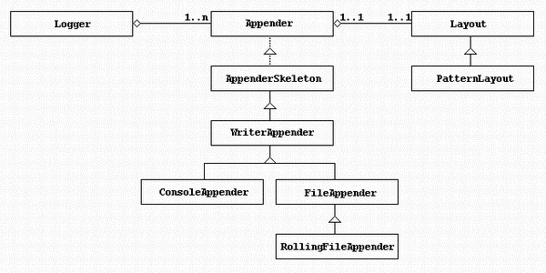

# 大纲 #

超链接： [官网](http://spring.io/)

图片  ： 

表格：

| ..	| ....	| ....	|
| ---	| :---: | :----:|
| ..	| .. 	| ..	|
| ..	| ..   	| ..	|
| ..	| ..   	| ..	|
# 插件 #
（1）插件可以分别安装到多个自定义的目录中，一个自定义目录中可以安装多个插件。
（2）Link文件的文件名及扩展名可以任意取（使用.txt、.link都无关紧要），只要保证link文件中path路径使用“/”分隔 。
（3）Links目录也可以有多个link文件 ，每个link文件中的path参数都将生效；一个link文件中可以有多个path参数。
（4）插件可以使用相对路径。如果插件目录建立在Eclipse安装目录下，path参数后的路径可以简写为“path=myplugins/插件解压文件夹” 。

## properties中文插件 ##
1. propertyEditor
2. 默认打开方式->window->Editors->File Associations->右边 *.properties->editor
[下载](http://sourceforge.jp/projects/propedit/downloads/40156/jp.gr.java_conf.ussiy.app.propedit_5.3.3.zip/)

----------

----------

----------
# 日志 #
1. 最普通的做法就是在代码中嵌入许多的打印语句
	1. System.out.println("打印,调试");
2. 如果项目上线
	* 不想输出到控制台,影响速度,慢!
	* 想输出到文件里面
3. 构造一个日**志操作类**来封装此类操作,提供一个开关

# 日志种类 #
	*种类:
		1. Commons-logging : apache最早提供的日志的门面接口。避免和具体的日志方案直接耦合。类似于JDBC 的api 接口，具体的的JDBC driver 实现由各数据库提供商实现。通过统一接口解耦，不过其内部也实现了一些简单日志方案。
		2. Log4j : 经典的一种日志解决方案。内部把日志系统抽象封装成Logger 、appender 、pattern 等实现。我们可以通过配置文件轻松的实现日志系统的管理和多样化配置。
		3. LOGBack:Logback是由log4j创始人设计的又一个开源日记组件.LOGBack 作为一个通用可靠、快速灵活的日志框架，将作为Log4j 的替代和SLF4J 组成新的日志系统的完整实现
		4. Slf4j : 全称为Simple Logging Facade for JAVA：java简单日志门面。 是对不同日志框架提供的一个门面封装。可以在部署的时候不修改任何配置即可接入一种日志实现方案。
	*两大派系
		Commons-logging+log4j
		Slf4j+Logback

# log4j #
1. Apache为我们提供了一个强有力的日志操作包Log4j
	[官网](http://logging.apache.org/log4j/)
	[1.2](http://logging.apache.org/log4j/1.2/download.html)
## 案例 ##
	配置文件:
		log4j.rootLogger=debug,appender1
		log4j.appender.appender1=org.apache.log4j.ConsoleAppender
		log4j.appender.appender1.layout=org.apache.log4j.TTCCLayout
	
		private static Logger logger = Logger.getLogger(Log4jTest.class);
## 组成 ##

	1. Logger:日志输出器,供程序员输出日志信息
	2. Appender:输出地dest,指定输出地方和输出格式
		1. ConsoleAppender - 目的地为控制台的Appender
		2. FileAppender - 目的地为文件的Appender 
		3. RollingFileAppender - 目的地为大小受限的文件的Appender
	3. Layout:日志格式化器，用来把程序员的logging request格式化成字符串
		1. PatternLayout - 用指定的pattern格式化logging request的Layout
	
## 配置文件 ##
1. 根Logger
	*格式
		log4j.rootLogger = level,appenderName1,appenderName2,...,
	*levle:日志级别(优先级)
		1. 优先级:ALL < DEBUG < INFO <WARN < ERROR < FATAL < OFF
		2. 当级别选择DEBUG时,后面大于他的都会输出
		3. off关闭
		4. 级别不区分大小写
		
2. Appender:输出目的地
	* 格式	
		log4j.appender.appenderName = Log4j提供的appender类
		log4j.appender.appenderName.属性名 = 属性值
		....
		log4j.appender.appenderName.属性名 = 属性值
	* Log4j提供的appender类
		org.apache.log4j.ConsoleAppender（控制台），
			 *属性:
				Threshold=WARN:指定日志消息的输出最低层次。
				ImmediateFlush=true:默认值是true,意谓着所有的消息都会被立即输出。
				Target=System.err：默认情况下是：System.out,指定输出控制台
		org.apache.log4j.FileAppender（文件），
			*属性:
				Threshold=WARN:指定日志消息的输出最低层次。
				ImmediateFlush=true:默认值是true,意谓着所有的消息都会被立即输出。
				File=mylog.txt:指定消息输出到mylog.txt文件。
				Append=false:默认值是true,即将消息增加到指定文件中，false指将消息覆盖指定的文件内容。
		org.apache.log4j.DailyRollingFileAppender（每天产生一个日志文件），
			*属性:
				Threshold=WARN:指定日志消息的输出最低层次。
				ImmediateFlush=true:默认值是true,意谓着所有的消息都会被立即输出。
				File=mylog.txt:指定消息输出到mylog.txt文件。
				Append=false:默认值是true,即将消息增加到指定文件中，false指将消息覆盖指定的文件内容。
				DatePattern=''.''yyyy-ww:每周滚动一次文件，即每周产生一个新的文件。
				当然也可以指定按月、周、天、时和分。即对应的格式如下：
					1)''.''yyyy-MM: 每月
					2)''.''yyyy-ww: 每周
					3)''.''yyyy-MM-dd: 每天
					4)''.''yyyy-MM-dd-a: 每天两次
					5)''.''yyyy-MM-dd-HH: 每小时
					6)''.''yyyy-MM-dd-HH-mm: 每分钟
		org.apache.log4j.RollingFileAppender（文件大小到达指定尺寸的时候产生一个新的文件），
			*属性:
			Threshold=WARN:指定日志消息的输出最低层次。
			ImmediateFlush=true:默认值是true,意谓着所有的消息都会被立即输出。
			File=mylog.txt:指定消息输出到mylog.txt文件。
			Append=false:默认值是true,即将消息增加到指定文件中，false指将消息覆盖指定的文件内容。
			MaxFileSize=100KB: 后缀可以是KB, MB 或者是 GB. 在日志文件到达该大小时，将会自动滚动，即将原来的内容移到mylog.log.1文件。
			MaxBackupIndex=2:指定可以产生的滚动文件的最大数。
		org.apache.log4j.WriterAppender（将日志信息以流格式发送到任意指定的地方）

3. layout布局:输出日志的格式
	*格式
		log4j.appender.appenderName.layout = Log4j提供的layout类
		log4j.appender.appenderName.layout.属性 = 值
		log4j.appender.appenderName.layout.属性 = 值
	*Log4j提供的layout类
		org.apache.log4j.HTMLLayout（以HTML表格形式布局），
			*属性:
				LocationInfo=true:默认值是false,输出java文件名称和行号
				Title=my app file: 默认值是 Log4J Log Messages.
		org.apache.log4j.PatternLayout（可以灵活地指定布局模式），
			*属性:
				ConversionPattern=%m%n :指定怎样格式化指定的消息。
		org.apache.log4j.SimpleLayout（包含日志信息的级别和信息字符串），
			*属性:
		org.apache.log4j.TTCCLayout（包含日志产生的时间、线程、类别等等信息）
			*属性:

	*eg:
		og4j.appender.A1.layout.ConversionPattern=%-4r %-5p %d{yyyy-MM-dd HH:mm:ssS} %c %m%n

4. 符号
	这里需要说明的就是日志信息格式中几个符号所代表的含义：
		-X号: X信息输出时左对齐；
		%p: 输出日志信息优先级，即DEBUG，INFO，WARN，ERROR，FATAL,
		%d: 输出日志时间点的日期或时间，默认格式为ISO8601，也可以在其后指定格式，
			比如：%d{yyy MMM dd HH:mm:ss,SSS}，输出类似：2002年10月18日 22：10：28，921
		%r: 输出自应用启动到输出该log信息耗费的毫秒数
		%c: 输出日志信息所属的类目，通常就是所在类的全名
		%t: 输出产生该日志事件的线程名
		%l: 输出日志事件的发生位置，相当于%C.%M(%F:%L)的组合,包括类目名、发生的线程，以及行数。
		举例：Testlog4.main(TestLog4.java:10)
		%x: 输出和当前线程相关联的NDC(嵌套诊断环境)，尤其用到像java servlets这样的多客户多线程的应用中。
		%%: 输出一个"%"字符
		%F: 输出日志消息产生时所在的文件名称
		%L: 输出代码中的行号
		%m: 输出代码中指定的消息,产生的日志具体信息
		%n: 输出一个回车换行符，Windows平台为"\r\n"，Unix平台为"\n"输出日志信息换行
	
	宽度:	
		1)%20c：指定输出category的名称，最小的宽度是20，如果category的名称小于20的话，默认的情况下右对齐。
		2)%-20c:指定输出category的名称，最小的宽度是20，如果category的名称小于20的话，"-"号指定左对齐。
		3)%.30c:指定输出category的名称，最大的宽度是30，如果category的名称大于30的话，就会将左边多出的字符截掉，但小于30的话也不会有空格。
		4)%20.30c:如果category的名称小于20就补空格，并且右对齐，如果其名称长于30字符，就从左边交远销出的字符截掉

5. 使用
	private static Logger logger = Logger.getLogger(Log4jTest.class);

# 任务 #
1. 用FileAppender,将日志,输出到logs文件夹中
2. 格式: 日志级别 类全名 当前时间 具体信息