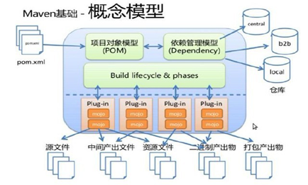
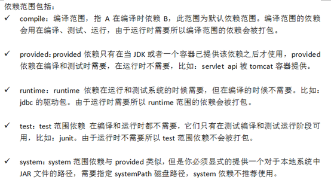
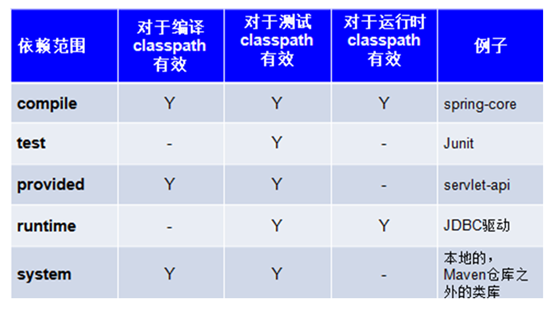
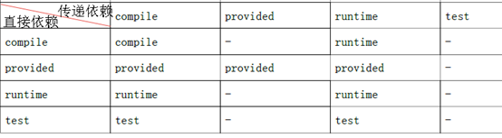

# 大纲 #

超链接： [官网](http://spring.io/)

图片  ： 

表格：

| ..	| ....	| ....	|
| ---	| :---: | :----:|
| ..	| .. 	| ..	|
| ..	| ..   	| ..	|
| ..	| ..   	| ..	|

----------

----------

----------
# 大纲 #
1. maven介绍(好处)
2. maven安装
3. maven配置和仓库配置
4. maven创建web项目
5. maven标准目录
6. maven pom配置
 
# maven介绍 #

## 传统项目 ##
1. 传统java项目,每个工程都自己携带自己依赖的jar,导致电脑上很多重复的jar,浪费资源
2. 传统java项目,项目打包发布不方便

## 坐标 ##
1. xx小区 几栋  1201			找人
2. 公司   项目   版本			找jar包

## maven ##
	1. 什么是maven
		* Maven是Apache下的一个纯java开发的开源项目
		* 项目管理工具
		* 核心:对java项目进行构建、依赖管理
	2. 依赖管理
		* 什么是依赖
			一个java项目可能要使用一些第三方的jar包才可以运行，这个java项目依赖了这些第三方的jar包
		* 传统的依赖管理方式: 
			* 传统的是手动拷贝到lib文件下
				1、没有对jar包的版本统一管理，容易导致版本冲突。
				2、从网上找jar包非常不方便，有些jar找不到。
				3、jar包添加到工程中导致工程过大。
		* maven的依赖管理方式
			* 只需要告诉maven,我需要xx,提供地址(坐标),自动添加依赖,自动下载
	3. 项目构建
		* 编写源代码到编译、测试、打包、部署、运行的过程
		* 传统打包
			* jar -cvf xx.war ./*
		*maven指令
			* 版本:mvn version
			* 运行:mvn tomcat:run
			* 打包:mvn package

# maven安装 #
1. 下载
	1. 百度maven
	2. 点击[官网](http://maven.apache.org/)
	3. 点击download->[官网](http://maven.apache.org/download.cgi)
	4. 找到Files
		下载:
			* apache-maven-3.5.0-bin.zip
			* apache-maven-3.5.0-src.zip
	5. bin.zip解压到没有中文没有空格的目录
	6. maven结构
		1. bin:二进制文件,放了一些指令;eg:mvn tomcat:run
		2. boot:boot引导,有一些引导程序
		3. conf:配置文件(☆☆☆)	
			* settins.xml :核心配置
		4. lib:maven开源项目依赖的jar包
2. 配置环境变量
	1. jdk1.7以上
	2. 配置JAVA_HOME
	3. path配置JAVA_HOME/bin
	4. 配置MAVEN_HOME    value:你的maven安装的路径（bin目录之前一级目录）
	5. path配置MAVEN_HOME/bin
	6. 测试:cmd里面,执行mvn -v
3. 	仓库配置
	1. maven安装路径下\conf\settings.xml文件中
	2. 本地仓库:localRepository
				 <localRepository>F:/develpment/apache-maven/repository</localRepository>
	3. 中央仓库 mirrors 下面
				<mirror>  
			     <id>repo2</id>  
			     <mirrorOf>central</mirrorOf>  
			     <name>Human Readable Name for this Mirror.</name>  
			      <url>http://repo1.maven.org/maven2</url>  
			    </mirror> 

		
4. 创建一个简单的maven项目

5. maven项目构建指令
	1. 清理:
		* mvn clear
		* 删除target目录的内容
	2. 编译:
		* mvn compile
		* 将src/main/java下的文件编译为class文件输出到target目录下
	3. 测试:
		* mvn test
		* 执行src/test/java下单元测试类
	4. 打包
		* mvn package
		* 将web工程打成war包
	5. 安装
		* mvn install
		* 将maven打成jar包或war包发布到本地仓库
	6. 运行
		* mvn  tomcat:run
	注意:
		* maven-*-plugin :就是别人写的代码,打包成的jar
		* 当后面的命令执行时，前面的操作过程也都会自动执行

1. 自带了插件,也可以早pom里面要求加入某些插件
2. 生命周期
		maven对项目构建过程分为三套相互独立的生命周期，请注意这里说的是“三套”，而且“相互独立”，这三套生命周期分别是： 
			Clean Lifecycle 在进行真正的构建之前进行一些清理工作。 
			Default Lifecycle 构建的核心部分，编译，测试，打包，部署等等。
			Site Lifecycle 生成项目报告，站点，发布站点。

----------

----------

----------
1. 指令太麻烦,使用工具

# maven和eclipse关联 #
1. (前期配置)
		1. m2e插件(前期配置)
			* 高版本自带
		2. 绑定自己下载的maven
			* eclipse->菜单-> window->preferences->搜索框输入maven
			* maven下面->点击installations->点击add->找到安装位置
		3. 绑定自己下载的maven中的设置文件(setting.xml)
			*  eclipse->菜单-> window->preferences->搜索框输入maven
			*  maven下面->User Settings-> user settings
		4. 建立索引
			* Window-show view -other - maven Repositories

2. 创建web的maven项目
		* 右键new-other-maven project->勾选 create a simple project
		* 标识
			* groupId:  组织名           南华大学
			* artifactId:项目名 			计算机
			* version:版本 				001号
		* 目录
			* src	
				* main
					* java    :java代码
					* resource:配置文件夹
					* webapps :等价于普通项目的WebContent
				* test
					* java
					* resource
3. 报错
		1. 代开pom.xml->web.xml is missing and <failOnMissingWebXml> is set to true
			1. webapps下创建WEB-INF文件夹
			2. WEB-INF文件夹创建web.xml
			3. 拷贝web.xml头部约束
		2. 新建一个servlet
			1. HttpServletRequest cannot be resolved to a type
				* 没有servlet.jar
				* 没有jsp.jar
			2. pom文件 选择 dependencies->点击add
			3. servlet-api
			4. jsp-api
			5. jstl
			6. standard
		
6. 找坐标的方式
	http://search.maven.org/
	http://mvnrepository.com/
	导入junit

# POM #
1. 添加依赖
2. 依赖范围 
3. JRE1.5 升 1.8和编码问题

	<build>
		<plugins>

			<plugin>
				<groupId>org.codehaus.mojo</groupId>
				<artifactId>tomcat-maven-plugin</artifactId>
				<version>1.1</version>
				<configuration>
					<!-- 可以灵活配置工程路径 -->
					<path>/ssh</path>
					<!-- 可以灵活配置端口号 -->
					<port>8080</port>
				</configuration>
			</plugin>

			<plugin>
				<groupId>org.codehaus.mojo</groupId>
				<artifactId>tomcat-maven-plugin</artifactId>
				<version>1.1</version>
				<configuration>
					<!-- 可以灵活配置工程路径 -->
					<path>/Hx_School</path>
					<!-- 可以灵活配置端口号 -->
					<port>80</port>
				</configuration>
			</plugin>

		</plugins>
	</build>

----------

# 依赖传递 #

----------

# maven 整合spring 框架 #
1. 导包
	* dao
		* mysql
		* c3p0
		* spring-jdbc
	* service
		* spring-core
		* beans
		* context
		* expression
		* aop
		* aopalliance
		* aspectjweaver
		* aspects
	* web
		* spring-web
		* servlet-api  2.5
		* jsp-api	2.1
		* jstl-api 1.2
		* standard	1.1.2
2. 配置文件
	application.xml
				<context:property-placeholder location="classpath:jdbc.properties"/>
				<!-- 开启扫描  -->
				<context:component-scan base-package="com.huaxin.spring.dao.impl"></context:component-scan>
				<!-- service层开启注解 -->
				<context:component-scan base-package="com.huaxin.spring.service.impl"></context:component-scan>
				<!-- 自动代理注解 -->
				<aop:aspectj-autoproxy ></aop:aspectj-autoproxy>
				<bean class="com.huaxin.spring.aop.MyAspectLog"></bean>
	
	jdbc.properties
			jdbc.url = jdbc:mysql:///mytest
			jdbc.username = root
			jdbc.password = 1234
			jdbc.driver = com.mysql.jdbc.Driver
	
	log4j.properties
			log4j.rootLogger= wARn,appender1
			#ConsoleAppender  appender1 =new ConsoleAppender ();
			log4j.appender.appender1 = org.apache.log4j.ConsoleAppender
			log4j.appender.appender1.Target = System.err
			#  appender1.setLayout(new  PatternLayout());
			log4j.appender.appender1.layout = org.apache.log4j.PatternLayout
			log4j.appender.appender1.layout.ConversionPattern=%-4r %-5p %d{yyyy-MM-dd HH:mm:ss SSS} %c %m%n

	web.xml
		  <!-- needed for ContextLoaderListener -->
			<context-param>
				<param-name>contextConfigLocation</param-name>
				<param-value>classpath:applicationContext.xml</param-value>
			</context-param>
			<!-- Bootstraps the root web application context before servlet initialization -->
			<listener>
				<listener-class>org.springframework.web.context.ContextLoaderListener</listener-class>
			</listener>

	  
		  <filter>
		  	<filter-name>CharacterEncodingFilter</filter-name>
		  	<filter-class>org.springframework.web.filter.CharacterEncodingFilter</filter-class>
		  	<init-param>
		  		<param-name>encoding</param-name>
		  		<param-value>utf-8</param-value>
		  	</init-param>
		  </filter>
		  <filter-mapping>
		  	<filter-name>CharacterEncodingFilter</filter-name>
		  	<url-pattern>/*</url-pattern>
		  </filter-mapping>

4.  < properties>
* 属性,一般本号提取
* 取值:${xx}
	  <!-- 集中定义依赖版本号 -->
	  <properties>
	  	<spring.vsersion>4.3.11.RELEASE</spring.vsersion>
	  </properties>

	在使用坐标时，对于同一个框架，引入多次时，它的版本信息就会多次出现，所以
	可以借用常量的思想，将这些版本号提取出来，在需要用到的时候，直接写版本的常量名称就可以了。

5. jar冲突
	1. A依赖 xx.1.0.jar
	2. B依赖 xx.2.0.jar
	3. 排除
					<exclusions>
						<exclusion>
							<groupId>org.springframework</groupId>
							<artifactId>spring-context</artifactId>
						</exclusion>
					</exclusions>

