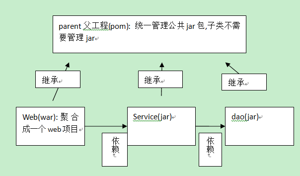

# 大纲 #

超链接： [官网](http://spring.io/)

图片  ： 

表格：

| ..	| ....	| ....	|
| ---	| :---: | :----:|
| ..	| .. 	| ..	|
| ..	| ..   	| ..	|
| ..	| ..   	| ..	|

----------

----------

----------
# 父子工程-工程拆分 #

1. 为了达到降低耦合度,web程序,更具自己的模块(层次)拆分
	* 原来项目拆分成三个子项目:
		* dao
		* service
		* web
2. 为了把子项目组成一个完成项目
	* 一般加入一个父工程
	* 项目:
		* maven project : 父工程
		* maven module	: web,service,dao

## 拆分步骤 ##
1. 创建maven project(父工程) : 
	* 打包方式选择:pom
	* 父工程编码
	* 统一管理公共jar包(工程与工程继承思想)

2. 创建子工程:Maven module(子模块dao层):
	* 选择父工程
	* 下一步:打包jar
	* 完成
		* 在父工程中多出
			  <modules>
			  	<module>Maven_Dao</module>
			  </modules>
		* 父工程每加一个子,都会加入
		* 父工程中多处一个文件夹
		* 
		* 在子工程中多处
			  <parent>
			    <groupId>com.huaxin</groupId>
			    <artifactId>Maven_Parent</artifactId>
			    <version>0.0.1-SNAPSHOT</version>
			  </parent>
		* 每个子模块都有父模块
3. 测试
	* 在父类pom添加,jdk版本插件
		<build>
			<plugins>
				<plugin>
					<groupId>org.apache.maven.plugins</groupId>
					<artifactId>maven-compiler-plugin</artifactId>
					<configuration>
						<source>1.8</source>
						<target>1.8</target>
						<encoding>UTF-8</encoding>
					</configuration>
				</plugin>
			</plugins>
		</build>
		
4. 重复创建子模块步骤:
	* service(jar)
		* 需要添加dao依赖(添加jar一样)
	* web(war)
		* 需要添加service依赖(添加jar一样)
	

classpath*:applicationContext-dao.xml
classpath*:applicationContext-service.xml

# 私服  nexus #
[nexus下载](http://www.sonatype.org/nexus/archived/)
1. 下载：nexus-bundle.zip
2. 解压，进入指定的目录
	* bin
		* nexus.bat
	* config
3. cmd进入bin目录，执行nexus.bat install
	* 安装成功在服务中查看有nexus服务：
4. 卸载服务
	* cmd进入nexus的bin目录，执行：nexus.bat uninstall
5. 启动
	* cmd进入bin目录，执行nexus.bat start
	* 直接启动nexus服务
6. conf/nexus.properties
	application-port=8081  	# nexus的访问端口配置
7.  http://localhost:8081/nexus/
	使用Nexus 内置账户admin/admin123登陆：
8. 仓库类型
		1.hosted，宿主仓库，部署自己的jar到这个类型的仓库，包括releases和snapshot两部分，Releases公司内部发布版本仓库、 Snapshots 公司内部测试版本仓库
		2.proxy，代理仓库，用于代理远程的公共仓库，如maven中央仓库，用户连接私服，私服自动去中央仓库下载jar包或者插件。 
		3.group，仓库组，用来合并多个hosted/proxy仓库，通常我们配置自己的maven连接仓库组。
		4.virtual(虚拟)：兼容Maven1 版本的jar或者插件 
		nexus仓库默认在sonatype-work目录中：