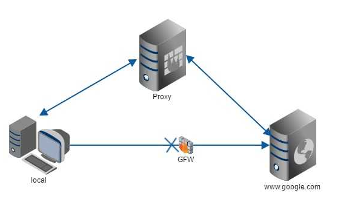
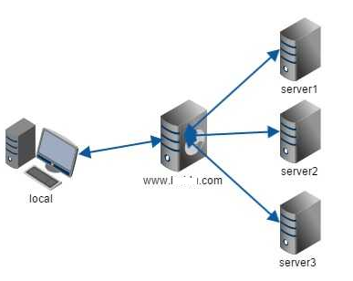
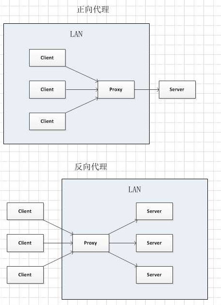
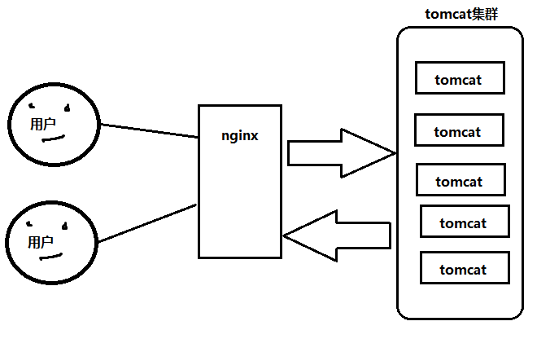
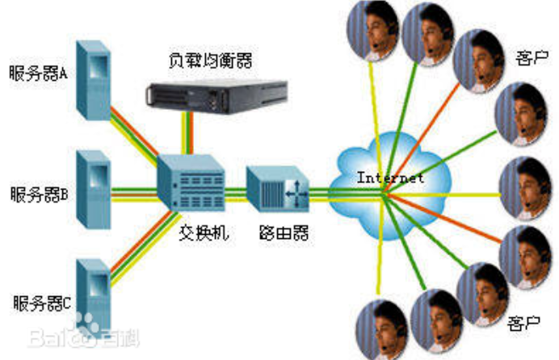

# 大纲 #
1. 介绍nginx
2. 正向代理,反向代理区别
3. 

超链接： [官网](http://spring.io/)

图片  ： 

表格：

| ..	| ....	| ....	|
| ---	| :---: | :----:|
| ..	| .. 	| ..	|
| ..	| ..   	| ..	|
| ..	| ..   	| ..	|

----------

# nginx 介绍 #
[介绍详情](https://baike.baidu.com/item/nginx/3817705?fr=aladdin)
	* 服务器
		* HTTP服务器
		* 反向代理服务器 (代理)
		* 电子邮件(IMAP/POP3/SMTP)服务器
		* 负载均衡服务器
	* 优点
		* 轻量
		* 高性能
		* 占有内存少，并发能力强
		* 开源
	* c 语言,俄罗斯人开发
	* Nginx是Apache服务器不错的替代品
	* 中国大陆使用nginx网站用户有：百度、京东、新浪、网易、腾讯、淘宝等
	
----------
# 下载使用 #
1. 下载
	*  [官网](http://nginx.org/)
			* mainline 主线
			* stable   稳定版
			* alpha beta 测试版
				* linux版本:nginx-1.12.2
				* windows版本:nginx/Windows-1.12.2
2. 使用
	* 解压(没有中文没有,空格)
		* No mapping for the Unicode character exists in the target multi-byte code page
	* 目录
		* conf
			* nginx.conf
		* html
		* logs
		* nginx.exe
	* 开启
		* 双击nginx.exe,在logs文件夹下error.log 没有错误信息
	* 关闭
		* 任务管理器,结束进程
			* master进程
			* worker进程

3. nginx.conf
	* http
		* server 虚拟主机节点,可以多个
			* listen 监听端口
			* server_name 监听域名
			* location 监听资源位置
				* root 根目录(项目nginx)
				* index 欢迎页面
			* error_page
			*
		* server  
			* another virtual host using mix of IP-, name-, and port-based configuration

	

----------

----------

----------

# nginx功能 #
	* 静态服务器(动静分离)
		* 自己做一个服务器,提供外界访问,静态资源
	* 反向代理
	* 负载均衡

## 静态服务器 ##
1. 提供静态资源的访问
		location / {
	            #root   html;
		    root C:\Users\Administrator\Desktop\soft\img;
	            index  index.html index.htm;
	        }

## 反向代理 ##
	1. 正向代理
		* 代理电脑掌握在客户端
		* 需要客户端手动设置代理ip和端口
		* 从客户端出发,代理服务器,请求转发

防火长城（英文名称Great Firewall of China，简写为Great Firewall，缩写GFW），也称中国防火墙或中国国家防火墙
	
	2. 反向代理
		* 代理电脑掌握在服务端
		* 需要服务器设置
		* 客户端访问,并不知道具体访问的电脑

[正向代理和反向代理_zhihu](https://www.zhihu.com/question/24723688)

[正向代理和反向代理](http://bbs.51cto.com/thread-967852-1-1.html)

	3. nginx反向代理
		* nginx 反向代理tomcat,负责请求转发
		* 代理单台
		 location / {
	            root   html;
	            index  index.html index.htm;
		    proxy_pass http://localhost:8090;
	     }

## 发展历史(代理多台服务器)  ##
	1. 00年兴起网页,每个人都想做一个自己的网页,但是电脑太贵->合租一台
		* nginx通过端口区分
			* 复制一份server节点
		* 问题:一个网站,占一个端口,,,不小心端口没有输,跑到别人网站去了
	2. 通过 域名 来区分
		1. 域名
			* 访问服务器,都是ip,但是不好记
			* 一个域名,绑定一个ip
			* 域名出钱可以购买,到期续费(万网,百度)
			* 微信:weixin.qq.com
		2. 区分
			* 顶级域名:.com
			* 一级域名:一级域名中只含有一个“.”，且“.”左边要有内容字段。一级域名又被称为顶级域名。
				* baidu.com
			* 二级:
				* www.baidu.com
			* ...
			* 顶级域名“.”的左边部分称为一级域名，一级域名"."的左边部分称为二级域名（SLD），二级域名的左边部分称为三级域名，以此类推
		3. 模拟域名hosts文件
			* C:\Windows\System32\drivers\etc
			* 配置 ip和域名 映射关系
				127.0.0.1 www.myjd.com 
				127.0.0.1 www.mytmall2.com
		4. 配置多个server节点
			  server {
			        listen       80;
			        server_name  www.mytmall.com;
			        location / {
			            root   html8080;
			            index  index.html index.htm;
			        }
			
			        error_page   500 502 503 504  /50x.html;
			        location = /50x.html {
			            root   html;
			        }
			    }

	

## 负载均衡 ##

	1. 问题
		* 超市收钱,如果只有一个收银口,大力比较大
		* 一台tomcat,最大并发访问量500
		* 一台nginx,最大并发访问量5w,优化一下10w
	2. 概念
		* 负载均衡，英文名称为Load Balance
		* 种廉价有效透明的方法扩展网络设备和服务器的带宽、增加吞吐量、加强网络数据处理能力、提高网络的灵活性和可用性
		* 原理就是数据流量分摊到多个服务器上执行，减轻每台服务器的压力，多台服务器共同完成工作任务，从而提高了数据的吞吐量
	3. 搭建多态服务器一起工作(集群)
		* 代理一台多态
			  upstream xxx{
				server 127.0.0.1:8081;
				server 127.0.0.1:8082;
			  }
			
			  server {
			        listen       80;
			        server_name  www.myjd.com;
			        location / {
			            root   html;
			            index  index.html index.htm;
				    proxy_pass   http://xxx;
			        }
			
			        error_page   500 502 503 504  /50x.html;
			        location = /50x.html {
			            root   html;
			        }
			    }

	* 权值越大,访问几率越大
		upstream server_proxy_name{
			server 127.0.0.1:8090 weight=3;
			server 127.0.0.1:8100 weight=1;
		}

----------

----------

----------
# session共享 #
1. 问题
	* 用户在tomcat1登入后,seesion中存了用户信息
	* 假设用户刷新,nginx分配给了tomcat2
	* session丢失,被拦,有需要登入

2. 演示
	* 登入界面
			<form action="LoginServlet" >
				账号<input name="username" type="text" /> 
				密码<input name="pasword" type="text" />
				<input type="submit" />
			</form>
	* 首页
			欢迎:${user.name }
			 
			session:<%=session.getId() %>
			 
			${cookie.JSESSIONID.value}
	* 登入servlet
			String parameter = request.getParameter("username");
			User user = new User();
			user.setName(parameter);
			request.getSession().setAttribute("user", user);
			String contextPath = request.getContextPath();
			response.sendRedirect(contextPath + "/success.jsp");
3. 方案
	* web服务器自带集群功能(每台都要打开)
		* 修改tomcat配置文件,server.xml
			* <Engine> 节点下,打开Cluster集群节点
			*  <Cluster className="org.apache.catalina.ha.tcp.SimpleTcpCluster"/>
		* 修改项目的配置文件
			* 在web.xml中添加一个节点 <distributable/>
		* 启动tomcat
			* Membership-MemberAdded
	* 保证一个ip地址,永远访问一台主机
		* 在nginx中,配置ip_hash;
			upstream server_proxy_name{
				server 127.0.0.1:8090 weight=3;
				server 127.0.0.1:8100 weight=1;
				ip_hash;
			}

	* 通用:redis存储session

----------

		worker_processes  1;
		events {
		    worker_connections  1024;
		}
		
		http {
		    include       mime.types;
		    default_type  application/octet-stream;
		    sendfile        on;
		
		    server {
		        listen       80;
		        server_name  localhost;
		
		        location / {
		            #root   html;
			    root C:\Users\Administrator\Desktop\soft\img;
		            index  index.html index.htm;
		        }
		
		        error_page   500 502 503 504  /50x.html;
		        location = /50x.html {
		            root   html;
		        }
		    }
		}
