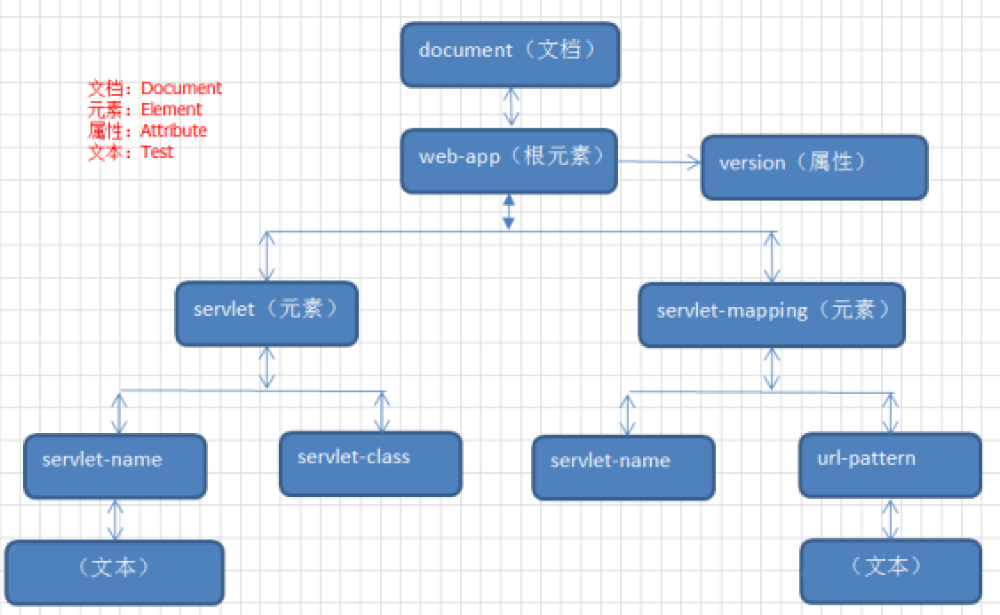
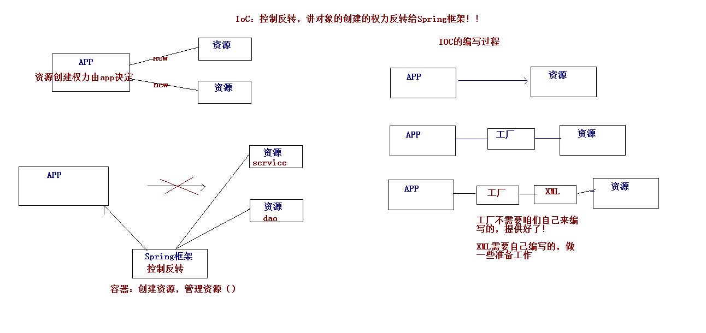

超链接： [官网](http://spring.io/)

图片  ： 

表格：

| ..	| ....	| ....	|
| ---	| :---: | :----:|
| ..	| .. 	| ..	|
| ..	| ..   	| ..	|
| ..	| ..   	| ..	|

----------

----------

----------
# 大纲 #
	1. xml介绍
	2. 编写解析xml
	3. DTD约束
	4. Schema约束

----------

----------

----------

# xml介绍 #

## 什么是xml ##
	*HTML : HyperText Markup Language，意思是超文本标记语言
	*XML  ：Extensible Markup Language，意思是可扩展的标记语言。
1. 显示，被html取代,但是还是可以用浏览器打开
2. 存储数据，被数据库取代
3. 配置文件
4. 传输数据，数据载体 eg：微信公众平台某些接口

## xml和html比较 ##

| 区别	| html	| xml	|
| ---	| :---: | :----:|
| 大小写	| 不区分 | 区分	|
| 根标签	| 要求	| 必须	|
| 闭合	| 要求  	| 必须	|
|属性引号| 要求  	| 必须（单双没有关系）	|
|标签内容空格换行| 不作为  | 都做为数据内容	|
| 特殊字符转义| 要求 	| 必须	|
| 后缀	| html 	| xml	|

## xml组成 ##
	1. 声明：(自动生成的)
		*作用：告诉别人我是一个xml
		*格式：<?xml 属性attribute=".."  ?>
		*eg :<?xml version="1.0" encoding="utf-8"  ?>
		*standalone="true" 是否独立
		*要求：
			1. 必须要放在第一行
			2. 必须顶格写
	2. 元素
		* 要求：
			1. 标签必须关闭
		* 元素命名：
			a)区分大小写
			b)不能使用空格<im g>，不能使用冒号:<im:g>
			c)不建议以XML、xml、Xml开头
	3. 属性
		*格式:
			<a 属性="..">
		*要求：
			1. 属性**值**必需引号(单引或双引)
			2. 必须出现在元素开始标签中
			3. 任意个属性,不能出现同名属性
			4. 命名:不能使用空格、冒号等特殊字符，且必须以字母开头
	4. 注释
		*和html一样   <!-- xx -->
	5. CDATA:char data 字符串
		*作用:
			解决转义问题,保证数据原样输出
		*格式:
			<![[]]>  ,<![CDATA[ 输出数据 ]]>
		

----------

----------

----------
# 解析xml #

## 解析的解决方案(方式) ##
	* dom
		* 一次性将文档加载到内容中,形成一个dom树.可以对dom树curd操作
		* 文档不能太大
		* 元素与元素之间保留结构关系，故可以进行增删改查操作
	* sax
		* 一行一行解析
		* 处理速度快，可以处理大文件
		* 不能返回,只能查询.
	

## 解释第三方包 ##
	JAXP：sun公司提供支持DOM和SAX开发包
	JDom：dom4j兄弟
	dom4j:非常非常优秀的Java XML API，hibernate底层采用。

## dom4j ##
	1. 导入包
		* [官网](http://www.dom4j.org/dom4j-1.6.1/)
		* https://dom4j.github.io/
	2. 创建xml
		* 创建web.xml文件:
			<?xml version="1.0" encoding="UTF-8"?>
			<web-app xmlns:xsi="http://www.w3.org/2001/XMLSchema-instance" xmlns="http://java.sun.com/xml/ns/javaee" xsi:schemaLocation="http://java.sun.com/xml/ns/javaee http://java.sun.com/xml/ns/javaee/web-app_2_5.xsd" id="WebApp_ID" version="2.5">
				<servlet>
				<servlet-name>s1</servlet-name><servlet-class>com.huaxin.servlet.S1</servlet-class>
				</servlet>
			
			  <servlet-mapping>
			  	<servlet-name>s1</servlet-name>
			  	<url-pattern>/*</url-pattern>
			  </servlet-mapping>
			</web-app>
		
	3. 创建 dom4j 核心对象 :SAXReader
		* reader = new SAXReader()
			* read(…) 加载执行xml文档
	4. 读取xml,获取文档对象: 
		* document= reader.read(file);
			* getRootElement() 获得根元素
	5. 获取根节点元素 :
		* rootElement = document.getRootElement();
			* getName() 获得当前元素的元素名
			* getText() 获得当前元素的文本内容
			* attributeValue(…) 获得指定属性名的属性值

			* elements(…) 获得指定名称的所有子元素。可以不指定名称
			* element(…) 获得指定名称第一个子元素。可以不指定名称
			* elementText(…) 获得指定名称子元素的文本值

			
	6. 元素点获取子元素
		List<Element> eles = root.elements();
	7. 元素获取自己属性值
		String value = ele.attributeValue(""属性名);
	8. 元素获取子内容
		String txt = ele.elementText("标签名")

	
		@Test
		public void test1() throws DocumentException {
			/** 第一步： 核心对象 **/
			SAXReader saxReader = new SAXReader();
			/** 第二步： 读取配置文件,变成document树 **/
			Document document = saxReader.read("./src/web.xml");
			/** 第三步： 根节点 **/
			Element rootEle = document.getRootElement();
			List<Element> elements2 = rootEle.elements("servlet-name");
			System.out.println(elements2.size()); // 0 不能拿到孙子
	
			System.out.println(
					"根节点名" + rootEle.getName() + "根节点文本(空行) " + rootEle.getText());
			System.out.println("根节点所有属性:");
			for (int i = 0; i < rootEle.attributeCount(); i++) {
				Attribute attribute = rootEle.attribute(i);
				System.out
						.println(attribute.getName() + " = " + attribute.getText());
			}
			System.out.println("id属性:" + rootEle.attributeValue("id"));
	
			System.out.println("子元素~~~~<servlet> 和 <servlet-mapping>~~~~~~~");
			/** 第四步： 操作 **/
			List<Element> elements = rootEle.elements();
			for (Element ele : elements) {
				System.out.println("子元素:" + ele.getName());
				String text = ele.elementText("servlet-name"); // 子子元素的文本
				System.out.println(text);
				String elementText = ele.elementText("url-pattern");
				System.out.println("url-pattern:" + elementText);
			}
		}

## XPath查找技术 ##
	1. 导入jar包
		* jaxen-1.1-beta-6.jar
	2. 创建xml
		<?xml version="1.0" encoding="ISO-8859-1"?>
		<bookstore>
			<book id="1">
			  <title lang="eng">Harry Potter</title>
			  <price>29.99</price>
			</book>
			<book id="2">
			  <title lang="eng">Learning XML</title>
			  <price>39.95</price>
			</book>
		</bookstore>
	3. 创建 dom4j 核心对象 :SAXReader
		reader = new SAXReader()
	4. 读取xml,获取文档对象: 
		document= reader.read(file);
	5. 方法api:
		*selectNodes("表达式")
		*selectSingleNode("表达式")
	6. 表达式
		*/ 从根节点选取 
		*// 从匹配选择的当前节点选择文档中的节点，而不考虑它们的位置
		*@ 选取属性  

		/**
		 * xPath :多个节点
		 */
		@Test
		public void test2() throws DocumentException {
	
			/** 第一步： 核心对象 **/
			/** 第二步： 读取配置文件,变成document树 **/
			Document document = new SAXReader().read("./src/book.xml");
			/** 第三步： 更节点 **/
			List<Node> selectNodes = document.selectNodes("/bookstore/book/title");
			Element node = (Element) selectNodes.get(0);
			String text = node.getText();
			System.out.println(text);
		}

			/**
			 * xPath:单个节点 + 属性
			 */
			@Test
			public void test3() throws DocumentException {
				/** 第一步： 核心对象 **/
				/** 第二步： 读取配置文件,变成document树 **/
				Document document = new SAXReader().read("./src/book.xml");
				/** 第三步： 更节点 **/
				Element node = (Element) document
						.selectSingleNode("/bookstore/book[@id=2]");
		
				String text = node.elementText("title");
				System.out.println(text);
			}

----------

----------

----------
# 大工厂案例 #
1. 解决耦合

## 简单工厂 ##
	1. 工厂类 
			SimpleFactory
	2. 获取方法 
			public static Object getBean(String id)
	3. 更具id匹配,放回 
	
	4. 缺点:
			每次新加实体bean,都需要修改源代码
		public class SimpleFactory {
			public static Object getBean(String id) {
				if (id.equals("hxClass")) {
					return new HxClaxx();
				}
				return null;
			}
		}

## spring工厂 ##
	*方案:
		1. 工厂生产的bean,提供动态配置文件
		2. 工厂+xml配置
	*实现
		1.创建xml:applicationContext.xml
			<?xml version="1.0" encoding="UTF-8"?>
			<beans>
				<bean  id="a" class="com.huaxin.bean.User">
					<property name="id"  value="aaaa"/>
					<property name="name"  value="小红花"/>
				</bean>
				<bean  id="b" class="com.huaxin.bean.Student">
				</bean>
			</beans>
		2.创建spring工厂
			*加载配置文件,获取document对象
					static Document document;
					static {
						SAXReader saxReader = new SAXReader();
						try {
							document = saxReader.read("./src/applicationContext.xml");
						} catch (DocumentException e) {
							e.printStackTrace();
						}
					}
			* 解析xml
				public static Object getBean(String id) {
					/** 第一步： xpath查找到bean **/
					Element element = (Element) document
							.selectSingleNode("//bean[@id='" + id + "']");
					// Element element = (Element) document
					// .selectSingleNode("//bean[@id='a']");
					if (element != null) {
						/** 第二步： 获取bean节点的属性 **/
						Attribute clazzAttr = element.attribute("class");
						String clazzVale = clazzAttr.getText();
						System.out.println(clazzVale);
						try {
							/** 第三步： 反射获取对象 **/
							Class<?> clazz = Class.forName(clazzVale);
							Object newInstance = clazz.newInstance();
							/** 第四步： 遍历bean里面的属性,给属性赋值 **/
							List<Element> elements = element.elements();
			
							for (Element propEle : elements) {
								// 获取子标签
								Attribute nameAttr = propEle.attribute("name");
								Attribute valueAttr = propEle.attribute("value");
								// 反射设置值
								System.out.println(nameAttr.getText());
								Field field = clazz.getDeclaredField(nameAttr.getText());
								field.setAccessible(true);
			
								field.set(newInstance, valueAttr.getText());
							}
							return newInstance;
						} catch (Exception e) {
							e.printStackTrace();
						}
					}
					return null;
				}
		3.反射返回对象
			Class<?> clazz = Class.forName(clazzVale);
			Object newInstance = clazz.newInstance();
		4.反射给字段注入值
			for (Element propEle : elements) {
				// 获取子标签
				Attribute nameAttr = propEle.attribute("name");
				Attribute valueAttr = propEle.attribute("value");
				// 反射设置值
				System.out.println(nameAttr.getText());
				Field field = clazz.getDeclaredField(nameAttr.getText());
				field.setAccessible(true);

				field.set(newInstance, valueAttr.getText());
			}
----------

----------

----------
# xml约束 #
	*作用:
		规定xml中,出现的什么元素.什么属性.他们的顺序
	*分类
		1.DTD约束
		2.schema约束
	*格式:
		1.一个约束文件,里面写
		2.一个xml文件,引入约束就行
			*类似 css 和 html
		

## DTD约束 ##
	1.xml关联dtd
		*内部
			格式:<!DOCTYPE 根元素名 [dtd语法]>
		*外部
			格式:<!DOCTYPE 根元素名 SYSTEM "文件位置">
		*网上
			格式:<!DOCTYPE 根元素名 PUBLIC "文件名称" "文件位置">
	2. 语法
		1.元素
			* <!ELEMENT 元素名称 (子元素)|(数据类型)>
			* 父元素 : 孩子是元素
				* <!ELEMENT 元素名称 (子元素)>
			* 叶子元素
				* <!ELEMENT 元素名称 (数据类型)>
				*数据类型:(#PCDATA)  字符串
			*符号:
				1. 没有:必须出现一次  1
				2. ? :0或1次
				3. * :0,1,2... 任意
				4. + :1,2,3    至少一次
				5. | :或者
				6. ():分组
				7. , :顺序
		2.属性:必须!开头
			* <!ATTLIST 元素名 属性名 属性类型 是否必须 >
			* 类型
				CDATA : 字符串
			* 是否必须
				1. REQUIRED 必须
				2. IMPLIED  不是必须
	3. 缺点:
		1. 一个xml 只能一个dtd
		2. dtd对数字,boolean,约束不强
	
	4. hibernate 配置文件
		<!DOCTYPE hibernate-configuration PUBLIC   
	          "-//Hibernate/Hibernate Configuration DTD 3.0//EN"   
	          "http://hibernate.sourceforge.net/hibernate-configuration-3.0.dtd">   
	5. Struts2 配置文件
		<!DOCTYPE struts PUBLIC
		    "-//Apache Software Foundation//DTD Struts Configuration 2.0//EN"
		  "http://struts.apache.org/dtds/struts-2.0.dtd">

## schema约束 ##
	1. 优点:
		*解决了dtd的缺点, Schema 是基于 XML 的 DTD 替代者
		*可以多个约束,约束性更强
	2. 关联:
		1. <根元素 xmlns="" xmlns:xsi="w3c" xsi:schemaLocation="">
		2. xmlns: namespace 名称空间(唯一),一个schema的id或者标识
		3. xmlns: 别名="http://www"
	3. 多个schema文件导入,使用别名区分
		1. 一个约束中定义了一个apple元素,代表5块钱一斤的苹果
		2. 一个约束中定义了一个apple元素,代表8888块钱一个的苹果手机
		3. 两个约束文件,写一个apple,代表什么
	4. 解决方法:  
		1. 第一个  xmlns="http://www.hx.com"
		2. 第二个  xmlns:app="http://www.apple.com"
		3. <apple price="5">
		4. <app:apple price="8888">
	5. 一个xml中,只能有一个没有别名的xmlns
	
	<?xml version="1.0" encoding="UTF-8"?>
	<web-app 
		xmlns:xsi="http://www.w3.org/2001/XMLSchema-instance" 
		xmlns="http://java.sun.com/xml/ns/javaee" 
		xsi:schemaLocation="http://java.sun.com/xml/ns/javaee http://java.sun.com/xml/ns/javaee/web-app_2_5.xsd" id="WebApp_ID" version="2.5">
		  <servlet>
		  	<servlet-name>s1</servlet-name>
		  	<servlet-class>com.huaxin.servlet.S1</servlet-class>
		  </servlet>
		  
		  <servlet-mapping>
		  	<servlet-name>s1</servlet-name>
		  	<url-pattern>/*</url-pattern>
		  </servlet-mapping>
	</web-app>

	1. xmlns:xsi ->xml schema instance -> 声明w3c约束的一个实例,遵循其规范,而不是约束
		1. xsd (XML Schemas Definition ) 
		2. 标识当前xml是 schema 约束
	2. xsi:schemaLocation  -> 指定schema位置
		1. 格式
			1. "名称空间 xml位置  名称空间2 xml位置2" 

	

