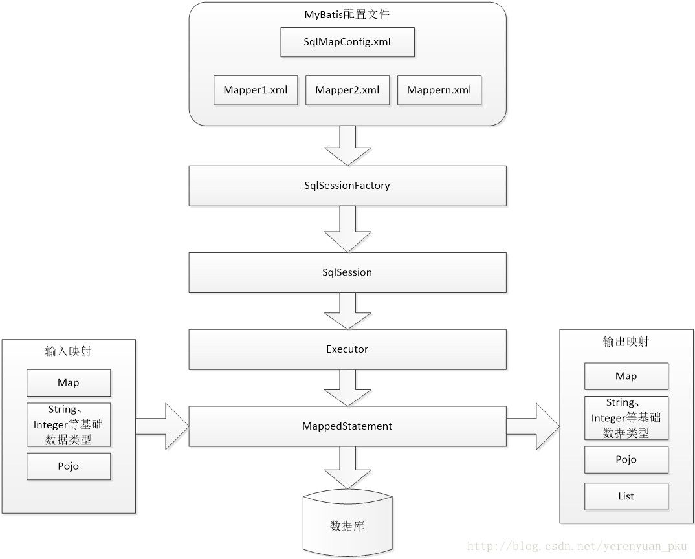
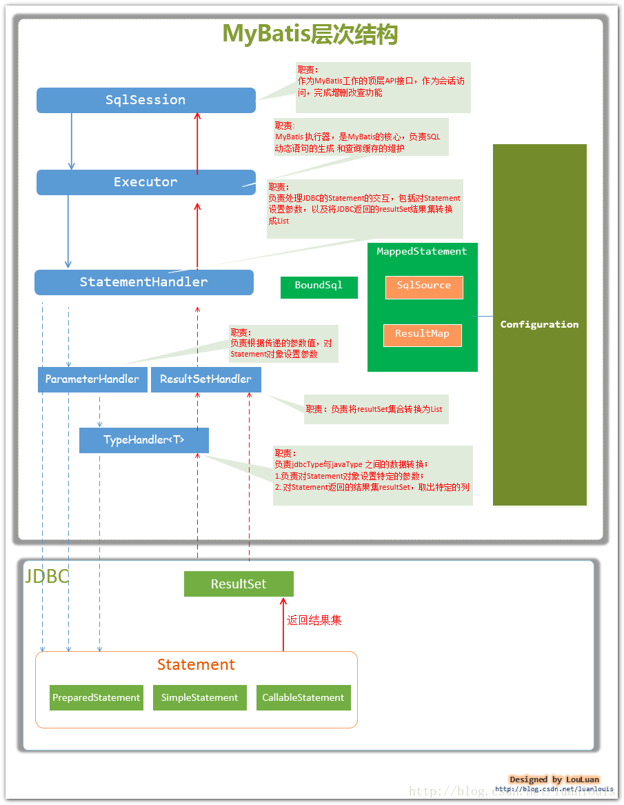

# 大纲 #
 [mybatis面试](https://www.cnblogs.com/huajiezh/p/6415388.html)

图片  ： 

表格：

| ..	| ....	| ....	|
| ---	| :---: | :----:|
| ..	| .. 	| ..	|
| ..	| ..   	| ..	|
| ..	| ..   	| ..	|

----------

----------

----------
# 大纲 #
1. 原始jdbc
	1. 写法
	2. 问题
2. bean,pojo,po
3. mybatis介绍
	1. 
4. mybatis入门
	1. 查询  占位符,拼接符
	2. insert 2中主键策略
	3. delete
	4. update

# 原始JDBC开发 #

## 表 ##
	
	create table HxUser(
	id int primary key auto_increment,
	username varchar(64) unique,
	password varchar(64) not null,
	name varchar(10),
	sex int(1) , # 1 男 2女
	birthday date # '生日', 
	);

	insert into HxUser values(null,'root','1234','张三','1','1998-08-01');
	insert into HxUser values(null,'root2','1234','张三2','1','1998-08-02');
	insert into HxUser values(null,'root3','1234','张三3','1','1998-08-03');
	insert into HxUser values(null,'root4','1234','张三4','1','1998-08-04');

	private int id;
	private String username;// 用户姓名
	private String password;// 密码
	private String name;
	private int sex;// 性别
	private Date birthday;// 生日

## 代码 ##

		/** 第一步： 加载数据库驱动 **/
		Class.forName("com.mysql.jdbc.Driver");
		/** 第二步： 通过驱动管理类获取数据库链接 **/
		Connection conn = DriverManager.getConnection("jdbc:mysql:///mytest",
				"root", "1234");
		/** 第三步： 准备sql执行者 **/
		String sql = "select * from HxUser where sex=?";
		PreparedStatement stmt = conn.prepareStatement(sql);
		// 设置参数，第一个参数为sql语句中参数的序号（从1开始），第二个参数为设置的参数值
		stmt.setObject(1, 1);
		// 向数据库发出sql执行查询，查询出结果集
		ResultSet resultSet = stmt.executeQuery();
		/** 第四步： 遍历查询结果集 **/
		while (resultSet.next()) {
			System.out.println(resultSet.getString("id") + "  "
					+ resultSet.getString("username"));
		}
		/** 第五步： 释放资源 **/
		resultSet.close();
		stmt.close();
		conn.close();

## 问题 ##
	1. 连接创建销毁频繁,严重影响速度(数据库连接池)
	2. sql语句写死在代码里面,硬编码(提取到xml配置文件中);;;Sql语句写在代码中造成代码不易维护，实际应用sql变化的可能较大，sql变动需要改变java代码
	3. 占位符号传参数(输入参数),sql变-参数变-硬编码(提取到xml配置文件中),因为sql语句的where条件不一定，可能多也可能少，修改sql还要修改代码，系统不易维护
		* 占位符 ? 不能嵌套单,引号里面
			* String sql = "select * from HxUser where name like '?'";
		* 能避免sql注入
	4. 结果参数(输出参数)解析繁琐(自动封装)

		pojo:(plain ordinary java object) 简单无规则java对象 ,不按mvc分层,只是java bean有一些属性,还有get set方法
		domain:不按mvc分层,只是java bean有一些属性,还有get set方法
		po:persistant  object  用在持久层,还可以再增加或者修改的时候,从页面直接传入action中,它里面的java bean 类名等于表名,
			属性名等于表的字段名,还有对应的get set方法
		vo: view object表现层对象,主要用于在高级查询中从页面接收传过来的各种参数.好处是扩展性强
		bo: business object 用在servie层,现在企业基本不用.
		这些po,vo, bo,pojo可以用在各种层面吗
		可以,也就是po用在表现层,vo用在持久层不报错,因为都是普通的java bean没有语法错误.
		但是在企业最好不要混着用,因为这些都是设计的原则,混着用比较乱.不利于代码维护.

# mybatis介绍 #
1. 原名ibatis, apache 下开源项目.迁移到Google Code后改名MyBatis
2. 一个基于Java的持久层框架
	* JdbcUtil
		* 对输出参数封装
	* Mabatis
		* 对输入,输出参数封装
		* 程序员直接编写原生态sql，可严格控制sql执行性能，灵活度高
	* Hibernate
		* 对输入,输出,sql封装
		* 完全的ORM -> (Object Relational Mapping)对象关系映射
	
3. mybatis对JDBC封装(不需要参数的手工设置以及结果集的检索)

4. mybatis方式:使用简单的 XML或注解用于配置和原始映射

## 框架对比 ##
1. Hibernate:用于老项目,用户群体不大,比如:政府,公司 OA系统
	* 用户量不大
	* 业务逻辑复杂
	* 速动要求不高
2. Mabatis:用于互联网项目,用户群体大,比如:书店,外卖,零食店等电商系统
	* 用户量大
	* 业务逻辑简单(违反第三范式,讲究速度)
	* 速度要求高

	1. mybatis不是一个完全的orm框架，hibernate是一个完全的orm框架
	2. mybatis需要自己写sql，但是输入和输出参数是映射的
	3. 学mybatis比hibernate容易，但是sql要求有点高
	4. 更加灵活，更加适用于需求不固定项目
	5. 查到需要的字段数据,封装对象,返回   ;   不要向hibernate一样在业务上数据还要进行筛选

1. 第一范式，就是数据表的列不可再分。
			学号		姓名	选课
			10001	张三	数学，语文，英语
			10002	李四	语文，英语
			10003	王五	语文，英语，历史

2. 第二范式是指，首先满足第一范式，并且表中非主键列不存在对主键的部分依赖
	* 两个表柔和在一起 -> 主键 学号,课程
	* 课程学分只依赖课程主键,所以部分依赖
	
			学号		课程	成绩	课程学分
			10001	数学	100	6
			10001	语文	90	2
			10001	英语	85	3
			10002	数学	90	6
			10003	数学	99	6
			10004	语文	89	2
3. 第三范式定义是，满足第二范式，并且表中的列不存在对非主键列的传递依赖
	* 主键为：（学号），所有字段 （姓名，性别，班级，班主任）都依赖与主键（学号），
	* 不存在对主键的部分依赖。所以是满足第二范式
	* 但是，表中存在一个传力依赖，(学号）->(班级）->（班主任）。也就是说，（班主任）这个非主键列依赖与另外一个非主键列 （班级）

			学号	姓名	性别	班级	班主任
			10001	张三	男	一班	小王
			10002	李四	男	一班	小王
			10003	王五	男	二班	小李
			10004	张小三	男	二班	小李

# mybatis架构 #

[架构详解 ](http://blog.csdn.net/yerenyuan_pku/article/details/71699515)

[po,pojo](http://www.blogjava.net/vip01/archive/2007/01/08/92430.html)
https://www.cnblogs.com/yxnchinahlj/archive/2012/02/24/2366110.html 

1. 配置文件 Configuration
	* 属性
		* HashMaps<String,MappedStatement> mappedStatements
	* 方法
		* newStatementHandler(executor,mappedSatement,paramObj,RowBounds.Default,null,null)
	* SqlMapConfig.xml:
		* 全局配置文件
	* mapper.xml :
		* 每一张表对应一个
		* sql写在这个文件里面
		* 需要在SqlMapConfig.xml 引入才能有效
	* 解析过程
		* xpath 找到 configuration 根节点
			* xpath 找到 mapper 节点
				* mapper子节点 匹配 package 获取里面的值
					* 加载package 下面所有 类  Set<Class> ,然后遍历
					* 每一个clazz 类型
						* 是否是接口  clazz.isInterface();
						* hasMapper  有抛异常,防止 多线程
						* 生成代理对象 mapperProxyFactory
							* databaseId
2. SqlSessionFactoryBuild
	1. build(inputStream);							
		1. xpath 解析xpath  核心配置文件  configuration 根节点, 子节点 
			1. xNode.eval("mappers"); 
			2. properties	settings	typeAliases	plugins environments
		2. mappers解析 
			1. 解析 **package** / resource url /class  子元素
			2. 找到 包下面 所有 接口 生成 clazz,然后遍历
			3. 放入map集合中<clazz,new MapperProxyFactory<T>(clazz)> ,通过接口,生成代理对象
			4. 加载mapper.xml配置文件,读取inputStream,解析 xpath
				1.  找根标签mapper ,  namespace 
				2.  标签 擦车   select|insert|update|delete ,遍历
					1.  解析 ,  include 处理 , selectKey 处理 ,
					2.  动态sql ?  解析  
						1. sqlSource  #{xx}占位符 转成 ?
						2. parametMappings ArrayList<?> 属性名称 模型in 属性类型  //占位符 记录值
					3.   
			5. 
			
2. SqlSessionFactory		
	* 会话工厂
	* 加载配置文件
	* 创建sql会话
	* 接口方法
		* openSession();
	* 实现类
		* DefaultSqlSessionFactory(configuration)   // 默认工厂
			* openSession()
				* openSessionFramDataSource(ExecutorType default,TransactionIsolation null,AutoCommit false)
					* 获取 environment
					* 获取事务工厂
					* 生成执行器对象 Executor
					* 返回 DefaultSqlSession (config,executor,autocommit);
3. sqlSession
	* 关联mapper中的sql
	* 属性
		* autoCommit =false
		* configuration 
		* cursorList = null
		* dirty = false	
			* true  提交
			* false mybatis回滚
		* executor = CachingExecutor
	* 方法
		* insert("sqlId statement",paramObj);  // 往update 方法调 
		* delete("sqlId statement",paramObj);  // 往update 方法调 
		* update("sqlId statement",paramObj);
			* dirty=true
			* 通过config配置类  传递sqlId  获取到   MappedStatement
			* executor.update(mappedState,wrapCollection(parameter))
				* wrapCollection 判断  是否是 集合 array
		* commit()
		* close() 
4. Executor: 执行器,mybatis 核心
	* 缓存维护
	* sql生成
	* 执行器
		* SimpleExecutor
			* 每执行一次update或select，就开启一个Statement对象，用完立刻关闭Statement对象
		* ReuseExecutor
			* 执行update或select，以sql作为key查找Statement对象，存在就使用，不存在就创建，用完后，不关闭Statement对象，而是放置于Map<String, Statement>内，供下一次使用。简言之，就是重复使用Statement对象
		* BatchExecutor
			* 执行update（没有select，JDBC批处理不支持select），将所有sql都添加到批处理中（addBatch()），等待统一执行（executeBatch()），它缓存了多个Statement对象，每个Statement对象都是addBatch()完毕后，等待逐一执行executeBatch()批处理。与JDBC批处理相同。
		* CachingExecutor
			* update(MappedStatement ms , Object paramObj)
				*  缓存
				*  delegate.update(MappedStatement ms , Object paramObj)
					*  doUpdate(MappedStatement ms , Object paramObj)  跑到SimpleExecutor里面去了...
						*  Statement stmt=null;  
						*  获取 config
						*  通过config 获取StatementHandler   ,config.newStatementHandler
							
						*  准备 sql  preparedStatement
							*  参数 设置好
			* commit 
				* 	transaction.commit();
	作用范围：Executor的这些特点，都严格限制在SqlSession生命周期范围内
5. Mapped Statement
	* mapper.xml文件中一个sql语句对应一个Mapped Statement对象
	* sql的id即是Mapped statement的id 
	* 对输入参数进行绑定 设置  paramterHandler
	* 对输出参数进行绑定		resultSetHandler
	* 属性
		* id = sqlId 
		* configuration
		* resource  = "XxxMapper.xml"
		* sqlSource  = RawSqlSource-> sql="select * from x ..where id=?"
6. TypeHandler 类型转换器
	1. java  数据库 类型转换
	2. 处理器
		1. resultSetHandler
		2. paramterHandler
	3. 自定义  
		1. 实现 TypeHandler接口
		2. 在核心配置文件中,配置
			1. typeHandlers dtd约束,有**位置顺序** 约束
			<typeHandlers> <typeHandler  handler="自定义类全路径com.xx.AHandler" javaType="" jdbcType=""/> 
7. StatementHandler
	1. PreparedStatementHandler
		1. 属性
			1. config
			2. executor
			3. mappedStatements
		2. 方法
			1. update(stmt)
				1. stmt 执行
				2. 返回 影响行数
8. commit
	1. commit(false)
		1. executor.commit
			* true  提交
			* false mybatis回滚

----------

----------

----------

# 入门 #

## 	编写内容 ##
1. SqlMapConfig.xml 配置文件
2. **mapper.xml   	每个表对应一个
3. 测试代码

## 开发步骤 ##`
1. 导包(maven添加)
	* mybatis
 [下载地址](https://github.com/mybatis/mybatis-3/releases)
			mybatis-3.2.7.jar----mybatis的核心包
			lib----mybatis的依赖包
			mybatis-3.2.7.pdf----mybatis使用手册
	* mysql
	* junit
	* log4j(mybatis默认使用log4j作为输出日志信息)

		    <!-- ##############构建插件,可以指定,jdk版本,编码,端口,项目名############################# -->
		    <build>
				<plugins>
					<plugin>
						<groupId>org.apache.maven.plugins</groupId>
						<artifactId>maven-compiler-plugin</artifactId>
						<configuration>
							<source>1.8</source>
							<target>1.8</target>
							<encoding>UTF-8</encoding>
						</configuration>
					</plugin>
				</plugins>
			</build>
		  
		    <dependencies>
		    	<dependency>
		    		<groupId>junit</groupId>
		    		<artifactId>junit</artifactId>
		    		<version>4.12</version>
		    		<scope>test</scope>
		    	</dependency>
		    	<dependency>
		    		<groupId>mysql</groupId>
		    		<artifactId>mysql-connector-java</artifactId>
		    		<version>5.1.35</version>
		    		<scope>runtime</scope>
		    	</dependency>
		    	<dependency>
		    		<groupId>org.mybatis</groupId>
		    		<artifactId>mybatis</artifactId>
		    		<version>3.2.8</version>
		    	</dependency>
		    	<dependency>
		    		<groupId>log4j</groupId>
		    		<artifactId>log4j</artifactId>
		    		<version>1.2.17</version>
		    	</dependency>
		    	<dependency>
		   			<groupId>commons-logging</groupId>
		   			<artifactId>commons-logging</artifactId>
		   			<version>1.2</version>
		   		</dependency>
		    </dependencies>

2. SqlMapConfig.xml 配置文件
	<?xml version="1.0" encoding="UTF-8" ?>
	<!DOCTYPE configuration
	  PUBLIC "-//mybatis.org//DTD Config 3.0//EN"
	  "http://mybatis.org/dtd/mybatis-3-config.dtd">
	<configuration>
	  <!-- 和spring整合后 environments配置将废除-->
	  <environments default="development">
	    <environment id="development">
	      <transactionManager type="JDBC"/>
	      <dataSource type="POOLED">
	        <property name="driver" value="com.mysql.jdbc.Driver"/>
	        <property name="url" value="jdbc:mysql:///mytest"/>
	        <property name="username" value="root"/>
	        <property name="password" value="1234"/>
	      </dataSource>
	    </environment>
	  </environments>
	  <mappers>
	    
	  </mappers>
	</configuration>
3. 编写mapper.xml配置文件
		<?xml version="1.0" encoding="UTF-8" ?>
		<!DOCTYPE mapper
		  PUBLIC "-//mybatis.org//DTD Mapper 3.0//EN"
		  "http://mybatis.org/dtd/mybatis-3-mapper.dtd">
		<mapper >
	
		</mapper>
	
		<!-- namespace:隔离sql: 
		SysUser表有一个 selectById
		HxUser表有一个 selectById
		-->
		<mapper namespace="com.huaxin.bean.HxUser">
			<!--  
				id				: 当前xml中标识一条sql(crud)
				parameterType	: 
					* 输入参数类型,
					* #{}占位符:如果输入时基本数据类型+string,占位符里面的变量名随便写  
				resultType		: 输出参数类型
			-->
			<select id="selectById" parameterType="java.lang.Integer" resultType="com.huaxin.bean.HxUser">
				select * from hxuser where id=#{id};
			</select>
		</mapper>

4. 在SqlMapConfig文件中加入,mapper文件
	  <mappers>
	    <mapper resource="HxUserMapper.xml"/>
	  </mappers>

5. 测试代码
		Reader inputStream;
		try {
			/** 第一步： 获取SqlSessionFactory **/
			inputStream = Resources.getResourceAsReader("SqlMapConfig.xml");
			SqlSessionFactory sqlSessionFactory = new SqlSessionFactoryBuilder()
					.build(inputStream);

			/** 第二步： 获取sqlSession **/
			SqlSession openSession = sqlSessionFactory.openSession();

			/**
			 * 第三步： 执行  
			 * 
			 * statement:指明那个sql语句(唯一) 
			 * parameter:指明的sql参数 
			 **/
			HxUser hxUser = openSession
					.selectOne("com.huaxin.bean.HxUser.selectById", 1);
			System.out.println(hxUser);
			/** 第四步： 关闭 **/
			openSession.close();
			inputStream.close();
		} catch (IOException e) {
			e.printStackTrace();
		}
	
6. 添加日志
		# Global logging configuration
		log4j.rootLogger=DEBUG, stdout
		# Console output...
		log4j.appender.stdout=org.apache.log4j.ConsoleAppender
		log4j.appender.stdout.layout=org.apache.log4j.PatternLayout
		# priority  thread message /n
		log4j.appender.stdout.layout.ConversionPattern=%5p [%t] - %m%n

	
7.错误
		* 配置文件中:
			* mapper没有引入
				Caused by: java.lang.IllegalArgumentException: Mapped Statements collection does not contain value for selectById
			* 没有添加namespace(每个mapper.xml必须要有 namespace)
				Caused by: org.apache.ibatis.builder.BuilderException: Error parsing SQL Mapper Configuration. 
					Cause: org.apache.ibatis.builder.BuilderException: Error parsing Mapper XML. Cause: java.lang.NullPointerException
						* XMLMapperBuilder 109 行   if (namespace.equals("")) 
						* 
			* 多个mapper.xml,两个namespace相同(可以相同)
				* 存在id相同的sql(statement) (already contains value 命名空间.方法)
					Caused by: org.apache.ibatis.builder.BuilderException: Error parsing SQL Mapper Configuration. 
						Cause: org.apache.ibatis.builder.BuilderException: Error parsing Mapper XML. Cause: java.lang.IllegalArgumentException: Mapped Statements collection already contains value for com.huaxin.bean.HxUser.selectById

		 * 代码中:
			* 如果引入多个mapper,里面有同名的id,查询的时候必须全面,
				* selectOne("selectById")
				* ambiguous : 含糊的，不明确的; 引起歧义的; 有两种或多种意思的; 模棱两可;
				Caused by: java.lang.IllegalArgumentException: selectById is ambiguous in Mapped Statements collection (try using the full name including the namespace, or rename one of the entries)
	 
	
----------

----------

----------
# 模糊查询 #
	1. sql
		select * from hxuser where name like '%三%';
	2. mapper文件
		<!-- 
		输出参数:
			如果返回list<E>,则resultType指定的是泛型
		 -->
		<select id="selectByNameLike"  parameterType="String" resultType="com.huaxin.bean.HxUser">
			select * from hxuser where name like #{name}
		</select> 
		
		<!-- 
			#{}:占位符,不能再引号里面('#{xx}',不行)
			使用${}:拼接符
			Caused by: java.sql.SQLException: Parameter index out of range (1 > number of parameters, which is 0).
		-->

		<select id="selectByNameLike2"  parameterType="String" resultType="com.huaxin.bean.HxUser">
			select * from hxuser where name like '%#{name}%'
		</select> 
		
		<!-- 
			Caused by: org.apache.ibatis.reflection.ReflectionException: There is no getter for property named 'name' in 'class java.lang.String'
			使用${}:拼接符,如果输入时基本数据类型+string,占位符里面的变量名随必须是value 
		-->
		<select id="selectByNameLike3"  parameterType="String" resultType="com.huaxin.bean.HxUser">
			select * from hxuser where name like '%${name}%'
		</select> 
		<select id="selectByNameLike4"  parameterType="String" resultType="com.huaxin.bean.HxUser">
			select * from hxuser where name like '%${value}%'
		</select> 
	3. 总结
		* #{变量名}
			* 占位符
			* 如果输入参数时基本数据类型+string,变量名随便写
			* 不能嵌套在单,双引号里面(#{}可以有效防止sql注入)
			* 自动进行java类型和jdbc类型转换
			* 如果输入参数是bean?,变量名怎么写?(演示增)
		* ${变量名}			表名 使用
			* 单纯拼接符,不进行jdbc类型转换
			* 如果输入参数时基本数据类型+string,变量名必须value
			* 比如 :模糊查询 '%${value}%'
		* 输入或者输出类型是基本数据类型+string,可以省写包名 
			* java.lang.Integer   int
			* java.lang.String	  string
		* selectOne selectList
			* selectList 兼容 selectOne
			* 反之不行: 当selectOne返回多条数据,报错
				* TooManyResultsException 

	4. 输入类型
		parameterType="hashmap"   引用: #{key}、${key}
		parameterType="Student"     引用: #{property}、${property}  eg:#{name}、${location.city}
		parameterType="int"       引用: #{随便什么名字}、${...} 
		parameterType="java.util.ArrayList"	#{list}
			如果int[]/Integer[]/ArrayList包装在一个类里面,名字property   xxxxX
				public class QueryBean{
					int[]  xxxx;
				}

----------

# 增 #
1. sql
	insert into HxUser values(null,'root','1234','张三xx','1','1998-08-01');
2. mapper文件
	<!-- 如果输入参数是bean对象,#{变量名}:直接是属性名字 -->
	<insert id="insert" parameterType="com.huaxin.bean.HxUser" >
		<!-- insert into HxUser values(null,#{username},#{password},#{name},#{sex},#{birthday}); -->
		 insert into HxUser
		(<include refid="fileId"></include>)		 
		  values(#{username},#{password},#{name},#{sex},#{birthday}); 
	</insert>
3. 提交事务
	* mybatis自动在**增删改**开启事务,但是不知道在哪提交,所以手动提交
	* openSession.commit();
4. 测试代码(提交事务)
	HxUser hxUser = new HxUser();
	hxUser.setBirthday(new Date());
	hxUser.setName("大红花");
	hxUser.setPassword("123456");
	hxUser.setSex(1);
	// Caused
	// by:com.mysql.jdbc.exceptions.jdbc4.MySQLIntegrityConstraintViolationException:Duplicate
	// entry'2015*****0115'for key'username'
	hxUser.setUsername("2015*****0117");
	/**
	 * 第三步： 执行  
	 **/
	int insert = openSession.insert("com.huaxin.bean.HxUser.insert",
			hxUser);
	System.out.println(insert);// 影响行数
	// mybatis自动在**增删改**开启事务,但是不知道在哪提交,所以手动提交
	openSession.commit();
	/** 第四步： 关闭 **/
	openSession.close();
	inputStream.close();

5. 返回主键 
	1. 不是 sqlSession.insert的返回值,而是放在了输入参数的某个字段
	2. 将id封装到bean哪个字段,keyProperty指定
	3. 插入数据前还是后有id,order="AFTER"
	4. id的类型:resultType指定
	5. 查询最后插入的id值
		*select LAST_INSERT_ID()
			<selectKey keyProperty="" order="AFTER" resultType="">
				select LAST_INSERT_ID() 
			</selectKey>

6. uuid策略
	1. 	表
		create table tt(
			id varchar(64) primary key,
			username varchar(32)
		);
	2. javaBean
		private String id;
		private String username;
	3. mapper文件	
		<mapper namespace="com.huaxin.bean.Tt">
			<insert id="insert" parameterType="com.huaxin.bean.Tt" >
				<selectKey keyProperty="id" order="BEFORE" resultType="string">
					select uuid();
					<!--    SELECT REPLACE(uuid(),"-","")   -->
					<!--    SELECT REPLACE(uuid(),"-","") from dual  --> <!-- 也可以  -->

				</selectKey>
				insert into tt values(#{id},#{username})	
			</insert>
		</mapper>
	4. SqlMapConfig.xml 引入mapper
	5. 测试
		@Test
		public void testInsertTt() {
			Reader inputStream;
			try {
				/** 第一步： 获取SqlSessionFactory **/
				inputStream = Resources.getResourceAsReader("SqlMapConfig.xml");
				SqlSessionFactory sqlSessionFactory = new SqlSessionFactoryBuilder()
						.build(inputStream);
				/** 第二步： 获取sqlSession **/
				SqlSession openSession = sqlSessionFactory.openSession();
	
				Tt tt = new Tt();
				tt.setUsername("ttUUID1");
				/**
				 * 第三步： 执行  
				 **/
				int insert = openSession.insert("com.huaxin.bean.Tt.insert", tt);
				System.out.println(insert);// 影响行数
	
				System.out.println(tt);
	
				// mybatis自动在**增删改**开启事务,但是不知道在哪提交,所以手动提交
				openSession.commit();
				/** 第四步： 关闭 **/
				openSession.close();
				inputStream.close();
			} catch (IOException e) {
	
				e.printStackTrace();
			}
		}
----------

# 删 #
1. sql
2. mapper
		<delete id="deleteById" parameterType="int">
			delete from hxuser where id=#{id}
		</delete>
3. 测试(提交事务)
		int insert = openSession.delete("com.huaxin.bean.HxUser.deleteById",
						1);

# 改 #
1. SQL
2. mapper
		<!-- 修改 -->
		<update id="updateById" parameterType="com.huaxin.bean.HxUser" >
			update hxuser set name=#{name},sex=#{sex} where id=#{id}
		</update>
3. 测试(提交事务)
		int insert = openSession.update("com.huaxin.bean.HxUser.updateById",
				hxUser);
		System.out.println(insert);// 影响行数

# 总结 #
1. mybatis会自动开启事务, 增删改 的时候需要手动提交事务
2. 查询不需要提交事务
3. mybatis自动封装输入参数,,,自动解析输出参数十分方便
4. 执行sql,自己编写

# 任务 #
1. 练习 HxUser 用户表crud
	* insert主键2总
2. 自己创建一个订单表,练习 crud

----------

----------

----------

# 类 #
1. SqlSessionFactoryBuilder
	1. 用于创建SqlSessionFacoty
2. SqlSessionFactory
	1. SqlSessionFactory是一个接口
	2. 定义了openSession的不同重载方法
	3. 一旦创建后可以重复使用，通常以单例模式管理SqlSessionFactory
	4. 最佳创建范围是整个应用运行期间
3. SqlSession
	1. 接口
	2. 封装了对数据库的crud操作
	3. **线程不安全**,每个线程都应一个新的实例,所有每次dao执行sql,必须创建一个新的session,不能公共使用
	4. 需要提交
	5. 使用完毕就要关闭它,一般放在finally中
	
