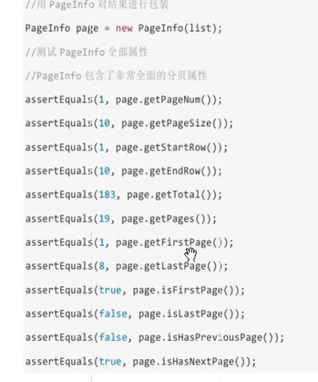

# mybatis分页插件 #
1. 支持
	1. oracle
	2. mysql
	3. MariaDb
	4. sqlLite
	5. Hsqldb
	6. PostgreSQL
2. 不支持
	1. sqlServer
3. 使用
	1. jar
	2. 在 sqlMapConfig.xml配置
			<configuration>
				<plugins>
					<!-- mybatis分页插件 -->
					<plugin interceptor="com.github.pagehelper.PageHelper">
						<!-- 方言 :支持 mysql oracle等 -->
						<property name="dialect" value="mysql"/>
					</plugin>
				</plugins>
			</configuration>

	3. 测试	
		

	

		 <pagehelper.version>4.1.4</pagehelper.version>
		<mybatis.paginator.version>1.2.15</mybatis.paginator.version>

		<dependency>
				<groupId>com.github.miemiedev</groupId>
				<artifactId>mybatis-paginator</artifactId>
				<version>${mybatis.paginator.version}</version>
			</dependency>
		<dependency>
			<groupId>com.github.pagehelper</groupId>
			<artifactId>pagehelper</artifactId>
			<version>${pagehelper.version}</version>
		</dependency> 

	@Test
	public void testPage() {
		/** 第一步： 设置分页条件 **/
		PageHelper.startPage(2, 10); // int pageNum, int pageSize
		/** 第二步： 查询 **/
		ClassPathXmlApplicationContext classPathXmlApplicationContext = new ClassPathXmlApplicationContext(
				"classpath:spring/applicationContext-dao.xml");
		TbItemMapper bean = classPathXmlApplicationContext
				.getBean(TbItemMapper.class);
		TbItemExample example = new TbItemExample();
		List<TbItem> selectByExample = bean.selectByExample(example);
		System.out.println(selectByExample);
		/** 第三步： 获取分页信息:使用pageInfo对象 **/
		PageInfo<TbItem> pageInfo = new PageInfo<>(selectByExample);
		System.out.println(pageInfo.getTotal());
		System.out.println(pageInfo.getPages());
		System.out.println(selectByExample.size());
	}

# PageInfo #
1. 当前页		pageNum
2. 每页的数量		pageSize
3. 当前页的数量	size
4. 当前页面第一个元素在数据库中的行号	startRow
5. 当前页面最后一个元素在数据库中的行号	endRow
6. 总记录数		total
7. 总页数		pages
8. 结果集		list
9. 
