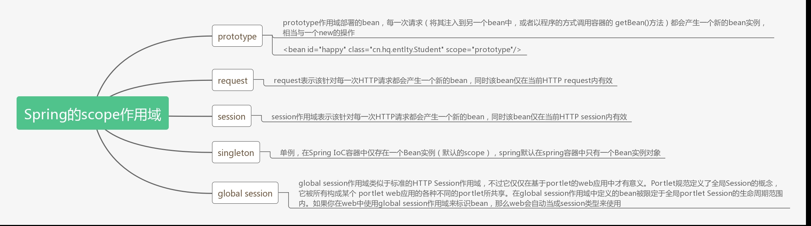

# 大纲 #
1. IOC注解
2. spring4JUnit

# 注解 #
	1. 取代传统xml配置,更简单
		* xml不利于团队开发
		* 臃肿
	2. 简化开发
		
## 开发步骤 ##		
	1. 创建工程,导包
		* 核心包:4个 + 依赖日志2个
		* web整合包:1个  spring-web
		* spring-aop.jar

	2. web三层
		* 接口+实现类
	3. 配置文件:
		* log4j
		* applicationContext.xml(需要保留,开启注解)
			*约束:(多一个context约束)
				<beans 
			       xmlns:context="http://www.springframework.org/schema/context"
			       xsi:schemaLocation="
					http://www.springframework.org/schema/context http://www.springframework.org/schema/context/spring-context.xsd">
				</beans>
	
			*开启扫描
				<!-- 
					component组件-scan扫描
					base-package:基本
				-->
				<context:component-scan base-package="" />

	4. 配置文件:web.xml
		* contextLoaderListener
		* contextparam
				<listener>
					<listener-class> org.springframework.web.context.ContextLoaderListener </listener-class>
				</listener>

			  <context-param>
				<param-name>contextConfigLocation</param-name>
				<param-value>classpath:applicationContext.xml</param-value>  
			  </context-param>

	5. service,dao添加注解
		1. @Component(value = "userService")
		2. 等价 <bean id="userService" class="当前类全路径"/>

	6. 测试
	    public class TT {
	        @Test
	        public void run1(){
	            ApplicationContext ac = new ClassPathXmlApplicationContext("applicationContext.xml");
	            UserService userService = (UserService) ac.getBean("userService");
	            userService.save();
	        }
	    }

## 拆分applicationContext.xml配置文件 ##
	1. 更具web三层,对应三个application配置文件
		1. applicationContext-service.xml
		2. applicationContext-dao.xml
		3. applicationContext.xml
	2. 一个总配置文件引入
		*方式
			<!-- 拆分applicationContext.xml配置文件 -->
			<import resource="applicationContext-service.xml"/>	
	3. 对应层,扫描自己的
		1. applicationContext-service.xml
		2. <context:component-scan base-package="com.spring.service" />

## 常用注解 ##
	1. @Component:组件.(作用在类上)
	2. Spring中提供@Component的三个衍生注解:(功能目前来讲是一致的)
		* @Controller		-- 作用在WEB层
		* @Service			-- 作用在业务层
		* @Repository		-- 作用在持久层
		
		* 说明：这三个注解是为了让标注类本身的用途清晰，Spring在后续版本会对其增强
	
	3. 属性注入的注解(说明：使用注解注入的方式,可以不用提供set方法)
		* @Value			-- 用于注入普通类型
			* 如果是注入的普通类型，可以使用value注解
			* 如果导入配置文件,可以用el表达式直接获取值
				<context:property-placeholder location="jdbc.properties"/

				@Value("${jdbc.url}")
				String xx;
		* @Autowired		-- 默认按 类型 进行自动装配
			* 如果注入的是对象**类型**
			* 如果多个类型相同的实体
				* 优先找变量名相同的实体注入,,如果没有id和变量名相同的,则报错 
					Caused by: org.springframework.beans.factory.NoUniqueBeanDefinitionException: No qualifying bean of type 'com.spring.dao.UserDao' available: expected single matching bean but found 2: userDao,userDao22	
			* @Qualifier	-- 强制使用名称注入
				* 必须要@Autowired一起使用		

		* @Resource				-- 相当于@Autowired和@Qualifier一起使用
			* 强调：Java提供的注解
			* 属性使用name属性
			* 当没有name值,当前id值,默认是当前类名首字小写 
				* UserDao ->   id="userDao"
	4. bean作用范围
		* @scope	
			1. singleton :单例(默认)
			2. prototype :多列

	5. 生命周期
		* @PostConstruct :创建init-method
		* @PreDestroy	 :销毁destroy-method

 

----------

----------

----------
# 整个junit #
1. 目的:简化junit测试
2. 步骤:
	1. 导包
		1. junit.ar
		2. spring-text.jar
	2. 添加注解
		1. @RunWith(SpringJUnit4ClassRunner.class)
		2. @ContextConfiguration("classpath:applicationContext.xml")
	