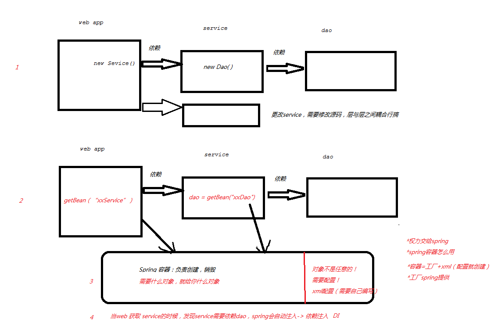
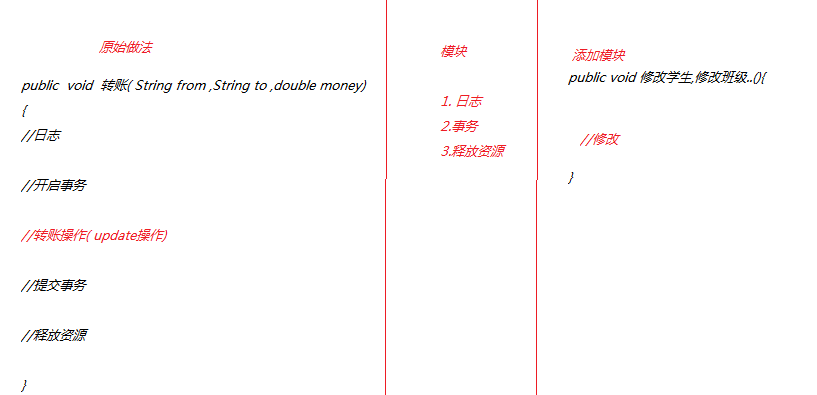
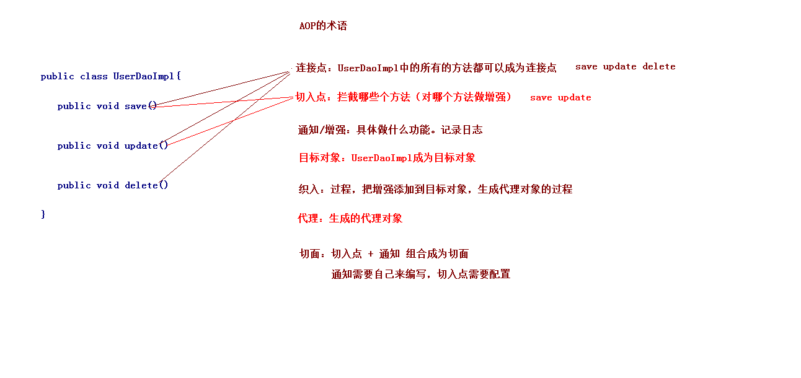

# 大纲 #

超链接： [官网](http://spring.io/)

图片  ： 

表格：

| ..	| ....	| ....	|
| ---	| :---: | :----:|
| ..	| .. 	| ..	|
| ..	| ..   	| ..	|
| ..	| ..   	| ..	|

----------

----------

----------	
# 大纲 #
	1. Spring aop的概述
	2. aop原理(代理模式)
	3. aspectJ动态代理

# 需求 #
1. 项目上先后
2. 新需求:需要在每一个dao层添加一个日志记录操作
3. 在不改变代码的情况下,怎么添加
4. 同理,每个service层需要开启事务

# AOP概述 #
	1. 什么是AOP的技术？
		* 在软件业，AOP为Aspect Oriented Programming的缩写，意为：面向切面编程
		* AOP是一种编程范式，隶属于软工范畴，指导开发者如何组织程序结构
		* AOP最早由AOP联盟的组织提出的,制定了一套规范.Spring将AOP思想引入到框架中,必须遵守AOP联盟的规范
		* 通过预编译方式和运行期动态代理实现程序功能的统一维护的一种技术
		* AOP是OOP的延续，是软件开发中的一个热点，也是Spring框架中的一个重要内容，是函数式编程的一种衍生范型
		* 利用AOP可以对业务逻辑的各个部分进行隔离，从而使得业务逻辑各部分之间的耦合度降低，提高程序的可重用性，同时提高了开发的效率

	2. AOP:面向切面编程.(思想.---解决OOP遇到一些问题)
	3. AOP采取横向抽取机制，取代了传统纵向继承体系重复性代码（性能监视、事务管理、安全检查、缓存）
	4. 为什么要学习AOP
		* 可以在不修改源代码的前提下，对程序进行增强！！	
	

----------

----------

----------

# aop原理 #
	1. 底层采用2种动态代理方式
		* 基于jdk动态
			* 必须接口,JDK动态代理只能对实现了接口的类生成代理，而不能针对类
			* jdk6、jdk7、jdk8逐步对JDK动态代理优化之后，在调用次数较少的情况下，JDK代理效率高于CGLIB代理效率
		* 基于cglib动态代理
			* 必须能继承,CGLIB是针对类实现代理，主要是对指定的类生成一个子类，覆盖其中的方法
			* 使用字节码技术生成代理类,效率会高一点
	2. 将核心关注点与横切关注点完全隔离

	1）如果目标对象实现了接口，默认情况下会采用JDK的动态代理实现AOP。
	2）如果目标对象实现了接口，可以强制使用CGLIB实现AOP。
	3）如果目标对象没有实现了接口，必须采用CGLIB库，Spring会自动在JDK动态代理和CGLIB之间转换。
	
	CGLib必须依赖于CGLib的类库

1.代理模式。
	比如A对象要做一件事情，在没有代理前，自己来做，在对A代理后，由A的代理类B来做。代理其实是在原实例前后加了一层处理
2.静态代理原理及实践。
	代理对象的一个接口只服务于一种类型的对象，如果要代理的方法很多，势必要为每一种方法都进行代理
	如果增加一个方法，除了实现类需要实现这个方法外，所有的代理类也要实现此方法
3.动态代理原理及实践。
	* JDK动态生成了一个类去实现接口,隐藏了这个过程  class $jdkProxy implements IUserDao{}
	* Cglib是以动态生成的子类继承目标的方式实现，在运行期动态的在内存中构建一个子类 public class $Cglib_Proxy_class  extends UserDao{}
4.Spring AOP原理及实战。
	1.创建容器对象的时候，根据切入点表达式拦截的类，生成代理对象。
	2.如果目标对象有实现接口，使用jdk代理。如果目标对象没有实现接口，则使用Cglib代理。然后从容器获取代理后的对象，在运行期植入"切面"类的方法。通过查看Spring源码，我们在DefaultAopProxyFactory类中，找到这样一段话
5. 能做什么
	1.  Spring声明式事务管理配置
	2.  Controller层的参数校验
	3.  对部分函数的调用进行日志记录
	4.  信息过滤

## 静态代理 ##
[参考-web基础-项目优化-数据库连接池]

## JDK动态代理(Proxy) ##

		public static <T> T getProxy(T bean) {
			ClassLoader loader = bean.getClass().getClassLoader();
			Class<?>[] interfaces = bean.getClass().getInterfaces();
			// 使用Proxy类生成代理对象
			T proxy = (T) Proxy.newProxyInstance(loader, interfaces,
					new InvocationHandler() {
						@Override
						public Object invoke(Object proxy, Method method,
								Object[] args) throws Throwable {
							// 方法增强
							String name = method.getName();
							if (name.startsWith("add")) {
								System.out.println("我在记入日志");
								// 开启事务
							}
							// 原方法调用
							return method.invoke(bean, args);
							// return null;
						}
					});
			// 返回代理对象
			return proxy;
		}

## CGLIB ##
1. 介绍:
	1. CGLIB是一个功能强大，高性能的代码生成包。它为没有实现接口的类提供代理，为JDK的动态代理提供了很好的补充。通常可以使用Java的动态代理创建代理，但当要代理的类没有实现接口或者为了更好的性能，CGLIB是一个好的选择
2. 原理
	* 动态生成一个要代理类的子类，子类重写要代理的类的所有不是final的方法。在子类中采用方法拦截的技术拦截所有父类方法的调用，顺势织入横切逻辑。它比使用java反射的JDK动态代理要快
3. 底层
	* 使用字节码处理框架ASM，来转换字节码并生成新的类。不鼓励直接使用ASM，因为它要求你必须对JVM内部结构包括class文件的格式和指令集都很熟悉
4. 缺点 
	* 对于final方法，无法进行代理

### java案例 ###
	1. 导包
		* 在Spring框架 核心包 中已经引入了CGLIB的开发包了。所以直接引入Spring核心开发包即可！
		* 核心包中 org.springframework.cglib.proxy.Enhancer
	2. 代码
		public static <T> T getProxyByCglib(T bean) {
			/** 第一步： 增强器 对象 **/
			Enhancer enhancer = new Enhancer();
			/** 第二步： **/
			enhancer.setSuperclass(bean.getClass());
	
			/** 第三步： **/
			Callback callback;
			enhancer.setCallback(new MethodInterceptor() {
	
				// 方法执行,触发
				@Override
				public Object intercept(Object obj, Method method, Object[] args,
						MethodProxy methodProxy) throws Throwable {
					// 方法增强
					String name = method.getName();
					if (name.startsWith("add")) {
						System.out.println("我在记入日志");
						// 开启事务
					} 
					// 正常执行
					return methodProxy.invokeSuper(obj, args);
				}
			});
			/** 第四步： 生成代理对象 **/
			T create = (T) enhancer.create();
			return create;
		}

----------

----------

----------

# springAOP工作 #

## 任务 ##
1. 代理不需要
	1. 框架框架实现,基于aspectJ
2. 增强需要
3. 配置需要

## AspectJ 框架术语 ##
	1. Joinpoint(连接点)	-- 所谓连接点是指那些被拦截到的点。在spring中,这些点指的是方法,因为spring只支持方法类型的连接点
		*UserServiceImpl实现类中的所有方法,都可以被增强
	2. Pointcut(切入点)		-- 所谓切入点是指我们要对哪些Joinpoint进行拦截的定义
		* UserServiceImpl实现类中的某些已经被增强的方法
		* 需要配置,告诉哪些是的
	3. Advice(通知/增强)	-- 所谓通知是指拦截到Joinpoint之后所要做的事情就是通知
		1. 通知分为前置通知,后置通知,异常通知,最终通知,环绕通知(切面要完成的功能)
		* 一个类里面的一个增强方法,
		* 自己编写
		* 具体增强的代码:日志,事务
		* eg:需要在add方法执行前打印日志,需要有这个通知类对象
	4. Target(目标对象)		-- 代理的目标对象
	5. Weaving(织入)		-- 是指把增强应用到目标对象来创建新的代理对象的过程
		* 动态生成代理对象的过程
		* 过程中自动选择 jdk还是 cglib
	6. Proxy（代理）		-- 一个类被AOP织入增强后，就产生一个结果代理类
		* 生成的代理对象
	7. Aspect(切面)		-- 是切入点和通知的结合，以后咱们自己来编写和配置的
		* 切入点(配置)+通知(方法)
	8. Introduction(引介)	-- 引介是一种特殊的通知在不修改类代码的前提下, Introduction可以在运行期为类动态地添加一些方法或Field
	
	9. advisor 顾问
		1. 和通知类似,是一个织入方式,d实际上是advice的封装
		2. 可以动态的将切面指定对应切入点
		3. advisor接口
			1. PrototypePlaceholderAdviser
			2. IntroductionAdvisor
			3. PointcutAdvisor 
				1. advice
				2. pointcut 接口
					1. classFilter 接口	: aop cglib 两个
						1. matches		(Class)->boolean
					2. methodMatcher 接口
						1. matches		(Method,Class)->boolean
							1. 静态匹配方式,之更具方法的名称判断
						2. isRuntime
						3. matches		(Method,Class,Object)->boolean
	

----------

----------

----------
# aop开发 #
1. 创建工程,导入jar
	* spring核心+日志:  6个包
	* web整合:spring-web.jar 1个
	* 测试:spring-test 1个
	* 注解:spring-aop.jar 
	* springAop包
		* spring-aop.jar
		* aop联盟规范:aopalliance:org.aopalliance-1.0.0.jar
	* aspectJ开发包
		* spring-aspects-4.3.10.RELEASE
		* aspectj:org.aspectj.weaver-1.6.8.RELEASE.jar
2. 配置文件,添加aop约束
	<?xml version="1.0" encoding="UTF-8"?>
	<beans xmlns="http://www.springframework.org/schema/beans"
	    xmlns:xsi="http://www.w3.org/2001/XMLSchema-instance"
	    xmlns:aop="http://www.springframework.org/schema/aop" xsi:schemaLocation="
	        http://www.springframework.org/schema/beans http://www.springframework.org/schema/beans/spring-beans.xsd
	        http://www.springframework.org/schema/aop http://www.springframework.org/schema/aop/spring-aop.xsd"> <!-- bean definitions here -->
	
	</beans>
3. 编写目标类
	AopService,AopServiceImpl
		@Override
		public void add(User user) {
			System.out.println("service aop 添加");
		}
		@Override
		public void delete(User user) {
			System.out.println("service aop 删除 invoke");
		}
4. 将类交给spring(配置)
	<bean id="aopService" class="com.huaxin.service.impl.AopServiceImpl"/>
5. 测试	
	@RunWith(SpringJUnit4ClassRunner.class)
	@ContextConfiguration("classpath:applicationContext.xml")
	public class T1 {
		@Resource
		AopService aopService;
		@Test
		public void aop1() throws Exception {
			aopService.add(null);
		}
	}
	* 在不改变service源码的情况下,添加日志
6. 编写切面类
	// 切面类= 切入点 + 通知
	public class MyLogAspect {
		// 通知
		public void log() {
			System.out.println("日志");
		}
	}
7. 切面类交个spring
	<bean id="myLogAspect" class="com.huaxin.aop.MyLogAspect"/>
8. 配置:1.代理对象 2.增强的切入点
	<!-- 配置aop -->
		<aop:config>
			<!-- 切面类 =切入点+通知(类型) -->
			<aop:aspect ref="myLogAspect" >
				<!-- 前置通知: add方法前执行 -->
				<aop:before method="log" pointcut-ref="xx"/>
				<aop:pointcut id="xx" expression="execution( * *..*.AopServiceImpl.add*(..))" />
			</aop:aspect>
		</aop:config>

# 切入点配置表达式(复制一个applicationContext.xml) #
1. 格式:
	* execution(   [修饰符] 返回值类型 包名.类名.方法名(参数)   )
	* [修饰符] :可以省略
	* 返回值类型:不能省略,可以用通配符*
	* 包名:
		* 不能省略,可以用通配符*
		* com.huaxin.service.impl
		* com.huaxin.service.*
		* com.huaxin.*.*
		* com.huaxin.*  没有了,一个*只能代表一层
		* 多层表示: *..*  ,所有都增强,
	* 类名:
		* 不能省略,可以用通配符*
		* 可以用半通配符:   *ServiceImpl
			* execution( * *..*.*Impl.add(*)
	* 方法名:
		* 不能省略,可以用通配符*
		* 可以用半通配符:   save*
			* execution( * *..*.AopServiceImpl.add*(*)
	* 参数:
		* 不能省略,可以用通配符*
		* *代表一个参数
		* 任意参数.. 
			* 最终写法 :execution( * *..*.AopServiceImpl.add*(..))

# 通知类型 #
	1. 前置通知
		* 在目标类的方法执行之前执行。
		* 配置文件信息：<aop:before method="before" pointcut-ref="myPointcut"/>
		* 应用：可以对方法的参数来做校验
		* 接口MethodBeforeAdvice		before方法
			* 注册通知实现类 xml
			* ProxyFactoryBean		代理对象工厂
				* targetName
				* interceptorNames
	
	2. 最终通知
		* 在目标类的方法执行之后执行，如果程序出现了异常，最终通知也会执行。
		* 在配置文件中编写具体的配置：<aop:after method="after" pointcut-ref="myPointcut"/>
		* 应用：例如像释放资源
	
	3. 后置通知
		* 方法正常执行后的通知。		
		* 在配置文件中编写具体的配置：<aop:after-returning method="afterReturning" pointcut-ref="myPointcut"/>
		* 应用：可以修改方法的返回值
	
	4. 异常抛出通知
		* 在抛出异常后通知
		* 在配置文件中编写具体的配置：<aop:after-throwing method="afterThorwing" pointcut-ref="myPointcut"/>	
		* 应用：包装异常的信息
	
	5. 环绕通知
		* 方法的执行前后执行。
		* 在配置文件中编写具体的配置：<aop:around method="around" pointcut-ref="myPointcut"/>
		* 要注意：
			* 目标的方法默认不执行，需要使用ProceedingJoinPoint对来让目标对象的方法执行。
			* 如果joinPoint.proceed(); 有返回值,必须返回

		/**
		 * 执行前,后的通知,,,默认情况下,目标类的方法不会被执行,需要手动放行
		 */
		public void logAround(ProceedingJoinPoint joinPoint) {
			System.out.println("logAround");
			// 放行
			try {
				joinPoint.proceed();
			} catch (Throwable e) {
				e.printStackTrace();
			}
			System.out.println("logAround2");
		}

	 HttpServletRequest request = ((ServletRequestAttributes)org.springframework.web.context.request.RequestContextHolder.getRequestAttributes()).getRequest();  
