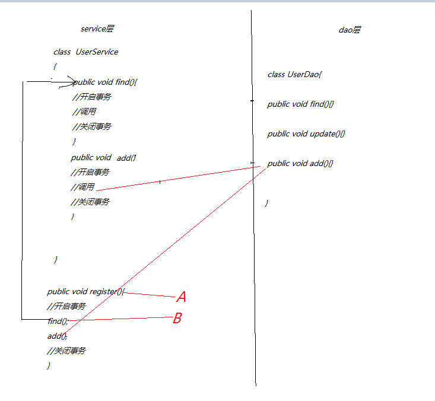
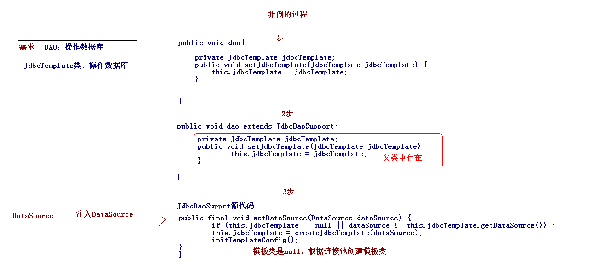

#  #

# 事务 #
1. 事务（Transaction），一般是指要做的或所做的事情。在计算机术语中是指访问并可能更新数据库中各种数据项的一个程序执行单元(unit)。事务(Transaction)是访问并可能更新数据库中各种数据项的一个程序执行单元(unit)。事务通常由高级数据库操纵语言或编程语言（如SQL，C++或Java）书写的用户程序的执行所引起，并用形如begin transaction和end transaction语句（或函数调用）来界定。事务由事务开始(begin transaction)和事务结束(end transaction)之间执行的全体操作组成
2. 一件完整的事情,包含多个操作单元,这些操作要么全部成功,要么全部失败.
## 特性 ACID ##
	* 原子性（atomicity）。一个事务是一个不可分割的工作单位，事务中包括的诸操作要么都做，要么都不做。
	* 一致性（consistency）。事务必须是使数据库从一个一致性状态变到另一个一致性状态。一致性与原子性是密切相关的。
	* 隔离性（isolation）。一个事务的执行不能被其他事务干扰。即一个事务内部的操作及使用的数据对并发的其他事务是隔离的，并发执行的各个事务之间不能互相干扰。
	* 持久性（durability）。持久性也称永久性（permanence），指一个事务一旦提交，它对数据库中数据的改变就应该是永久性的。接下来的其他操作或故障不应该对其有任何影响
	

		ACID
		原子性:事务里面的操作单元不可切割,要么全部成功,要么全部失败
		一致性:事务执行前后,业务状态和其他业务状态保持一致.
		隔离性:一个事务执行的时候最好不要受到其他事务的影响
		持久性:一旦事务提交或者回滚.这个状态都要持久化到数据库中

		原子性:要么全部成功,要么全部失败
		一致性:转账前和转账后,总钱不变
		隔离性:事务和事务不要相互影响
		持久性:一旦事务提交或者回滚.这个状态都要持久化到数据库中
## 事务提交方式 ##
		start transaction ;
		
		update tb_account set money=money+100 where id =1;
		
		update tb_account set money=money-100 where id =2;
		
		ROLLBACK;

1. 自动提交
	1. mysql默认情况
2. 手动提交
	1. oracle默认情况

事务一旦开启,要么提交要么回滚

## 隔离级别 isolation ##
1. 隔离性问题(当多个线程都开启事务操作数据库中的数据时)
		脏读:在一个事务中读取到另一个事务没有提交的数据
		不可重复读:在一个事务中,两次查询的结果不一致(针对的update操作)
		虚读(幻读):在一个事务中,两次查询的结果不一致(针对的insert操作)

2. 隔离级别
	* read_uncommited   读没有提交	上面三个问题都会发生
	* read_commited	 	读提交		可以避免脏读
	* repeatable_read	可以重复读	可以避免脏读+不可重复读(mysql 默认的事物隔离级别)
	* serializable		序列化,串行化 所有问题可以避免,一个事务一个事务来(锁表)
	
3. 效率
	read uncommitted>read committed>repeatable read>serializable
4. 安全
	read uncommitted<read committed<repeatable read<serializable
## 传播行为 ##

	* 先解释什么是事务的传播行为：解决的是业务层之间的方法调用！！
	
	* PROPAGATION_REQUIRED（默认值）	-- A中有事务,使用A中的事务.如果没有，B就会开启一个新的事务,将A包含进来.(保证A,B在同一个事务中)，默认值！！
	* PROPAGATION_SUPPORTS			-- A中有事务,使用A中的事务.如果A中没有事务.那么B也不使用事务.
	* PROPAGATION_MANDATORY			-- A中有事务,使用A中的事务.如果A没有事务.抛出异常.
	
	* PROPAGATION_REQUIRES_NEW（记）-- A中有事务,将A中的事务挂起.B创建一个新的事务.(保证A,B没有在一个事务中)
	* PROPAGATION_NOT_SUPPORTED		-- A中有事务,将A中的事务挂起.
	* PROPAGATION_NEVER 			-- A中有事务,抛出异常.
	
	* PROPAGATION_NESTED（记）		-- 嵌套事务.当A执行之后,就会在这个位置设置一个保存点.如果B没有问题.执行通过.如果B出现异常,运行客户根据需求回滚(选择回滚到保存点或者是最初始状态)
	

----------

----------

----------

# spring 事务 #
1. PlatformTransactionManager接口	-- 平台事务管理器.(真正管理事务的类)。该接口有具体的实现类，根据不同的持久层框架，需要选择不同的实现类！
2. TransactionDefinition接口			-- 事务定义信息.(事务的隔离级别,传播行为,超时,只读)
3. TransactionStatus接口				-- 事务的状态

## 转账案例 ##
	1. 创建项目,导包
		* 核心+日志6个包
		* AOP的4个包
		* C3P0的1个包
		* MySQL的驱动包
		* spring:JDBC目标2个包
		* 整合JUnit测试包
	2. 配置文件
		* 引入log4j.properties
		
		* 引入applicationContext.xml
			<bean id="dataSource" class="com.mchange.v2.c3p0.ComboPooledDataSource">
		    	<property name="driverClass" value="com.mysql.jdbc.Driver"/>
		    	<property name="jdbcUrl" value="jdbc:mysql:///mytest"/>
		    	<property name="user" value="root"/>
		    	<property name="password" value="1234"/>
		    </bean>
	3. service层,dao层
		* com.huaxin.service
			* AccountService
			* AccountServlceImpl
		*com.huaxin.dao
			* AccountDao
			* AccountDaoImpl
	4. service,dao交给spring
		<bean id="accountService" class="com.huaxin.service.AccountServiceImpl">
        </bean>
        <bean id="accountDao" class="com.huaxin.dao.AccountDaoImple"></bean>
	5. 注入属性
		<bean id="accountService" class="com.huaxin.service.AccountServiceImpl">
        	<property name="accountDao" ref="accountDao" />
        </bean>
		<--  简化开发: dao,继承JdbcDaoSupport类,可以不用jdbcTemplate -->
        <bean id="accountDao" class="com.huaxin.dao.AccountDaoImple">
        	<property  name="dataSource"  ref="dataSource"/>
        </bean>
	6. dao实现
		public class AccountDaoImple extends JdbcDaoSupport implements AccountDao {
			@Override
			public void updateMoney(int id, double money) {
				int update = getJdbcTemplate().update(
						"update tb_account set money= money + ? where id =?", money,
						id);
				System.out.println(update);
			}
		}
	7.service层
		public class AccountServiceImpl implements AccountService {
			private AccountDao accountDao;
			public void setAccountDao(AccountDao accountDao) {
				this.accountDao = accountDao;
			}
			@Override
			public void transferAccount(int fromId, int toId, double money) {
				/** 第一步： 扣钱 **/
				accountDao.updateMoney(fromId, -money);
				//int a = 1/0;
				/** 第二步： +++ **/
				accountDao.updateMoney(toId, money);
			}
		}
	8. 测试
		@RunWith(SpringJUnit4ClassRunner.class)
		@ContextConfiguration("classpath:applicationContext2.xml")
		public class TransferAccountTest {
			@Resource
			AccountService AccountService;
			@Test
			public void t1() {
				AccountService.transferAccount(2, 3, 100);
			}
		}

## AOP声明开启事务 ##
1. 底层采用AOP的技术
2. 配置文件里配置
	aop:
		1. 切面类 :srping提供
		2. 通知	 :spring提供
		3. 切点  :需要自己配置
			1. expression=""
3. 方式
	1. 配置文件
	2. 注解

4. 配置文件开启事务方式
	1. conn交给连接池dataSource
	2. dataSource交给spring事务管理器
			<!-- 数据源2 c3p0 -->
			<bean id="dataSource" class="com.mchange.v2.c3p0.ComboPooledDataSource">
				<!-- 四大参数 -->
				<property name="driverClass" value="com.mysql.jdbc.Driver" />
				<property name="jdbcUrl" value="jdbc:mysql:///mytest" />
				<property name="user" value="root" />
				<property name="password" value="1234" />
			</bean>
			<!-- 配置事务管理器 -->
		 	<bean id="transactionManager" class="org.springframework.jdbc.datasource.DataSourceTransactionManager">
		 		<property name="dataSource" ref="dataSource"/>
		 	</bean>
	3. 配置切面需要的通知
		 	<!-- aop事务(采用xml配置文件方式) -->
		 	<!-- 先配置通知 -->
		 	<tx:advice id="advice" transaction-manager="transactionManager">
		 		<tx:attributes>
		 				<!--
							name		：绑定事务的方法名，可以使用通配符，可以配置多个。
							propagation	：传播行为
							isolation	：隔离级别
							read-only	：是否只读
							timeout		：超时信息
							rollback-for：发生哪些异常回滚.
							no-rollback-for：发生哪些异常不回滚.
						 -->
						<!-- 哪些方法加事务 可以+*  : tA* -->
					 <tx:method name="transferAccount" /> 		
		 		</tx:attributes>
		 	</tx:advice>
	4. 配置切面
	 	<!--配置AOP的切面:如果自己写的 使用aop:aspect ,如果使用spring,使用aop:advisor -->
	 	<aop:config>
	 		<aop:pointcut expression="execution(* *..*transferAccount(..))" id="exe"/>
			<!-- 切入点,可以使用 -->
			<aop:advisor advice-ref="advice" pointcut-ref="exe"/> 	
	 	</aop:config>

完整的配置

	<!-- 通知 -->
	<tx:advice id="txAdvice" transaction-manager="transactionManager">
		<!-- 配置传播行为 -->
		<tx:attributes>
			<tx:method name="save*" propagation="REQUIRED" />
			<tx:method name="insert*" propagation="REQUIRED"/>
			<tx:method name="update*" propagation="REQUIRED"/>
			<tx:method name="delete*" propagation="REQUIRED"/>
			<tx:method name="find*" propagation="SUPPORTS" read-only="true"/>
			<tx:method name="get*" propagation="SUPPORTS" read-only="true"/>
			<tx:method name="select*" propagation="SUPPORTS" read-only="true"/>
		</tx:attributes>
	</tx:advice>
	<!-- aop配置 -->
	<aop:config>
		<aop:advisor advice-ref="txAdvice"
		 pointcut="execution(* com.huaxin.ssm.service.impl.*.*(..))"/>
	</aop:config>

----------

5. 注解开启事务
	1. conn交给连接池dataSource
	2. dataSource交给spring事务管理器
		<!-- 数据源2 c3p0 -->
		<bean id="dataSource" class="com.mchange.v2.c3p0.ComboPooledDataSource">
			<!-- 四大参数 -->
			<property name="driverClass" value="com.mysql.jdbc.Driver" />
			<property name="jdbcUrl" value="jdbc:mysql:///mytest" />
			<property name="user" value="root" />
			<property name="password" value="1234" />
		</bean>
		<!-- 配置事务管理器 -->
	 	<bean id="transactionManager" class="org.springframework.jdbc.datasource.DataSourceTransactionManager">
	 		<property name="dataSource" ref="dataSource"/>
	 	</bean>
	3. 开启事务注解
		<tx:annotation-driven transaction-manager="transactionManager"/>
	4. 添加注解:类方,方法上都行(接口、接口方法、类以及类方法上)
		1. @Transactional
		2. 类上
			* 当作用于类上时，该类的所有 public 方法将都具有该类型的事务属性，同时，我们也可以在方法级别使用该标注来覆盖类级别的定义。
		3. 使用
			@Transactional(isolation = Isolation.READ_COMMITTED, propagation = Propagation.REQUIRED,readOnly=false)

| 属性  |类型|描述|
| ---	| :---: | :----:|
|value|String|可选的限定描述符，指定使用的事务管理器|
|propagation|enum: Propagation|可选的事务传播行为设置|
|isolation|enum: Isolation|可选的事务隔离级别设置|
|readOnly|boolean|读写或只读事务，默认读写|
|timeout|int (in seconds granularity)|事务超时时间设置|
|rollbackFor|Class对象数组，必须继承自Throwable|导致事务回滚的异常类数组|
|rollbackForClassName|类名数组，必须继承自Throwable|导致事务回滚的异常类名字数组|
|noRollbackFor|Class对象数组，必须继承自Throwable|不会导致事务回滚的异常类数组|
|noRollbackForClassName|类名数组，必须继承自Throwable|不会导致事务回滚的异常类名字数组|