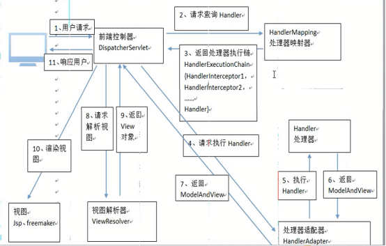

# 大纲 #
1. springMVC介绍
2. 入门
3. 架构
4. ssm整合
5. 参数绑定
6. struts2 和 springMvc区别

----------

----------

----------

# springMVC介绍 #
2008 struts1
2010 struts2
2014 springMvc

1. spring公司,web表现层框架,是spring框架的一部分
2. 作用
	* 接受请求参数 
		* 普通文本
		* 图片
	* 处理请求  Handler
	* 发送响应
		* html
		* json
		* forward
		* redirect
3. 请求响应流程(处理流程)
	* 传统:
		* 请求直接到servlet
		* 响应也直接返回
	* 现在:
		* 请求先经过  DispatcherServlet , 然后交给 Controller
		* 响应也要经过 DispatcherServlet ,然后返回
		* 类似环绕通知!!!

# 入门 #
1. 创建工程(不接入数据库)
2. 导包
	* spring 核心 6个
	* 核心支持	  1个
	* aop		  4个(可以不要??)
	* spring-web  2个
		* spring-web
		* spring-web-mvc
3. 配置文件
	* log4j
	* applicationContext.xml (清空,先不使用)
	* mvc 约束
			docs\spring-framework-reference\html\mvc.html
					搜索xmlns

4. web.xml配置springMVC核心控制器-DispatcherServlet 
		* 其实就是一个servlet
					<servlet>
						<servlet-name>servlet的名字</servlet-name>
						<servlet-class>在springmvc.jar里面</servlet-class>
					</servlet>
					
					<servlet-mapping>
						<servlet-name></servlet-name>
						<url-pattern>*.do</url-pattern>
					</servlet-mapping>
		* servlet节点中 需要开机就启动
			* load-on-startup
		* servlet节点中 需要给定springMvc配置文件的位置
			* 如果不给定,默认位置
				* /WEB-INF/servlet的名-servlet.xml
				* Caused by: java.io.FileNotFoundException: Could not open ServletContext resource [/WEB-INF/springDispatcherServlet-servlet.xml]
			* 配置(方便配置文件统一管理).需要在servlet节点添加初始化参数
				* init-param
					<init-param>
						<param-name>源码dispatcher父类中</param-name>
						<param-value>classpath:springMVC.xml</param-value>		
					</init-param>
		* 先要配置 初始化参数,然后配置加载顺序

		<servlet>
			<servlet-name>springDispatcherServlet</servlet-name>
			<servlet-class>org.springframework.web.servlet.DispatcherServlet</servlet-class>
			<!-- 配置springMVC 核心配置文件的位置 -->
			<init-param>
				<param-name>contextConfigLocation</param-name>
				<param-value>classpath:springMvc.xml</param-value>
			</init-param>
			<!-- tomcat启动就加载 -->
			<load-on-startup>1</load-on-startup>
		</servlet>
		<servlet-mapping>
			<servlet-name>springDispatcherServlet</servlet-name>
			<url-pattern>*.do</url-pattern>
		</servlet-mapping>

5. springMvc.xml配置文件
	* 约束:spring一样
	* 开启注解扫描
			<?xml version="1.0" encoding="UTF-8"?>
			<beans xmlns="http://www.springframework.org/schema/beans"
			    xmlns:xsi="http://www.w3.org/2001/XMLSchema-instance"
			    xmlns:context="http://www.springframework.org/schema/context" xsi:schemaLocation="
			        http://www.springframework.org/schema/beans http://www.springframework.org/schema/beans/spring-beans.xsd
			        http://www.springframework.org/schema/context http://www.springframework.org/schema/context/spring-context.xsd"> <!-- bean definitions here -->
				<!-- web层扫描 -->
				<context:component-scan base-package="com.huaxin.mvc.web.controller"></context:component-scan>
			</beans>

6. 创建web层->controller
	* 创建一个普通类
	* 类上添加注解
	* 方法上添加注解
		@Controller
		public class UserController {
			// 指定 外界(浏览器)访问url路径
			//可以加后缀,也可以不加后缀
			@RequestMapping("/list")
			public ModelAndView list() {
				// 查询数据库数据
				ArrayList<HxUser> arrayList = new ArrayList<HxUser>();
				arrayList.add(new HxUser("张三"));
				arrayList.add(new HxUser("张4"));
				arrayList.add(new HxUser("张5"));
				/**
				 * model(模型 ) : 存放返回 数据
				 * 
				 * view(视图) : 存放返回 页面的位置
				 */
				ModelAndView modelAndView = new ModelAndView();
				// 返回数据
				modelAndView.addObject("lists", arrayList);
				// 返回页面位置,底层使用dispatch:内部路径
				modelAndView.setViewName("/WEB-INF/jsp/user/list.jsp");
				return modelAndView;
			}
		}
8. jsp
	* ${lists }
9. 访问路径
	* http://localhost/SpringMvc_001/list.do
7. 原理
	1. 扫描包 添加@Controller注解的类
	2. 当请求发送过来,存内存里找加载的类中有和请求路径匹配的方法

# springMVC底层架构流程 #

## 流程 ##
1. 异步管理
		WebAsyncManager asyncManager = WebAsyncUtils.getAsyncManager(request);
2. 检测文件上传
		processedRequest = checkMultipart(request);
		multipartRequestParsed = (processedRequest != request);
3. 通过request,从handlerMappings中,获取执行器链接(拦截器)
		HandlerExecutionChain mappedHandler 
			* HandlerInterceptor[]
			* Object handler	
4. 通过handler, 获取处理器适配器 HandlerAdapter
5. 判断get请求,是否缓存
6. 前置拦截
7. 执行HandlerAdapter,返回mv
8. 补充前后缀????
9. 后置拦截
10. 渲染/异常处理
11. finally 最终拦截

1. handlerExecutionChain
2. processDispatchResult
3. doService->doDispatch->
	1. 
	2. 

1. 请求到前端控制器(DispatcherServlet)
2. servlet 调用 处理器映射器(HandlerMapping),
	*  通过request请求参数(请求url找到具体的处理器)
	*  获取处理器(handler,方法) 和 拦截链(handlerExecutionChain)
3. 执行前置拦截链,是否拦截
4. 如果放行
5. servlet 调用 处理器适配器(handlerAdapter),执行handler方法
	1. 自动映射方法参数(普通类型,po,日期类型)
	2. 返回ModelAndView
6. serlvet 调用 视图解析器(ViewReslover)
	* 参数: mv
	* 返回: 视图具体位置
	* 添加前缀  添加 后缀
		public String getViewName(HttpServletRequest request) {
			String lookupPath = this.urlPathHelper.getLookupPathForRequest(request);
			return (this.prefix + transformPath(lookupPath) + this.suffix);
		}
7. 执行后置拦截链,收尾工作(后置通知),postHandle
		1. 后置通知:这里可在返回用户前对模型数据进行加工处理，比如这里加入公用信息以便页面显示
8. servlet 对 view 渲染
9. 执行最终拦截链,收尾工作
10. 响应客户

## SpingMvc三大组件 ##
1. HandlerMapping：处理器映射器
	HandlerMapping负责根据用户请求找到Handler即处理器，
	springmvc提供了不同的映射器实现不同的映射方式，
		例如：配置文件方式，实现接口方式，注解方式等。
2. HandlAdapter：处理器适配器
	通过HandlerAdapter对处理器进行执行，这是适配器模式的应用，
	通过扩展适配器可以对更多类型的处理器进行执行。
3. View Resolver：视图解析器
	View Resolver负责将处理结果生成View视图
	View Resolver首先根据逻辑视图名解析成物理视图名即具体的页面地址
	再生成View视图对象，最后对View进行渲染将处理结果通过页面展示给用户。

## 其他组件 ##
1. DispatcherServlet：前端控制器
	用户请求到达前端控制器，它就相当于mvc模式中的c，dispatcherServlet是整个流程控制的中心，
	由它调用其它组件处理用户的请求，dispatcherServlet的存在降低了组件之间的耦合性。
2. Handler：处理器 (需要自己开发)
	Handler对具体的用户请求进行处理。
	由于Handler涉及到具体的用户业务请求，所以一般情况需要程序员根据业务需求开发Handler。
3. View：视图(需要自己开发)
	pdfView等。我们最常用的视图就是jsp。
	一般情况下需要通过页面标签或页面模版技术将模型数据通过页面展示给用户，需要由程序员根据业务需求开发具体的页面。

## 默认组件配置位置 ##
1. spring-mvc.jar -> DispatcherServlet.properties
2. 三大组件中2大 有多个
	* 如果没有显示指定,三大组件, springMvc默认会去配置文件中查找对应的三大组件
		* 效率低,降低访问速度
3. 配置三大组(springMVC.xml中)
	* 配置 处理器映射器,处理器适配器
				<!-- 手动配置 三大组件中的2个:提高效率 -->
				<!--注解形式的handlermapping -->
				<bean class="org.springframework.web.servlet.mvc.annotation.DefaultAnnotationHandlerMapping"></bean>
				<!--注解形式的handlerAdapter -->
				<bean class="org.springframework.web.servlet.mvc.annotation.AnnotationMethodHandlerAdapter"></bean>	
		* 点进源码 过时
		* 最新版本的
				<!-- 手动配置 最新版本的三大组件中的2个:提高效率 -->
				<!--最新版:注解形式的handlermapping -->
				<bean class="org.springframework.web.servlet.mvc.method.annotation.RequestMappingHandlerMapping"></bean>
				<!--最新版:注解形式的handlerAdapter -->
				<bean class=org.springframework.web.servlet.mvc.method.annotation.RequestMappingHandlerAdapter></bean>	
		* 本本更新每次改,
			* spring提供一个注解驱动,自动配置最新版
				<mvc:annotation-driven></mvc:annotation-driven>
				概念:
					注解驱动:自动配置最新版
					注解扫描:扫描
	* 配置 视图解析器
		* 配置前缀
		* 配置后缀
			<!-- 配置视图解析器: 配置后不需要写完整路径 	 -->
				<bean class="org.springframework.web.servlet.view.InternalResourceViewResolver">
					<!-- 正真路径:  prefix + viewName  + suffix 
						/WEB-INF/jsp/user/  list  .jsp
					 -->
					<property name="prefix" value="/WEB-INF/jsp/user/"></property>
					<property name="suffix" value=".jsp"></property>
				</bean>	