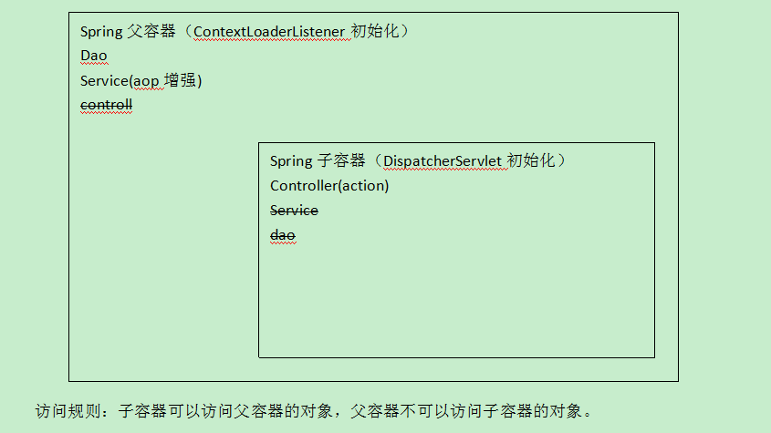

# 表设计 #

# ssm框架整合 #
1. manager-service
	1. 所有配置信息,最好放在service(war)统一管理
		1. mybatis
		2. dao
		3. service
		4. tans
		5. log4j
		6. jdbc
		7. web.xml 配置加载spring 的监听
2. web
	1. spring-mvc
	2. web.xml

## 父子容器 ##
	父:ContextLoaderListener
		子:DispatcherServlet

	父:(ContextLoaderListener)
		父容器不可以访问子容器对象	
			扫描 dao.service	(增强)
		
	
	子(DispatcherServlet)
		容器可以访问父容器的对象
		扫描 Controller(可以访问service,dao)

1. 为什么要分开springMvc子容器
	1. web层框架不只是一个!!!,分权
