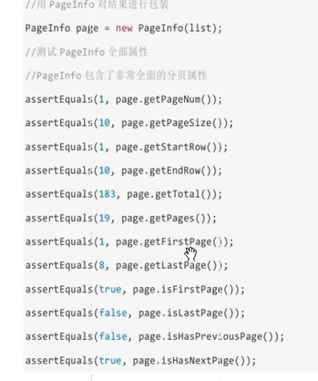

# mybatis分页插件 #
1. 支持
	1. oracle
	2. mysql
	3. MariaDb
	4. sqlLite
	5. Hsqldb
	6. PostgreSQL
2. 不支持
	1. sqlServer
3. 使用
	1. jar
	2. 在 sqlMapConfig.xml配置
			<configuration>
				<plugins>
					<!-- mybatis分页插件 -->
					<plugin interceptor="com.github.pagehelper.PageHelper">
						<!-- 方言 :支持 mysql oracle等 -->
						<property name="dialect" value="mysql"/>
					</plugin>
				</plugins>
			</configuration>

	3. 测试	
		

	