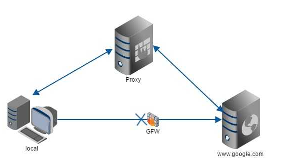
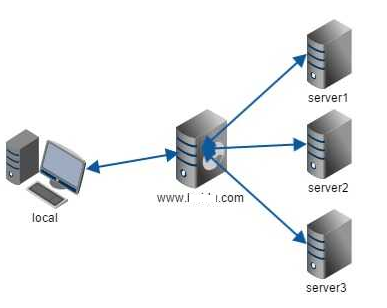
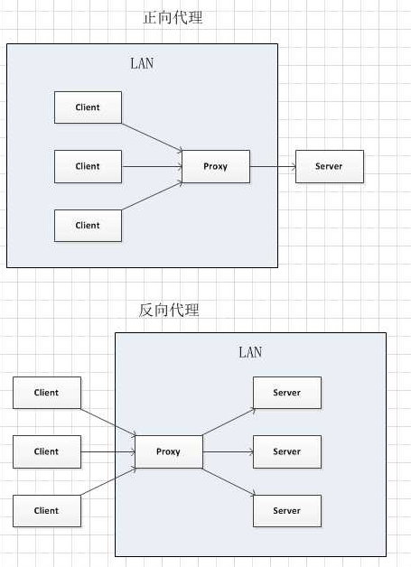

# nginx 介绍 #
	* https://baike.baidu.com/item/nginx/3817705?fr=aladdin
	* 轻量,高性能的服务器
	* HTTP和反向代理服务器
	* 电子邮件(IMAP/POP3/SMTP)服务器
	* 占有内存少，并发能力强
	* 中国大陆使用nginx网站用户有：百度、京东、新浪、网易、腾讯、淘宝等
	* c 语言开发

----------

# nginx功能 #
	* 反向代理
	* 负载均衡
	* 动静分离
## 反向代理 ##
	1. 正向代理
		* 代理电脑掌握在客户端
		* 需要客户端手动设置代理ip和端口
		* 从客户端出发

	2. 反向代理
		* 代理电脑掌握在服务端
		* 需要服务器设置
		* 客户端访问,并不知道具体访问的电脑

[正向代理和反向代理_zhihu](https://www.zhihu.com/question/24723688)

[正向代理和反向代理](http://bbs.51cto.com/thread-967852-1-1.html)

## 负载均衡 ##
	1. 问题
		* 超市收钱,如果只有一个收银口,大力比较大
	2. 概念
		* 负载均衡，英文名称为Load Balance
		* 种廉价有效透明的方法扩展网络设备和服务器的带宽、增加吞吐量、加强网络数据处理能力、提高网络的灵活性和可用性
		* 原理就是数据流量分摊到多个服务器上执行，减轻每台服务器的压力，多台服务器共同完成工作任务，从而提高了数据的吞吐量
	3. 搭建多态服务器一起工作(集群)

## 动静分离 ##
	1. 动态资源,静态资源分开
	2. 如果访问静态资源,nginx服务器可以提供,不需要再去请求代理服务器了

----------

----------

----------
# windows下nginx #
## 使用 ##
	1. 下载
		* [下载](http://nginx.org/en/download.html)
		* nginx-1.13.5.zip
	2. 解压
		* 新建一个tomcat文件夹,解压到
		* 目录
			* conf 配置
				* nginx.conf
			* html 内部静态页面
			* nginx.exe
	3. 执行
		* 点击nginx.exe,一闪而过
		* 在任务管理器,查看nginx
		* 在浏览器上: http://localhost/  ,出现nginx首页
		* nginx默认端口80

## nginx代理一台tomcat ##
1. 解压一台新的tomcat->tomcat1
2. 修改server.xml端口,每个端口加10
3. 新建一个web项目,发布到webapps下
	* index.jsp
		tomcat1 
		${pageContext.session.id}
4. 启动tomcat
	* http://localhost:8090/test/
5. 配置nginx
	* 在 nginx/conf/nginx.conf
		* 格式 名字 { 名字 值; }
	* http节点下的server节点
		 location / {
	            root   html;
	            index  index.html index.htm;
		    proxy_pass http://localhost:8090;
	     }
6. 重启nginx
	* 直接任务管理器,关闭

7. 刷新浏览器
	* http://localhost/
	* 如果配置文件写错,则显示不出代理tomcat界面

## nginx多台tomcat(tomcat集群) ##
1. 复制tomcat1->tomcat2
2. 修改端口,再加10
3. 修改index.jsp
	tomcat2 
	${pageContext.session.id}
4. 启动tomcat
	* http://localhost:8100/test/
5. 配置nginx
	1. 在http节点下(server平级),添加节点
		upstream server_proxy_name{
			server 127.0.0.1:8090 ;
			server 127.0.0.1:8100 ;
		}
	2. 修改server节点下
	    location / {
            root   html;
            index  index.html index.htm;
	   		 proxy_pass http://server_proxy_name;
        }

6. 重启nginx
	* 直接任务管理器,关闭

7. 刷新浏览器
	* http://localhost/test
	* 如果配置文件写错,不显示界面

8. 如果某台服务器性能好一些,可以在upstream节点添加权重weight
	* 权值越大,访问几率越大
		upstream server_proxy_name{
			server 127.0.0.1:8090 weight=3;
			server 127.0.0.1:8100 weight=1;
		}

## session共享 ##
1. 问题
	* 用户登入后,session丢失,被拦,有需要登入
2. 方案
	* web服务器自带集群功能(每台都要打开)
		* 修改tomcat配置文件,server.xml
			* <Engine> 节点下,打开Cluster集群节点
			*  <Cluster className="org.apache.catalina.ha.tcp.SimpleTcpCluster"/>
		* 修改项目的配置文件
			* 在web.xml中添加一个节点 <distributable/>
		* 启动tomcat
			* Membership-MemberAdded
	* 保证一个ip地址,永远访问一台主机
		* 在nginx中,配置ip_hash;
			upstream server_proxy_name{
				server 127.0.0.1:8090 weight=3;
				server 127.0.0.1:8100 weight=1;
				ip_hash;
			}

	* 通用:redis存储session

----------

----------

----------
# linux下nginx #
1. 下载
	* [下载](http://nginx.org/en/download.html)
	* nginx-1.13.5.tar.gz
2. 上传
3. 解压
	cd /usr/local/src/
	mkdir nginx
	cp /root/nginx-1.13.5.tar.gz ./nginx/
	cd nginx/
	tar -xvf n
4. 依赖(nginx是C语言开发，需要运行环境)
	* 编译报错 error
		* ./configure: error: C compiler cc is not found
		* ./configure: error: the HTTP rewrite module requires the PCRE library.
		* ./configure: error: the HTTP gzip module requires the zlib library.
	* gcc (需要点时间)
		* nginx编译依赖gcc环境
		* yum -y install gcc-c++ 
	* PCRE
		* Perl Compatible Regular Expressions是一个Perl库(正则表达式库),nginx的http模块使用pcre来解析正则表达式，所以需要在linux上安装pcre库。
		* yum install -y pcre pcre-devel
	* zlib
		* nginx使用zlib对http包的内容进行gzip
		* yum install -y zlib zlib-devel
	* openssl
		* 安全套接字层密码库,提供SSL协议
		* nginx不仅支持http协议，还支持https（即在ssl协议上传输http）
		* yum install -y openssl openssl-devel
5. 编译
	* 在nginx文件夹下
	* ./configure 
		* 默认安装在外面
			* 上一层目录
			* /usr/nginx
	* ./configure --prefix=/usr/local/src/nginx
		* 指定安装路径 
5. 安装
	* make
	* make install

6. 运行nginx(在sbin下面执行)
	1. 启动		./nginx
	2. 关闭		./nginx -s	stop
	3. 退出		./nginx -s	quit
	4. 重新加载	./nginx	-s	reload
7. 访问
	* ps -ef | grep nginx
		root      14693      1  0 02:32 ?        00:00:00 nginx: master process ./nginx
		nobody    14694  14693  0 02:32 ?        00:00:00 nginx: worker process
		root      14699   5224  0 02:36 pts/2    00:00:00 grep nginx
	* http://192.168.126.134
	* 防火墙,放行80端口
		80端口放行 
			/sbin/iptables -I INPUT -p tcp --dport 80 -j ACCEPT
		将该设置添加到防火墙的规则中
			/etc/rc.d/init.d/iptables save
	* 403  Forbidden 
		nginx nginx.conf  user nobody; -> user root;

# linux 集群 #
1. 准备tomcat1,发布项目 
2. 拷贝 tomcat1->tomcat2
	cp -r apache-tomcat-8.5.23 apache-tomcat-8.5.23_2
3. 修改项目,修改端口
	vi conf/server.xml 
	vi webapp/test/index.jsp
4. 启动tomcat
	./startup.sh
5. 查看
	ps -ef | grep tomcat
6.  防火墙,放行 
	8090端口放行 
		/sbin/iptables -I INPUT -p tcp --dport 8090 -j ACCEPT
	将该设置添加到防火墙的规则中
		/etc/rc.d/init.d/iptables save

7. ngix配置
	upsteam server_name{
        server 127.0.0.1:8080;
        server 127.0.0.1:8090;  
    }   

 	location / {
            root   html;
            index  index.html index.htm;
            proxy_pass http://server_name;
        }

8. session共享问题
	* 修改配置文件
		upsteam server_name{
	        server 127.0.0.1:8080;
	        server 127.0.0.1:8090;  
			ip_hash;
    	}   

----------
# 防火墙 #
1. 单个放行
	8090端口放行 
		/sbin/iptables -I INPUT -p tcp --dport 8090 -j ACCEPT
	将该设置添加到防火墙的规则中
		/etc/rc.d/init.d/iptables save
2. 关闭
	service iptabels stop
	chkconfig iptables off
