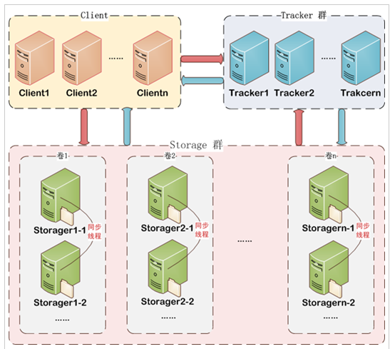
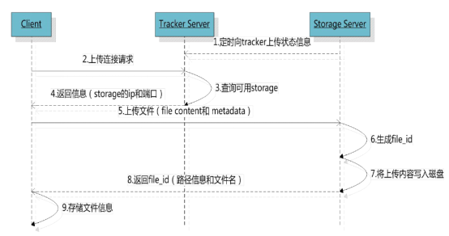
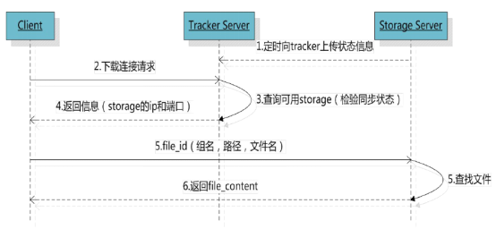

# fastDFS #
1. FastDFS是用c语言编写的一款开源的分布式文件系统。
2. FastDFS为互联网量身定制，充分考虑了冗余备份、负载均衡、线性扩容等机制，并注重高可用、高性能等指标，使用FastDFS很容易搭建一套高性能的文件服务器集群提供文件上传、下载等服务。

# 架构 #

1. Tracker server
	1. 类似dubbo注册中心
	2. 负载均衡,存储调度(内部策略找到/选定storage)
	3. 主要负责调度
	4. 支持集群(多台)
		1. 多台,平等关系
		2. 同时提供服务 
		3. 不存在单点故障
		4. 如果,一台挂了则另一台服务
2. Storage Server
	1. 存储文件的服务器
	2. 可以分组,支持扩容
		1. 组内,内容相同(同步,平等)
		2. 组外,内容不相同(相互独立)

## 流程 ##
1. 上传

2. 下载

3. 文件规则
	1. 组名
	2. 虚拟磁盘路径
	3. 两级目录
	4. 文件名
	group1/M00/02/aa.

----------
[x1](http://blog.csdn.net/xb565517830/article/details/78982233)
# 搭建 #
	简单版
		1. 一个tracker
		2. 一个storage 
		3. 一个nginx
1. 准备安装软件包
	1. libfastcommon(依赖包)
	2. FastDFS(源码)
	3. fastdfs-nginx-module(nginx模块)
		http://pan.baidu.com/s/1hs3qp84
		https://sourceforge.net/projects/fastdfs/files/FastDFS%20Nginx%20Module%20Source%20Code/
		https://nchc.dl.sourceforge.net/project/fastdfs/FastDFS%20Nginx%20Module%20Source%20Code/fastdfs-nginx-module_v1.16.tar.gz

		https://github.com/happyfish100/ -> libfastcommon-> releases

2. 预先安装
	1. gcc
		yum -y install make cmake gcc gcc-c++
		yum -y install gcc gcc-c++  make automake autoconf libtool perl
	2. libevent工具包
		yum -y install libevent
3. libfastcommon 安装
	1. 解压
		tar -xvf libfastcommon-1.0.36.tar.gz
		unzip fastdfs-master.zip
		总用量 36
			drwxrwxr-x. 2 root root 4096 4月   5 2017 doc
			-rw-rw-r--. 1 root root 8005 4月   5 2017 HISTORY
			-rw-rw-r--. 1 root root  566 4月   5 2017 INSTALL
			-rw-rw-r--. 1 root root 1606 4月   5 2017 libfastcommon.spec
			-rwxrwxr-x. 1 root root 3099 4月   5 2017 make.sh
			drwxrwxr-x. 2 root root 4096 4月   5 2017 php-fastcommon
			-rw-rw-r--. 1 root root 2763 4月   5 2017 README
			drwxrwxr-x. 3 root root 4096 4月   5 2017 src
	2. make.sh
		1. 编译
			./make.sh
		2. 安装
			./make.sh install

			在/usr/lib64文件夹中 创建了libfastcommon.so
	3. 把/usr/lib64/libfastcommon.so文件向/usr/lib/下复制一份(仅仅32位需要)
			cp /usr/lib64/libfastcommon.so  /usr/lib/
			* lib 32系统   
			* lib64 64位系统
4. FastDFS 安装
	1. 解压
		 tar -xvf fastdfs-5.11.tar.gz 

		总用量 136
			drwxrwxr-x. 3 root root  4096 6月   3 2017 client
			drwxrwxr-x. 2 root root  4096 6月   3 2017 common
			drwxrwxr-x. 2 root root  4096 6月   3 2017 conf
			-rw-rw-r--. 1 root root 35067 6月   3 2017 COPYING-3_0.txt
			-rw-rw-r--. 1 root root  3171 6月   3 2017 fastdfs.spec
			-rw-rw-r--. 1 root root 33100 6月   3 2017 HISTORY
			drwxrwxr-x. 2 root root  4096 6月   3 2017 init.d
			-rw-rw-r--. 1 root root  7755 6月   3 2017 INSTALL
			-rwxrwxr-x. 1 root root  5548 6月   3 2017 make.sh
			drwxrwxr-x. 2 root root  4096 6月   3 2017 php_client
			-rw-rw-r--. 1 root root  2380 6月   3 2017 README.md
			-rwxrwxr-x. 1 root root  1768 6月   3 2017 restart.sh
			-rwxrwxr-x. 1 root root  1680 6月   3 2017 stop.sh
			drwxrwxr-x. 4 root root  4096 6月   3 2017 storage
			drwxrwxr-x. 2 root root  4096 6月   3 2017 test
			drwxrwxr-x. 2 root root  4096 6月   3 2017 tracker
	2. make.sh
		1. 编译
			./make.sh
		2. 安装
			./make.sh install
		3. 错误
			* ./make.sh: line 147: perl: command not found
				* 重新安装了gcc	
					yum -y install gcc gcc-c++  make automake autoconf libtool perl
				* 移除然后重新解压
		4. 影响:
			1. 在 /usr/bin/ 多处一些命令
				cd /usr/bin/
				ll fdfs_*
					-rwxr-xr-x. 1 root root 255539 1月  18 05:20 fdfs_appender_test
					-rwxr-xr-x. 1 root root 255236 1月  18 05:20 fdfs_appender_test1
					-rwxr-xr-x. 1 root root 245668 1月  18 05:20 fdfs_append_file
					-rwxr-xr-x. 1 root root 245338 1月  18 05:20 fdfs_crc32
					-rwxr-xr-x. 1 root root 245751 1月  18 05:20 fdfs_delete_file
					-rwxr-xr-x. 1 root root 246558 1月  18 05:20 fdfs_download_file
					-rwxr-xr-x. 1 root root 246284 1月  18 05:20 fdfs_file_info
					-rwxr-xr-x. 1 root root 258924 1月  18 05:20 fdfs_monitor

					-rwxr-xr-x. 1 root root 872078 1月  18 05:20 fdfs_storaged  
					-rwxr-xr-x. 1 root root 261971 1月  18 05:20 fdfs_test
					-rwxr-xr-x. 1 root root 261148 1月  18 05:20 fdfs_test1

					-rwxr-xr-x. 1 root root 368211 1月  18 05:20 fdfs_trackerd
					-rwxr-xr-x. 1 root root 246606 1月  18 05:20 fdfs_upload_appender
					-rwxr-xr-x. 1 root root 247736 1月  18 05:20 fdfs_upload_file
				2. 在/etc/fdsf 配置文件
					cd /etc/fdsf
						-rw-r--r--. 1 root root 1461 1月  18 05:10 client.conf.sample
						-rw-r--r--. 1 root root 7927 1月  18 05:10 storage.conf.sample
						-rw-r--r--. 1 root root  105 1月  18 05:10 storage_ids.conf.sample
						-rw-r--r--. 1 root root 7389 1月  18 05:10 tracker.conf.sample
	3. 配置文件
			1. fastDFS解压目录有conf/* 下面很多配置文件
					-rw-rw-r--. 1 root root 23981 6月   3 2017 anti-steal.jpg
					-rw-rw-r--. 1 root root  1461 6月   3 2017 client.conf
					-rw-rw-r--. 1 root root   955 6月   3 2017 http.conf
					-rw-rw-r--. 1 root root 31172 6月   3 2017 mime.types
					-rw-rw-r--. 1 root root  7927 6月   3 2017 storage.conf
					-rw-rw-r--. 1 root root   105 6月   3 2017 storage_ids.conf
					-rw-rw-r--. 1 root root  7389 6月   3 2017 tracker.conf
			2. 安装/etc/fdfs/* 配置文件
			3. 讲1中的文件拷贝到2中
					cd /root/fastDFS/fastdfs-5.11/conf
					cp * /etc/fdfs/
	4. 修改配置
			1. 修改/etc/fdfs/,目录下tracker.conf
				vi /etc/fdfs/tracker.conf
					port-22122
					base_path=/home/yuqing/fastdfs		数据日志目录,修成自己的路径,然后创建文件夹
							  /home/fastdfs/tracker

					mkdir -p /home/fastdfs/tracker
	5. 启动
			 /usr/bin/fdfs_trackerd /etc/fdfs/tracker.conf
			 /usr/bin/fdfs_trackerd /etc/fdfs/tracker.conf  restart
			 
			 ps -aux | grep tracker
	6. storage 安装
		1. 如果在不同服务器安装,需要执行以上1,2,3步骤
		2. 修改配置文件
			1. 修改/etc/fdfs/,目录下storage.conf
				vi /etc/fdfs/storage.conf
				port=23000
				base_path=/home/yuqing/fastdfs		数据日志目录,修成自己的路径,然后创建文件夹
						  /home/fastdfs/storage
				store_path0=/home/yuqing/fastdfs	图片存放路径		
							/home/fastdfs/storage
				tracker_server=192.168.209.121:22122	tracker服务器,一般不再一台电脑上
							   192.168.126.135:22122
							单机搭建，IP不要写127.0.0.1
				mkdir -p /home/fastdfs/storage
				
		3. 启动
			/usr/bin/fdfs_storaged /etc/fdfs/storage.conf
			/usr/bin/fdfs_storaged /etc/fdfs/storage.conf restart

			 ps -aux | grep storage
	7. tracker和storage分别/home/fdfs创建了
		1. data (storage 创建了很多文件夹)
		2. logs 

	8. 测试
		1. 修改配置文件 vi /etc/fdfs/client.conf
			base_path=/home/yuqing/fastdfs
					  /home/fastdfs/client
			tracker_server=192.168.0.197:22122
							192.168.126.135:22122

			mkdir -p /home/fastdfs/client
		2. 上传图片		
			 cd /etc/fdfs
			 /usr/bin/fdfs_test /etc/fdfs/client.conf upload anti-steal.jpg

					This is FastDFS client test program v5.11
					
					Copyright (C) 2008, Happy Fish / YuQing
					
					FastDFS may be copied only under the terms of the GNU General
					Public License V3, which may be found in the FastDFS source kit.
					Please visit the FastDFS Home Page http://www.csource.org/ 
					for more detail.
					
					[2018-01-18 06:13:22] DEBUG - base_path=/home/fastdfs/client, connect_timeout=30, network_timeout=60, tracker_server_count=1, anti_steal_token=0, anti_steal_secret_key length=0, use_connection_pool=0, g_connection_pool_max_idle_time=3600s, use_storage_id=0, storage server id count: 0
					
					tracker_query_storage_store_list_without_group: 
					        server 1. group_name=, ip_addr=192.168.126.135, port=23000
					
					group_name=group1, ip_addr=192.168.126.135, port=23000
					storage_upload_by_filename
					group_name=group1, remote_filename=M00/00/00/wKh-h1pfyoKAb0TCAABdrZgsqUU623.jpg
					source ip address: 192.168.126.135
					file timestamp=2018-01-18 06:13:22
					file size=23981
					file crc32=2553063749
					example file url: http://192.168.126.135/group1/M00/00/00/wKh-h1pfyoKAb0TCAABdrZgsqUU623.jpg
					storage_upload_slave_by_filename
					group_name=group1, remote_filename=M00/00/00/wKh-h1pfyoKAb0TCAABdrZgsqUU623_big.jpg
					source ip address: 192.168.126.135
					file timestamp=2018-01-18 06:13:22
					file size=23981
					file crc32=2553063749
				example file url: http://192.168.126.135/group1/M00/00/00/wKh-h1pfyoKAb0TCAABdrZgsqUU623_big.jpg
		3. 还不能访问,没有http服务器
5. 搭建http服务
	1. nginx插件  fastdfs-nginx-module (需要编译)	
		1. 解压zip包
			yum -y install unzip
			yum -y install zip  
		2. 解压
			unzip xxx

				-rw-r--r--. 1 root root 2804 5月  30 2017 HISTORY
				-rw-r--r--. 1 root root 1722 5月  30 2017 INSTALL
				drwxr-xr-x. 2 root root 4096 5月  30 2017 src

					-rw-r--r--. 1 root root 43398 5月  30 2017 common.c
					-rw-r--r--. 1 root root  3987 5月  30 2017 common.h
					-rw-r--r--. 1 root root   902 5月  30 2017 config
					-rw-r--r--. 1 root root  3725 5月  30 2017 mod_fastdfs.conf
					-rw-r--r--. 1 root root 28668 5月  30 2017 ngx_http_fastdfs_module.c
		3. 修改配置文件
			1. 修改:src/config
				老版本 : 
					* /usr/local/include/fastdfd
					* /usr/local/include/fastcommon
					* 需要把local去除
				新版本不需要
			2. 移动:src/mod_fastdfs.conf
				src/mod_fastdfs.conf文件复制到/etc/fdfs目录下
						cp mod_fastdfs.conf /etc/fdfs/.
						ll /etc/fdfs/
			3. 编辑/etc/fdfs/mod_fastdfs.conf
				vi /etc/fdfs/mod_fastdfs.conf
					base_path=/tmp	日志路径,可以不修改
					tracker_server=tracker:22122	tracker的url修改  tracker_server=192.168.126.135:22122
					url_have_group_name = false		是否包含组名修改	 url_have_group_name = true 
					store_path0=/home/yuqing/fastdfs保存路径 		 store_path0=/home/fastdfs/storage
							如果没配置,能上传成功,但是不能显示
		4. 对nginx重新configure
			1. 移除makeFile
				rm -rf Makefile 
			2. 移除安装文件
			3. 重新编译(生成新的MakeFile)
				 ./configure --prefix=/root/nginx/nginx-install --add-module=/root/fastDFS/fastdfs-nginx-module-master/src
			4. 重新安装
					* make
					* make install
		5. 修改nginx配置
			vi nginx.conf
					在nginx的配置文件中添加/修改一个Server：
					server {
					        listen       80;
					        server_name  192.168.126.135;
					
					        location /group1/M00/{
					                #root /home/FastDFS/fdfs_storage/data;
					                ngx_fastdfs_module;
					        }
					}
		6. 将libfdfsclient.so拷贝至/usr/lib下(64位可以不需要拷贝)
				cp /usr/lib64/libfdfsclient.so /usr/lib/
		7. 启动ngxin
			1. 错误logs
				1. open() "/root/nginx/nginx-install/logs/nginx.pid" failed (2: No such file or directory)
					使用nginx -c的参数指定nginx.conf文件的位置 (需要kill nginx先)
						 /root/nginx/nginx-install/sbin/nginx  -c /root/nginx/nginx-install/conf/nginx.conf

					[root@ly2 nginx-install]# ./sbin/nginx  -c ./conf/nginx.conf 
					ngx_http_fastdfs_set pid=10319			//插件运行
----------
# 启动 #
1. tracker
	 /usr/bin/fdfs_trackerd /etc/fdfs/tracker.conf
	/usr/bin/fdfs_trackerd /etc/fdfs/tracker.conf  restart
2. storage
	/usr/bin/fdfs_storaged /etc/fdfs/storage.conf
	/usr/bin/fdfs_storaged /etc/fdfs/storage.conf restart
	 ps -aux | grep storage
3. nginx
	 /root/nginx/nginx-install/sbin/nginx  -c /root/nginx/nginx-install/conf/nginx.conf

----------

----------

----------
# 测试 #
1. 导包,
	1. 下载fastdfs-client-java-master.zip
[官网](https://github.com/happyfish100/)
	2. maven导入
	3. 安装在本地仓库
	4. 导坐标
			<dependency>
				<groupId>org.csource</groupId>
				<artifactId>fastdfs-client-java</artifactId>
				<version>1.27-SNAPSHOT</version>
			</dependency>
2. 创建配置文件
	1. 在src/main/resources/properties下面,新建一个client.conf文件
		tracker_server = 192.168.126.135:22122
3. 代码:
	1. 初始化配置文件	
	2. 创建TrackerClient
	3. 获取TrackerServer
	4. 声明一个storageServer
	5. 获得storageClient
	6. 直接调用storageClient对象上传文件
			@Test
			public void test() {
				try {
					String conf_filename = "F:/develpment/web/huaxin/workspace_learn/SSM_FastDFS/src/main/resources/properties/client.conf";
					// 1. 初始化配置文件
					ClientGlobal.init(conf_filename);
					// 2. 创建TrackerClient
					TrackerClient trackerClient = new TrackerClient();
					// 3. 获取TrackerServer
					TrackerServer trackerServer = trackerClient.getConnection();
					// 4. 声明一个storageServer
					StorageServer storageServer = null;
					// 5. 获得storageClient
					StorageClient storageClient = new StorageClient(trackerServer,
							storageServer);
					// 6. 直接调用storageClient对象上传文件
					String[] upload_file = storageClient.upload_file(
							"C:/Users/Administrator/Desktop/xxx.png", "png", null);
		
					System.out.println(upload_file);// [Ljava.lang.String;@65e2dbf3
					System.out.println(Arrays.deepToString(upload_file));// [group1,
																			// M00/00/00/wKh-h1pgEbeAF0VrAADS8pMIs4U238.png]
					// http://192.168.126.135/group1/M00/00/00/wKh-h1pgEbeAF0VrAADS8pMIs4U238.png
				} catch (Exception e) {
					throw new RuntimeException(e);
				} finally {
		
				}
			}
4. 错误
	1. 连接22122超时
		22122端口放行 
			/sbin/iptables -I INPUT -p tcp --dport 22122 -j ACCEPT
		将该设置添加到防火墙的规则中
			/etc/rc.d/init.d/iptables save
	2. 连接超时
		1. String[] upload_file = storageClient.upload_file("c:/x.png", "png", null);	
			storage server  port=23000

		23000端口放行 
			/sbin/iptables -I INPUT -p tcp --dport 23000 -j ACCEPT
		将该设置添加到防火墙的规则中
			/etc/rc.d/init.d/iptables save

----------
# 工具类提取 FastDFSClient #

		package cn.itcast.fastdfs.cliennt;
		
		import org.csource.common.NameValuePair;
		import org.csource.fastdfs.ClientGlobal;
		import org.csource.fastdfs.StorageClient1;
		import org.csource.fastdfs.StorageServer;
		import org.csource.fastdfs.TrackerClient;
		import org.csource.fastdfs.TrackerServer;
		
		public class FastDFSClient {
		
			private TrackerClient trackerClient = null;
			private TrackerServer trackerServer = null;
			private StorageServer storageServer = null;
			private StorageClient1 storageClient = null;
			
			public FastDFSClient(String conf) throws Exception {
				if (conf.contains("classpath:")) {
					conf = conf.replace("classpath:", this.getClass().getResource("/").getPath());
				}
				ClientGlobal.init(conf);
				trackerClient = new TrackerClient();
				trackerServer = trackerClient.getConnection();
				storageServer = null;
				storageClient = new StorageClient1(trackerServer, storageServer);
			}
			
			/**
			 * 上传文件方法
			 * 
Title: uploadFile

			 * 
Description: 

			 * @param fileName 文件全路径
			 * @param extName 文件扩展名，不包含（.）
			 * @param metas 文件扩展信息
			 * @return
			 * @throws Exception
			 */
			public String uploadFile(String fileName, String extName, NameValuePair[] metas) throws Exception {
				String result = storageClient.upload_file1(fileName, extName, metas);
				return result;
			}
			
			public String uploadFile(String fileName) throws Exception {
				return uploadFile(fileName, null, null);
			}
			
			public String uploadFile(String fileName, String extName) throws Exception {
				return uploadFile(fileName, extName, null);
			}
			
			/**
			 * 上传文件方法
			 * 
Title: uploadFile

			 * 
Description: 

			 * @param fileContent 文件的内容，字节数组
			 * @param extName 文件扩展名
			 * @param metas 文件扩展信息
			 * @return
			 * @throws Exception
			 */
			public String uploadFile(byte[] fileContent, String extName, NameValuePair[] metas) throws Exception {
				
				String result = storageClient.upload_file1(fileContent, extName, metas);
				return result;
			}
			
			public String uploadFile(byte[] fileContent) throws Exception {
				return uploadFile(fileContent, null, null);
			}
			
			public String uploadFile(byte[] fileContent, String extName) throws Exception {
				return uploadFile(fileContent, extName, null);
			}
		}

----------
