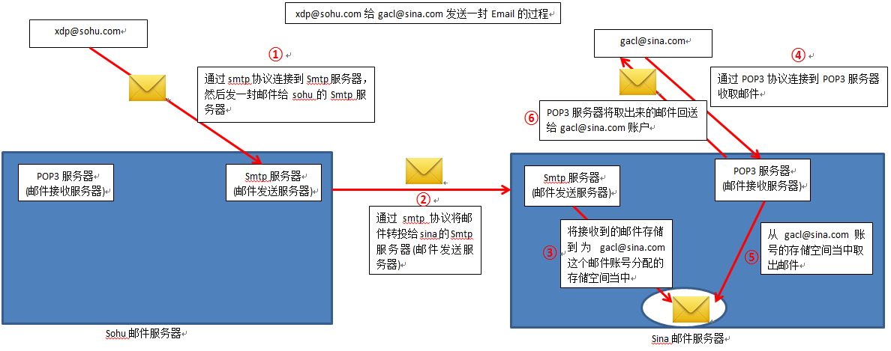
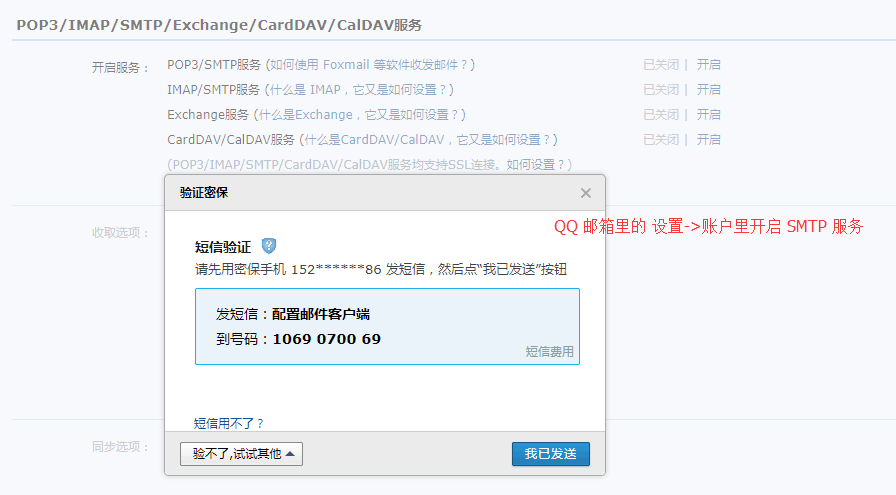
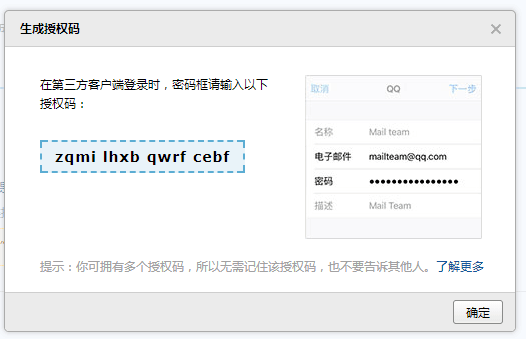

# 邮件用途 #
1. 找回密码
2. 新员工入职,人力资源部门,给新员工发送内部账号密码(没有注册功能)
3. 降低成本

# 邮件 #
1. 常用的电子邮件协议有SMTP(25)、POP3(110)、IMAP4(143)，它们都隶属于TCP/IP协议簇，默认状态下，分别通过TCP端口25、110和143建立连接。
2. 发送(SMTP协议)
	1. SMTP的全称是“Simple Mail Transfer Protocol”，即简单邮件传输协议
	2. 默认端口25
3. 接受(POP协议)
	1. POP(Post Office Protocol )即邮局协议
	2. POP3(Post Office Protocol 3)即邮局协议的第3个版本
	3. 默认端口110

# 邮件发送,接受流程 #
[流程](http://blog.csdn.net/qq_15646957/article/details/52544099)

	　　1、xdp@sohu.com 用户写好一封Email发送到sohu的Smtp服务器。对应于上图的步骤①
	
	　　2、sohu的Smtp服务器开始处理xdp@sohu.com 用户的请求，它会根据收件人的地址判断，当前收件人是不是自己管辖的用户，如果是，就直接将Email存放到为该收件人的分配的邮箱空间当中。sohu的Smtp服务器判断收件人地址发现，这一封Email的收件人gacl@sina.com 是Sina的邮件服务器管理的，于是又将Email转发给Sina的Smtp服务器。对应于上图的步骤②
	
	　　3、Sina的Smtp服务器开始处理sohu的Smtp服务器发送过来的Email，Sina的Smtp服务器根据收件人的地址判断，发现收件人自己管辖的用户，于是就直接将Email存放到为gacl@sina.com 用户的分配的邮箱空间当中。对应于上图的步骤③。
	
	　　4、xdp@sohu.com 用户将邮件发出去之后，就通知gacl@sina.com 用户去收取。gacl@sina.com 用户于是就连接上Sina的POP3服务器收取邮件，对应于上图的步骤④。
	
	　　5、POP3服务器从gacl@sina.com 用户的邮箱空间当中取出Email，对应于步骤⑤。
	
	　　6、POP3服务器将取出来的Email发给gacl@sina.com 用户，对应于步骤⑥。

# QQ开启smtp 服务#
	1. QQ 邮箱里的 设置->账户	里开启 SMTP 服务
	2. 记住授权码
[开启QQ smtp服务](http://blog.csdn.net/never_cxb/article/details/50543289)

 

# JavaMail #
1. javaMail，顾名思义，提供给开发者处理电子邮件相关的编程接口。它是Sun发布的用来处理email的API。它可以方便地执行一些常用的邮件传输。我们可以基于JavaMail开发出类似于Microsoft Outlook的应用程序。
2. 开发步骤
	1. 导包  mail.jar  和  spring-context-support.jar
			<dependency>
			    <groupId>javax.mail</groupId>
			    <artifactId>mail</artifactId>
			    <version>1.4.7</version>
			</dependency>
					依赖包含了
					<dependency>
					    <groupId>javax.activation</groupId>
					    <artifactId>activation</artifactId>
					    <version>1.1</version>
					</dependency>

		  	<dependency>
		  		<groupId>org.springframework</groupId>
		  		<artifactId>spring-context-support</artifactId>
		  		<version>4.3.7.RELEASE</version>
		  	</dependency>

# 传统邮件,不予spring整合 #

	1. 编写测试发送邮件
	2. 文档:
		1. 附录案例 Appendix B: example sending a message (80页,最后一个案例)
		2. 属性描述 Appendix A:		(61页)
	3. 成功代码
		 	@Test
			public void test3() throws Exception {
		
				/** 第一步： 准备数据 **/
				Properties props = new Properties();
				props.put("mail.smtp.host", "smtp.qq.com");// 指定邮件的发送服务器地址
				props.put("mail.smtp.auth", "true");// 服务器是否要验证用户的身份信息
				Session session = Session.getInstance(props);// 得到javax.mail.Session
				session.setDebug(true);// 代表启用debug模式，可以在控制台输出smtp协议应答的过程
		
				// -----开启ssl加密 ,如果没有 报错:530 需要开始ssl加密------------------
				MailSSLSocketFactory sf = new MailSSLSocketFactory();
				sf.setTrustAllHosts(true);
				props.put("mail.smtp.ssl.enable", "true");
				props.put("mail.smtp.ssl.socketFactory", sf);
		
				// -----------------------
		
				/** 第二步： 创建邮件 设置邮件属性 : 设置发送者,设置接受者,主题,内容 **/
				// 创建一个MimeMessage格式的邮件
				MimeMessage message = new MimeMessage(session);
				// 设置发送者
				Address fromAddress = new InternetAddress("1661105301@qq.com");//发送邮箱地址(公司邮箱)
																				// 1661105301
				message.setFrom(fromAddress);// 设置发送的邮件地址
				// 设置接收者
				Address toAddress = new InternetAddress("465282857@qq.com");// 邮件地址
				message.setRecipient(RecipientType.TO, toAddress);// 设置接收者的地址
		
				// 设置邮件的主题
				message.setSubject("邮件测试一毛钱");
				// 设置邮件的内容
				message.setText("您在xx网,注册会员,请点击激活用户 http://");
		
				// 保存邮件
				message.saveChanges();
		
				// 得到发送邮件的火箭
				Transport transport = session.getTransport("smtp");// smtp 发送
		
				// 火箭连接到发送服务器上
				// transport.connect("smtp.qq.com", "1661105301@qq.com.com",
				// "fhwknsogosdqfbbf"); // 报错 535 账号/密码写错了 1661105301@qq.com.com
				transport.connect("smtp.qq.com", "1661105301@qq.com",
						"zqmilhxbqwrfcebf"); // 独立密码
				// 火箭点火，发送 sendMessage
				transport.sendMessage(message, message.getAllRecipients());
				// 关闭通道
				transport.close();
			}
	4. debug日志 
[参考](https://baike.baidu.com/item/SMTP/175887?fr=aladdin)
			
			DEBUG: setDebug: JavaMail version 1.4.4
			DEBUG: getProvider() returning javax.mail.Provider[TRANSPORT,smtp,com.sun.mail.smtp.SMTPTransport,Sun Microsystems, Inc]
			DEBUG SMTP: useEhlo true, useAuth true
			DEBUG SMTP: trying to connect to host "smtp.qq.com", port 465, isSSL true
			220 smtp.qq.com Esmtp QQ Mail Server
			DEBUG SMTP: connected to host "smtp.qq.com", port: 465
			
			EHLO PC-20160526CBIK   //主机名
			250-smtp.qq.com
			250-PIPELINING
			250-SIZE 73400320
			250-AUTH LOGIN PLAIN
			250-AUTH=LOGIN
			250-MAILCOMPRESS
			250 8BITMIME
			DEBUG SMTP: Found extension "PIPELINING", arg ""
			DEBUG SMTP: Found extension "SIZE", arg "73400320"
			DEBUG SMTP: Found extension "AUTH", arg "LOGIN PLAIN"
			DEBUG SMTP: Found extension "AUTH=LOGIN", arg ""
			DEBUG SMTP: Found extension "MAILCOMPRESS", arg ""
			DEBUG SMTP: Found extension "8BITMIME", arg ""
			DEBUG SMTP: Attempt to authenticate
			DEBUG SMTP: check mechanisms: LOGIN PLAIN DIGEST-MD5 NTLM 
			AUTH LOGIN			//请求认证
			334 VXNlcm5hbWU6
			MTY2MTEwNTMwMUBxcS5jb20=	//USERbase64加密后的用户名
			334 UGFzc3dvcmQ6
			enFtaWxoeGJxd3JmY2ViZg==	//PASSbase64加密后的密码
			235 Authentication successful //认证成功
			DEBUG SMTP: use8bit false
			MAIL FROM:<1661105301@qq.com>	//发送者
			250 Ok
			RCPT TO:<465282857@qq.com>		//接受者
			250 Ok
			DEBUG SMTP: Verified Addresses
			DEBUG SMTP:   465282857@qq.com
			DATA
			354 End data with <CR><LF>.<CR><LF>
			From: 1661105301@qq.com
			To: 465282857@qq.com
			Message-ID: <603443293.0.1513756265516.JavaMail.Administrator@PC-20160526CBIK>
			Subject: =?UTF-8?B?6YKu5Lu25rWL6K+V5LiA5q+b6ZKx?=
			MIME-Version: 1.0
			Content-Type: text/plain; charset=UTF-8
			Content-Transfer-Encoding: base64
			
			5oKo5ZyoeHjnvZEs5rOo5YaM5Lya5ZGYLOivt+eCueWHu+a/gOa0u+eUqOaItyBodHRwOi8v
			.
			250 Ok: queued as 

# 问题 #
1. 535:javax.mail.AuthenticationFailedException: 535 Error: 
	1. 密码一定是授权码
	2. 账号别写错了!!!  1661105301@qq.com.com 哎!
2. 530:javax.mail.AuthenticationFailedException: 530 Error: A secure connection is requiered(such as ssl). More information at http://service.mail.qq.com/cgi-bin/help?id=28
	1. 需要ssl加密
				MailSSLSocketFactory sf = new MailSSLSocketFactory();
				sf.setTrustAllHosts(true);
				props.put("mail.smtp.ssl.enable", "true");
				props.put("mail.smtp.ssl.socketFactory", sf);

# base64 解密debug信息 #
		/***
		 * encode by Base64
		 */
		public static String encodeBase64(byte[] input) throws Exception {
			Class clazz = Class.forName(
					"com.sun.org.apache.xerces.internal.impl.dv.util.Base64");
			Method mainMethod = clazz.getMethod("encode", byte[].class);
			mainMethod.setAccessible(true);
			Object retObj = mainMethod.invoke(null, new Object[] { input });
			return (String) retObj;
		}
	
		/***
		 * decode by Base64
		 */
		public static byte[] decodeBase64(String input) throws Exception {
			Class clazz = Class.forName(
					"com.sun.org.apache.xerces.internal.impl.dv.util.Base64");
			Method mainMethod = clazz.getMethod("decode", String.class);
			mainMethod.setAccessible(true);
			Object retObj = mainMethod.invoke(null, input);
			return (byte[]) retObj;
		}

# email工具类(最好放在子线程) #
1. 发送者 和 密码 由公司统一提供
2. 动态参数:接受者,标题,内容
		public class MailUtil {
			/**
			 * 发送电子邮件
			 * 
			 * @param addr
			 *            收件人地址
			 * @param subject
			 *            主题
			 * @param text
			 *            内容
			 * @throws MessagingException
			 */
			public static void sendMail(String addr, String subject, String text)
					throws Exception {
				/** 第一步： 准备数据 **/
				Properties props = new Properties();
				props.put("mail.smtp.host", "smtp.qq.com");// 指定邮件的发送服务器地址
				props.put("mail.smtp.auth", "true");// 服务器是否要验证用户的身份信息
				Session session = Session.getInstance(props);// 得到javax.mail.Session
				session.setDebug(true);// 代表启用debug模式，可以在控制台输出smtp协议应答的过程
				// -----开启ssl加密 ,如果没有 报错:530 需要开始ssl加密------------------
				MailSSLSocketFactory sf = new MailSSLSocketFactory();
				sf.setTrustAllHosts(true);
				props.put("mail.smtp.ssl.enable", "true");
				props.put("mail.smtp.ssl.socketFactory", sf);
		
				/** 第二步： 创建邮件 设置邮件属性 : 设置发送者,设置接受者,主题,内容 **/
				// 创建一个MimeMessage格式的邮件
				MimeMessage message = new MimeMessage(session);
				// 设置发送者
				Address fromAddress = new InternetAddress("1661105301@qq.com");// 发送邮箱地址(公司邮箱)
				message.setFrom(fromAddress);// 设置发送的邮件地址
				// 收件地址 
				Address toAddress = new InternetAddress(addr);
				message.setRecipient(MimeMessage.RecipientType.TO, toAddress);
				// 主题 
				message.setSubject(subject);
				// 正文 
				message.setText(text);
				// 保存邮件
				message.saveChanges();
				/** 第三步： 准备发送 **/
				// 得到发送邮件的火箭
				Transport transport = session.getTransport("smtp");// smtp 发送
				// 火箭连接到发送服务器上
				transport.connect("smtp.qq.com", "1661105301@qq.com",
						"zqmilhxbqwrfcebf"); // 独立密码
				// 火箭点火，发送 sendMessage
				transport.sendMessage(message, message.getAllRecipients());
				// 关闭通道
				transport.close();
			}
		}

----------

----------

----------

# spring整合javaMail #
1. spring-context-support下提供支持mail
	1. MailSender(接口) :发送邮件主接口
	2. SimpleMailMessage: 对邮件参数进行了封装,能发送简单邮件
		1. form
		2. to
		3. subject
		4. text
	3. Mail**Exception	: 自定义邮件异常
2. 使用
	1. JavaMailSender :  MailSender(接口)的继承接口
	2. JavaMailSenderImpl: 邮件发送的实现类
	3. MimeMailMessage	: 发送附件的邮件

3. 体系
	1. MailSender
		* JavaMailSender
			* JavaMailSenderImpl	*
	2. MailMessage
		* SimpleMailMessage	*
		* MimeMailMessage	*
	3. MailException
		* MailParseException
		* MailPreparationException
	

## 普通消息步骤 ##
	1. 提取邮件配置文件	mail.properties
			mail.smtp.host=smtp.qq.com
			mail.username=1661105301@qq.com
			mail.password=zqmilhxbqwrfcebf
			
			mail.from=1661105301@qq.com
			
			mail.smtp.auth=true
			mail.debug=true
			
			mail.smtp.ssl.enable=true
			mail.smtp.ssl.socketFactory=javax.net.ssl.SSLSocketFactory
	2. 创建applicationContext-mail.xml,交给spring管理
		1. 加载mail.properties文件 
					<!-- 加载mail.properties文件 好像不能使用2个placeholder,在dao  * 全部导入-->
					<context:property-placeholder location="classpath:props/mail.properties"/>
		2. 配置一个简单邮件对象
					<bean id="mailMessage" class="org.springframework.mail.SimpleMailMessage">
						<!-- 发送者公司统一 -->
					   <property name="from" value="${mail.from}"></property>
					</bean>
		3. 创建发送者实现类
				<!-- 邮件的发送对象 -->
			     <bean id="mailSender" class="org.springframework.mail.javamail.JavaMailSenderImpl">
			     	<!-- 进源码,配置属性 -->
			         <property name="host" value="${mail.smtp.host}"></property>
			         <property name="username" value="${mail.username}"></property>
			         <property name="password" value="${mail.password}"></property>
			         <property name="defaultEncoding" value="UTF-8"></property>
			    	 <!--   件发送相关的配置信息 -->
			         <property name="javaMailProperties" >
			            <props>
			                  <prop key="mail.smtp.auth">${mail.smtp.auth}</prop>
			                  <prop key="mail.debug">${mail.debug}</prop>
			                  <prop key="mail.smtp.timeout">0</prop>
			                  <prop key="mail.smtp.ssl.enable">${mail.smtp.ssl.enable}</prop>
			                  <prop key="mail.smtp.socketFactory.class">${mail.smtp.ssl.socketFactory}</prop>
			            </props>
			         </property>
			    </bean> 
		4. 530 ssl异常
				 <prop key="mail.smtp.ssl.enable">true</prop>
				 <prop key="mail.smtp.socketFactory.class">javax.net.ssl.SSLSocketFactory</prop>
		5. 测试
				@Test
				public void t1() throws Exception {
					ApplicationContext ac = new ClassPathXmlApplicationContext(
							"classpath:spring/applicationContext-mail.xml");
					SimpleMailMessage message = (SimpleMailMessage) ac
							.getBean("mailMessage");// 加载简单邮件对象
					// 设置简单邮件对象的属性
					message.setSubject("spring与javamail的测试");// 主题
					message.setText("hello,spring and javamail ");// 内容
					message.setTo("465282857@qq.com");// 收件箱

					JavaMailSender sender = (JavaMailSender) ac.getBean("mailSender"); // 得到邮件的发送对象，专门用于邮件发送
					// 发送点单/复杂邮件
					sender.send(message);
				}

## 复杂消息 ##
1. 获取mailSender
2. 创建MimeMessage
3. 使用帮助类 MimeMessageHelper
4. 帮助类设置基本参数	
	1. from
	2. to
	3. subject
	4. text(文本,是否html展示)
5. 替换图片  cid:image 占位
6. 发送
	sender.send(message);

		@Test
			public void testJavaMail() throws Exception {
				ApplicationContext ac = new ClassPathXmlApplicationContext(
						"classpath:spring/applicationContext-mail.xml");
		
				JavaMailSender sender = (JavaMailSender) ac.getBean("mailSender"); // 得到邮件的发送对象，专门用于邮件发送
		
				// 发送一个允许带图片，同时带附件的邮件
				MimeMessage message = sender.createMimeMessage();// 创建一封允许带图片，同时带附件的邮件对象
		
				// 为了更好的操作MimeMessage对象，借用一个工具类来操作它 ,,true 带附件 supports alternative
				// texts, inline elements and attachments
				MimeMessageHelper helper = new MimeMessageHelper(message, true);
		
				// 通过工具类设置主题，内容，图片，附件
				helper.setFrom("1661105301@qq.com");
				helper.setTo("465282857@qq.com");
				helper.setSubject("华信教育集团");
				helper.setText("<html><head></head><body><h1>hello world!! </h1>"
						+ "<a href=http://www.huaxinjiaoyu.com>华信</a>"
						+ "</body></html>", true);// 第二个参数说明内容要解析为html代码
		
				// 添加图片
				FileSystemResource resource = new FileSystemResource(
						new File("D:\\x.jpg"));
				helper.addInline("image", resource);

				// 添加附件
				FileSystemResource file = new FileSystemResource(new File("D:\\x.jpg"));
				helper.addAttachment("x.jpg", file);// 附件名
			
				sender.send(message);
			}

# 注意 #
1. spring整合的时候,导入配置文件,dao已经有一个配置文件导入,好像不能使用2个placeholder
		<context:property-placeholder location="classpath:props/mail.properties"/>
		<context:property-placeholder location="classpath:props/dao.properties"/>
	使用
		<context:property-placeholder location="classpath:props/*.properties"/>	